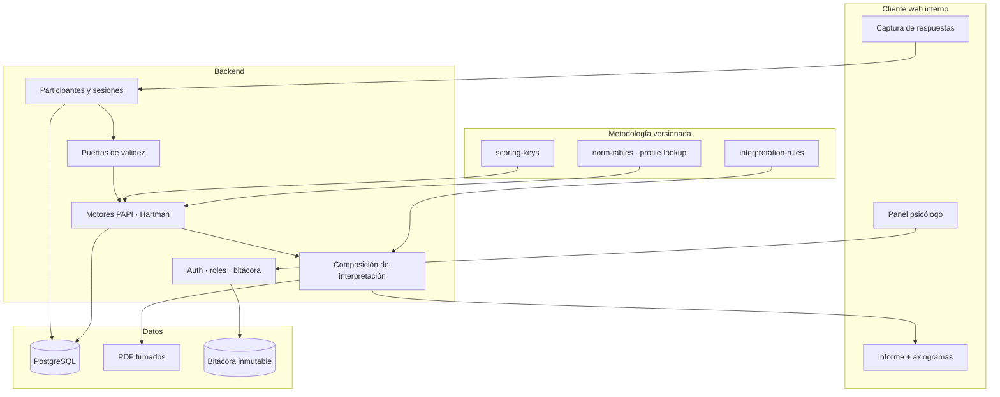

# Plataforma interna de pruebas psicológicas — PAPI · Hartman

**Revisión 2** · julio 2026 · Documento vivo de arquitectura, alcance, costos y cronograma.

**Alcance:** plataforma **interna** para que el psicólogo aplique o capture pruebas, revise **calificaciones** e **interpretaciones**, y emita informes firmados. No hay autoservicio público del evaluado.

**Tarifa de referencia:** **10 USD / hora**.

Documentos técnicos ligados:
- [`docs/PAPI-CALIFICACION.md`](docs/PAPI-CALIFICACION.md) — motor PAPI
- [`docs/HARTMAN-CALIFICACION.md`](docs/HARTMAN-CALIFICACION.md) — motor Hartman

---

## 1. Resumen ejecutivo

> ⚠️ **Las cifras vigentes están en [`docs/CRONOGRAMA.md`](docs/CRONOGRAMA.md) (revisión 4).** Este documento conserva la arquitectura y el razonamiento; su estimación corresponde a la revisión 2, cuando el alcance eran dos instrumentos y la metodología de Hartman todavía tenía incógnitas.

| Concepto | Rev. 2 (este doc) | **Rev. 4 — vigente** |
|----------|------------------:|---------------------:|
| Instrumentos | 2 | **3** — PAPI · Hartman · MABE |
| Horas base | 348 h | **240 h** |
| Reserva de riesgo | 52 h | **24 h** |
| **Total** | 400 h → 4 000 USD | **264 h → 2 640 USD** |
| Duración | 6 meses | **15 semanas** |

Se agregó un instrumento completo y el costo bajó 1 360 USD. Dos causas, ninguna de ellas compresión de estimaciones:

1. **Decisiones de alcance** — captura por transcripción en vez de aplicación guiada, textos de los manuales capturados por el psicólogo, PDF por hoja de estilo de impresión, nube gestionada. Detalle en `CRONOGRAMA.md` rev. 3.
2. **Trabajo metodológico ya resuelto** — el motor de Hartman quedó reconstruido por completo sin descifrar su Excel, el de MABE se extrajo íntegro, y la tabla Gráfica ya está en CSV. Detalle en `CRONOGRAMA.md` §2.1.

---

## 2. Qué cambió respecto a la revisión 1

Antes de re-planear se verificó el material base directamente (imagen de la rejilla PAPI, extracción de los `.docx`, aritmética de la hoja Hartman). Resultados:

### 2.1 Hallazgos que **reducen** trabajo

| Hallazgo | Impacto |
|----------|---------|
| **La escala PAPI 0–9 es el conteo crudo**, no una normalización: cada factor participa en exactamente 9 ítems (90 pares × 2 ÷ 20 factores) | M4 pierde su parte más incierta. `norm_tables` deja de bloquear PAPI. **−24 h** |
| **Los 90 pares se extraen automáticamente** de `Cuestionario.docx` — verificado, 180 frases exactas y limpias | M2 pasa de transcripción manual a script + revisión. **−12 h** |
| **La rejilla PAPI es geométrica, no arbitraria**: 10 roles × 10 necesidades menos las 10 díadas propias = 90 ítems. La clave se **deriva** y se verifica con invariantes mecánicas | Elimina el riesgo de "clave mal transcrita" como riesgo mayor. **−8 h** |
| **"Parte III" de Hartman no existe**: son 2 partes de entrada y 3 axiogramas de salida | Pendiente bloqueante de M5 cerrado. **−4 h** |
| **Los textos de interpretación de Hartman están completos** en `Plantillas Hartman.docx`, indexados por axiograma | M7 es vaciado de datos, no redacción. |

### 2.2 Hallazgos que **añaden** riesgo o trabajo

| Hallazgo | Impacto |
|----------|---------|
| **`DIF` no vale 171.** El 171 es la comprobación Σ rankings; `DIF` es el puntaje de diferenciación con rango normativo 22–80 (siempre par). La revisión 1 lo daba por resuelto y era un error de fondo | El motor Hartman se rediseña sobre diferencias, no sobre sumas de puntos |
| **El ejemplo del Excel es el protocolo perfecto**, no un caso real: sus rankings son exactamente la norma de Hartman | Se creía tener un caso oro y no se tiene. **Sigue siendo el bloqueo #1** |
| **La clave I/E/S de Hartman diverge en 7 de 18 ítems** de la composición HVP más difundida | Punto de firma obligatorio del psicólogo antes de congelar |
| **La hoja Gráfica son ~966 celdas** (23 columnas × 42 filas) de umbrales que no admiten un solo error | Doble captura con verificación cruzada. **+6 h** |
| **Faltaba por completo el cumplimiento de datos personales** — se manejan datos de salud, que son datos sensibles | Nuevo módulo M9. **+12 h** |

---

## 3. Estado del material base

| Recurso | Contenido | Estado |
|---------|-----------|--------|
| `Cuestionario.docx` | PAPI: 90 pares forzados A/B | ✅ extraído y verificado |
| `Tabla para evaluar.jpg` | Clave ítem → 20 factores | ✅ estructura decodificada · ⚠️ clave por derivar |
| `Prueba PAPI.docx` | Manual, interpretación, medias | ⏳ por vaciar a reglas |
| `Grafica PAPI.doc` | Perfil gráfico | ⏳ por digitalizar |
| `Plantillas Hartman.docx` | 2 partes × 18 ítems + 3 axiogramas + textos | ✅ extraído y verificado |
| `Calificación Hartman.xlsx` | Hojas Hartman y Gráfica | ⚠️ cifrado en disco; lógica transcrita a mano · ❌ faltan fórmulas D.I./A.I./VQ y la tabla Gráfica completa |
| `MABE_2007.*`, `PLANTILLA MABE.ppt` | Segunda batería | Fase 2, sin analizar |

---

## 4. Fase 0 — Cierre metodológico (compuerta)

> **Principio de este plan: no se comprometen 400 horas sobre una metodología que todavía tiene incógnitas.**

La revisión 1 arrancaba directo en infraestructura. Esta abre con un *spike* corto y barato cuyo único propósito es convertir las incógnitas en hechos firmados. Si algo va a hacer descarrilar el proyecto, se descubre en la semana 3 y no en el mes 4.

**Duración:** 32 h (~3 semanas).

| Entregable | Criterio de salida |
|-----------|--------------------|
| `papi/scoring-key.v1.json` | 90 ítems derivados de la rejilla, pasan K1–K4 (§9) y reproducen un protocolo real calificado a mano |
| `papi/items.v1.json` | 90 pares extraídos, revisados ortotipográficamente y firmados |
| `hartman/norm-and-key.v1.json` | Orden normativo + clave I/E/S **firmados por el psicólogo** |
| `hartman/profile-lookup.v1.csv` | 23 columnas × 42 filas capturadas por duplicado, sin discrepancias |
| Nota de decisión `DIF` | Confirmado si usa diferencias crudas o ajustadas |
| Prototipo de motor (script, sin UI) | Reproduce 2 protocolos reales (1 PAPI + 1 Hartman) celda a celda |

**Compuerta:** si al cierre de F0 los dos protocolos reales no se reproducen exactamente, **no se avanza a M4/M5**; se replanea con el psicólogo. Esta es la decisión más valiosa de todo el documento.

---

## 5. Arquitectura

### 5.1 Principios

1. **La metodología es dato versionado, no código.** Claves, normas, umbrales y textos viven en archivos JSON/CSV versionados y cargados a BD. Cambiar una clave es publicar una versión, no desplegar un binario.
2. **Los informes son inmutables.** Un informe emitido guarda el *snapshot* de la versión de clave, normas y reglas que usó. Publicar `scoring-key.v2` **nunca** modifica un informe ya firmado. Existe una acción explícita y auditada de *re-calificar* que produce un informe nuevo, no una edición.
3. **Puertas de validez antes que cálculo.** Σ = 171, disimilitudes, pares completos: si el protocolo no es válido, el motor se detiene y lo dice; no produce números plausibles pero sin sentido.
4. **Borrador por defecto.** Ningún texto generado sale del sistema sin aprobación nominal del psicólogo.
5. **Todo lo clínico se audita.** Quién capturó, quién calificó, quién aprobó, cuándo, con qué versión.

### 5.2 Diagrama lógico

### 5.3 Stack

| Capa | Tecnología | Motivo |
|------|-----------|--------|
| Frontend | Next.js (App Router) + TypeScript | Formularios densos, informes, despliegue simple |
| UI | shadcn/ui + Tailwind | Velocidad y consistencia |
| Motores | Módulos TypeScript puros, sin dependencias de framework | Se prueban aislados, sin BD ni HTTP |
| Backend | Server Actions + servicios | Superficie mínima |
| BD | PostgreSQL gestionado | Relaciones, JSONB para respuestas y snapshots |
| Auth | Credenciales + roles, sesión corta, 2FA para rol psicólogo | Personal autorizado únicamente |
| Informes | PDF server-side | Descargable, con pie de trazabilidad |
| Gráficas | SVG propio | El perfil PAPI y los axiogramas Hartman tienen geometría fija; una librería genérica estorba más de lo que ayuda |

**Nota sobre los motores:** son funciones puras `(respuestas, clave) → puntajes`. Esa es la decisión de arquitectura más importante del proyecto — permite ejecutar cientos de casos de prueba en milisegundos y validar el motor contra el Excel sin levantar nada.

### 5.4 Roles

| Rol | Puede |
|-----|-------|
| **Psicólogo** | Todo: crear sesiones, capturar, calificar, editar interpretación, **aprobar y firmar** informes |
| **Aplicador / asistente** | Crear participantes, capturar respuestas. **No** ve interpretación ni aprueba |
| **Administrador** | Usuarios, versiones de metodología, respaldos. **No** accede a contenido clínico |

La separación aplicador / psicólogo es lo que permite escalar la operación sin diluir la responsabilidad clínica.

---

## 6. Modelo de datos

**Metodología (versionada, solo lectura en runtime)**

| Tabla | Contenido |
|-------|-----------|
| `tests` | PAPI, Hartman, MABE |
| `test_versions` | Versión de ítems e instrucciones; una es `active` |
| `items` | Enunciados, orden, parte, opción A/B o ítem a–r |
| `scoring_keys` | PAPI: ítem → (rol, necesidad). Hartman: norma + clave I/E/S |
| `norm_tables` | `hartman_profile_lookup` (columna, nivel, min, max) |
| `interpretation_rules` | PAPI: (factor, banda) y (díada, regla). Hartman: (axiograma, indicador, nivel) |

**Operación**

| Tabla | Contenido |
|-------|-----------|
| `participants` | Datos demográficos mínimos necesarios |
| `assessment_sessions` | Estado, batería, psicólogo responsable, tiempos, modalidad |
| `responses` | Respuestas crudas (JSONB) + timestamps |
| `item_scores` | Hartman: por ítem `hartman`, `persona`, `d_signed`, `d_ajustada`, `es_disimilitud` |
| `scores` | Puntajes por factor / indicador + nivel 1–7 |
| `validity_flags` | DIS impar, DIS ≥ 6, Σ ≠ 171, pares incompletos |
| `reports` | Snapshot de interpretación, notas del psicólogo, estado, firma, versiones usadas |
| `audit_log` | Append-only: actor, acción, entidad, antes/después, IP, timestamp |

`item_scores` y `validity_flags` no existían en la revisión 1 y son las que hacen auditable un informe: sin ellas, cuando el psicólogo pregunte *"¿por qué este DIM salió 22?"*, la única respuesta posible sería "recalcúlalo".

---

## 7. Módulos, criterios de aceptación y estimación

Cada módulo se considera terminado solo si cumple su **criterio de aceptación**, no si "está codificado".

| # | Módulo | Criterio de aceptación | Horas | USD |
|---|--------|------------------------|------:|----:|
| **F0** | Cierre metodológico | Compuerta §4 superada: 2 protocolos reales reproducidos celda a celda | 32 | 320 |
| **M1** | Infraestructura y núcleo | Repo, CI, dev/staging, esquema BD migrado, login con 3 roles y bitácora activa | 32 | 320 |
| **M2** | Catálogo de pruebas | 90 ítems PAPI + 36 Hartman cargados y versionados; cambiar de versión activa no altera sesiones cerradas | 16 | 160 |
| **M3** | Captura de respuestas | UI 90 pares + 2 rankings 1–18; imposible guardar un protocolo inválido; se puede pausar y retomar | 36 | 360 |
| **M4** | Motor PAPI | 20 factores 0–9; invariante Σ = 90; reproduce el protocolo oro | 32 | 320 |
| **M5** | Motor Hartman | DIF/DIM/INT/DIS/VQ/SQ/BQr/BQa/CQ; puertas de validez operando; reproduce el protocolo oro | 40 | 400 |
| **M6** | Interpretación PAPI | Gráfica de perfil + textos por factor y por díada; borrador editable | 44 | 440 |
| **M7** | Interpretación Hartman | 3 axiogramas con niveles 1–7 y textos por axiograma; bloqueo efectivo con DIS ≥ 6 | 36 | 360 |
| **M8** | Panel e informe | Listado, detalle, notas, aprobación con firma, PDF con pie de trazabilidad | 40 | 400 |
| **M9** | Datos personales y cumplimiento | Aviso de privacidad, consentimiento registrado, retención, ARCO, exportación y borrado | 12 | 120 |
| **M10** | Seguridad, despliegue y capacitación | HTTPS, cifrado en reposo, respaldos con restauración probada, manual, UAT firmado | 28 | 280 |
| | **Subtotal** | | **348** | **3 480** |
| | **Reserva de riesgo (15 %)** | Se consume solo con acuerdo explícito | **52** | **520** |
| | **TOTAL** | | **400** | **4 000** |

**Fase 2 opcional — MABE:** 48 h → 480 USD. No estimable con precisión hasta analizar `MABE_2007.docx` y `Calificación MABE_2007.xlsx`; la cifra es un marcador.

### 7.1 Hitos de pago sugeridos

Pagar contra entregable verificable, no contra horas transcurridas:

| Hito | Al cerrar | Monto |
|------|-----------|------:|
| 1 | F0 — compuerta metodológica superada | 320 USD |
| 2 | M1–M3 — captura funcionando en staging | 840 USD |
| 3 | M4–M5 — ambos motores reproducen los casos oro | 720 USD |
| 4 | M6–M7 — informes borrador completos | 800 USD |
| 5 | M8–M10 — producción interna con UAT firmado | 800 USD |
| — | Reserva, si se consume | hasta 520 USD |

---

## 8. Cronograma (~66 h/mes)

| Mes | Foco | Módulos | h | Entregable visible |
|-----|------|---------|--:|--------------------|
| **1** | Cerrar metodología + cimientos | F0 (32) · M1 (32) | 64 | Claves firmadas, motor prototipo reproduce casos oro, login con roles |
| **2** | Captura | M2 (16) · M3 (36) · M4 inicio (14) | 66 | PAPI y Hartman capturables en pantalla, con validación |
| **3** | Motores | M4 cierre (18) · M5 (40) · reserva (8) | 66 | Ambas pruebas calificando con puertas de validez |
| **4** | Interpretación PAPI | M6 (44) · M7 inicio (22) | 66 | Perfil PAPI + informe borrador |
| **5** | Interpretación Hartman + panel | M7 cierre (14) · M8 (40) · M9 (12) | 66 | 3 axiogramas, flujo de aprobación, PDF |
| **6** | Cierre | M10 (28) · reserva (38) | 66 | Producción interna, UAT firmado, capacitación |

El mes 6 lleva deliberadamente 38 h de reserva. En un proyecto con dependencias clínicas externas, un mes final sin holgura es un mes final que se desborda.

---

## 9. Estrategia de calidad

Un error de scoring no se ve: produce un número plausible y un informe firmado equivocado. Por eso las pruebas no son opcionales en este proyecto.

**Nivel 1 — Invariantes (property tests, miles de casos aleatorios)**

| Prueba | Instrumento |
|--------|-------------|
| Cada factor aparece exactamente 9 veces en la clave | PAPI |
| Ningún ítem enfrenta a un factor con su díada | PAPI |
| Σ de los 20 puntajes = 90 en todo protocolo completo | PAPI |
| Σ rankings = 171 por parte | Hartman |
| `DIF` siempre par | Hartman |
| 6 ítems por eje I/E/S | Hartman |

**Nivel 2 — Casos oro.** Protocolos reales calificados a mano, comparados celda a celda. Mínimo 2 para arrancar, objetivo 5 por instrumento antes de producción.

**Nivel 3 — Casos límite.** Σ ≠ 171, rankings repetidos, pares sin responder, DIS impar, DIS ≥ 6, valores fuera del rango de la tabla Gráfica.

**Nivel 4 — UAT.** El psicólogo califica 3 protocolos en paralelo (a mano y en la plataforma) y firma la equivalencia. Es el criterio de salida a producción.

---

## 10. Flujo funcional

1. El aplicador crea **participante** y **sesión** (PAPI, Hartman o batería), registrando el consentimiento.
2. Captura las respuestas en pantalla, o transcribe un protocolo aplicado en papel.
3. El sistema ejecuta las **puertas de validez**. Si falla, se detiene y explica por qué.
4. Califica y muestra **gráficas + interpretación borrador**, siempre marcada como tal.
5. El psicólogo **revisa**, ajusta el texto libre, y **aprueba** el informe con su firma.
6. Se emite el **PDF** con pie de trazabilidad: fecha, responsable, versión de clave, normas y reglas.
7. El informe queda **inmutable**. Cualquier corrección genera una nueva versión enlazada a la anterior.

---

## 11. Cumplimiento, licencias y datos personales (M9)

Bloque ausente por completo en la revisión 1, y no es opcional: **los resultados de pruebas psicológicas son datos personales sensibles** (datos de salud).

### 11.1 Datos personales

| Requisito | Implementación |
|-----------|----------------|
| Consentimiento informado **expreso** del evaluado | Registrado por sesión, con fecha, versión del aviso y evidencia; sin él la sesión no avanza |
| Aviso de privacidad | Documento versionado, visible y aceptado antes de aplicar |
| Finalidad limitada | Solo evaluación psicológica; sin usos secundarios ni analítica de terceros |
| Derechos ARCO (acceso, rectificación, cancelación, oposición) | Procedimiento y pantallas de exportación / anonimización |
| Retención | Política explícita de años de conservación y purga automática al vencer |
| Cifrado | TLS en tránsito; cifrado en reposo en BD y respaldos |
| Minimización | Solo los datos demográficos que los instrumentos requieren |
| Vulneraciones | Procedimiento de detección y notificación documentado |

> Si la operación es en México aplica la LFPDPPP y su tratamiento reforzado de datos sensibles (consentimiento expreso y por escrito). **Confirmar la normativa vigente y la jurisdicción con asesoría legal** antes del despliegue: este plan cubre la implementación técnica, no sustituye el dictamen legal.

### 11.2 Licencias de los instrumentos

| Instrumento | Consideración |
|-------------|---------------|
| **PAPI** | Instrumento con licencia del editor. Uso estrictamente interno; el cuestionario, la clave y el manual no se exponen públicamente; acceso nominal y auditado |
| **Hartman (HVP)** | Verificar la titularidad de la adaptación al español que se está usando |

> **Acción para el psicólogo:** confirmar por escrito que cuenta con la licencia vigente de ambos instrumentos y que su digitalización para uso interno está permitida. Es una dependencia legal del proyecto, no un detalle administrativo.

### 11.3 Ética profesional

El secreto profesional y el criterio clínico se preservan por diseño: informe siempre borrador, aprobación nominal obligatoria, y la interpretación automática presentada como apoyo a la decisión, nunca como diagnóstico.

---

## 12. Riesgos

| Riesgo | Prob. | Impacto | Mitigación |
|--------|:-----:|:-------:|------------|
| **No llegan los protocolos calificados a mano** | Alta | **Crítico** | Compuerta F0. Sin casos oro el proyecto se detiene, no continúa a ciegas |
| Excel Hartman nunca se exporta sin cifrar | Media | Alto | Reconstrucción a partir de casos oro; consume reserva |
| Clave I/E/S mal transcrita (7 ítems divergentes) | Media | **Crítico** | Firma explícita del psicólogo + validación con casos oro |
| Errores al digitalizar las ~966 celdas de la hoja Gráfica | Media | Alto | Doble captura independiente con verificación cruzada automatizada |
| Fórmulas D.I. / A.I. / VQ nunca se resuelven | Media | Medio | Emitir informe sin esos indicadores, marcados como "no calculado" |
| Licencia PAPI no vigente | Baja | **Crítico** | Verificar antes de M1 |
| Sobreconfianza clínica en el texto automático | Media | Alto | Borrador por defecto, aprobación nominal, lenguaje de apoyo |
| Disponibilidad del psicólogo para validación | Alta | Medio | Bloques de validación agendados por adelantado en cada hito |

---

## 13. Lo que se necesita del psicólogo

Ordenado por urgencia. Los tres primeros son bloqueantes de F0:

1. 🔴 **Un protocolo PAPI real calificado a mano** — las 90 respuestas A/B y los 20 puntajes resultantes.
2. 🔴 **Un protocolo Hartman real calificado a mano** — los rankings de ambas partes y todas las salidas (DIF, DIM, INT, DIS, VQ, SQ, BQr, BQa, CQ y niveles).
3. 🔴 **`Calificación Hartman.xlsx` exportado sin cifrar** o en CSV por hoja. Resuelve de un golpe las fórmulas de D.I./A.I./VQ y la tabla Gráfica completa.
4. 🟠 **Firma de la clave I/E/S de Hartman** — confirmar los 7 ítems señalados en `docs/HARTMAN-CALIFICACION.md` §2.5.
5. 🟠 **Confirmación de licencias vigentes** de PAPI y de la adaptación Hartman.
6. 🟡 Decisión de hospedaje: nube gestionada vs servidor propio (afecta M1 y M10).
7. 🟡 Política de retención de datos: cuántos años se conservan los informes.

**Cómo destrabar rápido lo más difícil:** si el Excel no se puede desbloquear, un protocolo real calificado a mano vale casi lo mismo — permite reconstruir las fórmulas faltantes por ingeniería inversa contra un resultado conocido.

---

## 14. Supuestos y exclusiones

**Supuestos**

- Un desarrollador a ~66 h/mes.
- El psicólogo dispone de bloques de validación en cada hito.
- Uso interno con volumen bajo (decenas de sesiones/mes), no SaaS multi-cliente.
- Español únicamente.

**No incluido en las 400 h**

- Tiempo de validación clínica del psicólogo.
- Aplicación móvil nativa.
- Autoservicio del evaluado o portal externo.
- Integraciones con sistemas de RRHH o expediente clínico.
- Costos de infraestructura (hosting, BD, dominio: estimar 20–40 USD/mes).
- Asesoría legal en materia de datos personales.
- Mantenimiento posterior al UAT (proponer contrato aparte).

---

*Revisión 2 — replaneada sobre verificación directa del material base. Ver `docs/PAPI-CALIFICACION.md` y `docs/HARTMAN-CALIFICACION.md` para el detalle técnico de cada motor.*
