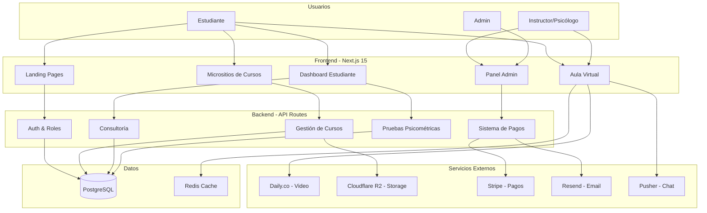
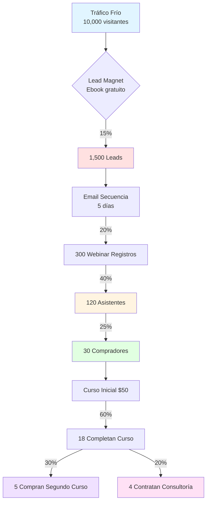

# PROPUESTA INTEGRAL: PLATAFORMA DE CURSOS Y CONSULTORÍA CON PRUEBAS PSICOMÉTRICAS

**Cliente:** Proyecto PsycoTest  
**Fecha:** 13 de Agosto, 2026  
**Presupuesto Total:** $15,000 USD  
**Documento:** Propuesta Técnica y Comercial Integral

---

## ÍNDICE

1. [Estado Actual del Proyecto](#1-estado-actual-del-proyecto)
2. [Alcance de la Propuesta Integral](#2-alcance-de-la-propuesta-integral)
3. [Arquitectura Técnica](#3-arquitectura-técnica)
4. [Módulos y Funcionalidades](#4-módulos-y-funcionalidades)
5. [Desglose de Inversión](#5-desglose-de-inversión)
6. [Cronograma de Implementación](#6-cronograma-de-implementación)
7. [Estrategia de Marketing y Adquisición](#7-estrategia-de-marketing-y-adquisición)
8. [Proyección de ROI](#8-proyección-de-roi)
9. [Entregables y Garantías](#9-entregables-y-garantías)

---

## 1. ESTADO ACTUAL DEL PROYECTO

### 1.1 Resumen Ejecutivo

El proyecto **PsycoTest** es una plataforma profesional de aplicación y calificación de pruebas psicométricas que actualmente incluye:

- ✅ **Tres instrumentos completos:** PAPI, Hartman (HVP) y MABE
- ✅ **Sistema de autenticación** con roles (psicólogo, aplicador, administrador)
- ✅ **Motores de calificación** validados con casos reales
- ✅ **Generación de informes PDF** con interpretación profesional
- ✅ **Panel administrativo** para gestión de participantes y sesiones
- ✅ **Base de datos** con auditoría completa
- ✅ **Infraestructura** lista para producción (Next.js 15 + SQLite/Turso)

### 1.2 Estado Técnico

| Componente | Estado | Observaciones |
|------------|--------|---------------|
| Frontend | ✅ Funcional | Next.js 15, TypeScript, diseño profesional |
| Backend | ✅ Funcional | API Routes, Server Actions |
| Base de datos | ✅ Funcional | Drizzle ORM, migraciones listas |
| Autenticación | ✅ Funcional | JWT, roles, sesiones seguras |
| Pruebas PAPI | ✅ Completo | 90 ítems, calificación automática |
| Pruebas Hartman | ✅ Completo | Axiogramas, validación completa |
| Pruebas MABE | ✅ Completo | Calificación e interpretación |
| Generación PDF | ✅ Funcional | Informes profesionales firmados |
| Despliegue | ✅ Listo | Vercel-ready, variables de entorno |

### 1.3 Valor Construido

**Inversión actual estimada:** ~$2,640 USD (264 horas según cronograma revisión 4)  
**Estado de completitud:** ~85% del plan original  
**Base sólida para expansión:** ✅ Lista para nuevos módulos

---

## 2. ALCANCE DE LA PROPUESTA INTEGRAL

### 2.1 Visión del Proyecto Ampliado

Transformar **PsycoTest** en una **plataforma completa de educación y consultoría psicológica** que integre:

1. **Plataforma de Venta de Cursos (LMS)**
   - Catálogo de cursos con páginas de venta
   - Pasarela de pagos integrada
   - Gestión de estudiantes y progreso
   - Certificados digitales

2. **Sistema de Transmisión en Vivo**
   - Clases en vivo estilo Zoom/Meet
   - Grabación automática de sesiones
   - Salas virtuales con capacidad de hasta 100 participantes
   - Calidad HD adaptativa

3. **Herramientas Colaborativas**
   - Pizarra interactiva en tiempo real
   - Chat grupal y privado
   - Compartir pantalla
   - Encuestas y quizzes en vivo

4. **Panel de Administración Avanzado**
   - Dashboard con analíticas
   - Gestión de cursos y contenido
   - Reportes de ventas y métricas
   - Gestión de usuarios y permisos

5. **Micrositios de Promoción**
   - Landing pages personalizadas por curso
   - SEO optimizado
   - Integración con redes sociales
   - Formularios de captura de leads

6. **Servicio de Consultoría**
   - Agenda de citas online
   - Videollamadas 1-a-1
   - Historial de consultas
   - Integración con pruebas psicométricas

7. **Marketing y Adquisición**
   - Automatización de email marketing
   - Embudo de conversión
   - Pixel de seguimiento y analytics
   - Integraciones con ads (Meta, Google)

### 2.2 Público Objetivo

| Perfil | Necesidad | Solución |
|--------|-----------|----------|
| **Psicólogos independientes** | Monetizar conocimiento | Plataforma de cursos + consultoría |
| **Estudiantes de psicología** | Formación continua | Acceso a cursos especializados |
| **Empresas RRHH** | Capacitación de personal | Cursos corporativos + pruebas |
| **Coaches y consultores** | Herramientas profesionales | Suite completa de evaluación |

---

## 3. ARQUITECTURA TÉCNICA

### 3.1 Stack Tecnológico Propuesto

| Capa | Tecnología | Justificación |
|------|------------|---------------|
| **Frontend** | Next.js 15 + React 19 | Ya implementado, Server Components |
| **UI/UX** | Tailwind CSS + Framer Motion | Consistente con sistema actual |
| **Backend** | Next.js API Routes + Server Actions | Serverless, escalable |
| **Base de datos** | PostgreSQL (Neon/Supabase) | Relacional, JSONB, escalable |
| **Almacenamiento** | Cloudflare R2 / S3 | Videos, archivos, grabaciones |
| **Video en vivo** | Daily.co API | WebRTC, SFU, hasta 100 participantes |
| **Pizarra** | Tldraw / Excalidraw embebido | Open source, tiempo real |
| **Chat** | Pusher / Ably | WebSockets, presencia en tiempo real |
| **Pagos** | Stripe + Mercado Pago | Internacional + Latinoamérica |
| **Email** | Resend + React Email | Transaccionales + marketing |
| **Analytics** | Plausible + PostHog | Privacidad, embudo de conversión |
| **CDN** | Cloudflare | Velocidad global, DDoS protection |

### 3.2 Diagrama de Arquitectura

### 3.3 Seguridad y Cumplimiento

| Aspecto | Implementación |
|---------|----------------|
| **Datos personales** | Ya implementado en PsycoTest (M9) |
| **Pagos PCI-DSS** | Stripe (certificado PCI Level 1) |
| **Cifrado** | TLS 1.3, datos en reposo AES-256 |
| **Autenticación** | JWT + refresh tokens, 2FA opcional |
| **GDPR/LFPDPPP** | Consentimientos, exportación, borrado |
| **Backups** | Automáticos diarios, retención 30 días |

---

## 4. MÓDULOS Y FUNCIONALIDADES

### 4.1 Módulo de Cursos (LMS)

**Funcionalidades:**

- ✨ Creación y edición de cursos con módulos y lecciones
- 🎥 Subida de videos (hasta 2GB por video)
- 📄 Material descargable (PDFs, hojas de trabajo)
- 📊 Progreso del estudiante en tiempo real
- 🏆 Sistema de certificados automáticos
- 💬 Foro de discusión por curso
- ⭐ Sistema de reseñas y calificaciones
- 🔒 Control de acceso por membresía/pago
- 📱 Diseño responsive (móvil, tablet, desktop)

**Experiencia del estudiante:**
1. Navega el catálogo de cursos
2. Ve preview gratuito (primera lección)
3. Compra acceso al curso
4. Consume contenido a su ritmo
5. Completa evaluaciones
6. Obtiene certificado digital

**Experiencia del instructor:**
1. Crea curso con editor visual
2. Sube contenido multimedia
3. Configura precio y promociones
4. Monitorea estadísticas de ventas
5. Interactúa con estudiantes
6. Recibe pagos automáticos

### 4.2 Módulo de Transmisión en Vivo

**Funcionalidades:**

- 🎥 Salas de video HD (hasta 100 participantes)
- 🎙️ Audio cristalino con supresión de ruido
- 👥 Vista de galería y modo presentador
- 📺 Compartir pantalla con audio del sistema
- 🎬 Grabación automática en la nube
- 📹 Transcripción automática (español)
- 💾 Almacenamiento de grabaciones (30 días incluidos)
- 📊 Estadísticas de asistencia
- 🔐 Salas privadas con contraseña

**Integración con Daily.co:**
- Infraestructura WebRTC profesional
- SFU (Selective Forwarding Unit) para escalabilidad
- Baja latencia (<200ms)
- Adaptación automática de calidad
- Costos: ~$0.004/minuto participante

**Ejemplo de uso:**
- Clase en vivo de 1 hora con 30 estudiantes
- Costo: 60 min × 30 participantes × $0.004 = $7.20 USD
- Margen al cobrar $20/estudiante: $593.80 utilidad

### 4.3 Módulo de Pizarra Interactiva

**Funcionalidades:**

- ✏️ Dibujo libre con múltiples colores y grosores
- 📐 Formas geométricas (rectángulos, círculos, flechas)
- 📝 Texto con formato
- 🖼️ Inserción de imágenes
- 📋 Copiar/pegar elementos
- ↩️ Deshacer/rehacer ilimitado
- 👥 Colaboración en tiempo real (multipuntero)
- 💾 Guardar y exportar (PNG, SVG, PDF)
- 📱 Funciona en tablets con stylus
- 🎨 Plantillas pre-diseñadas (mapas mentales, diagramas)

**Tecnología:** Tldraw (open source, battle-tested)

### 4.4 Módulo de Chat

**Funcionalidades:**

- 💬 Chat grupal durante clases en vivo
- 💌 Mensajes privados instructor-estudiante
- 📎 Envío de archivos (hasta 10MB)
- 😊 Emojis y reacciones
- 🔔 Notificaciones en tiempo real
- 📌 Mensajes destacados
- 🔍 Búsqueda en historial
- 🚫 Moderación (silenciar, expulsar)
- 🤖 Comandos rápidos (/poll, /quiz)

**Tecnología:** Pusher o Ably (5M mensajes/mes incluidos en plan básico)

### 4.5 Panel de Administración Avanzado

**Funcionalidades:**

**Dashboard Principal:**
- 📊 Métricas clave (ventas, estudiantes activos, tasa de completitud)
- 📈 Gráficas de tendencias (últimos 30/90/365 días)
- 💰 Resumen financiero (ingresos, comisiones, neto)
- 🎯 KPIs (tasa de conversión, valor promedio de orden)

**Gestión de Cursos:**
- ➕ Crear/editar/archivar cursos
- 📋 Arrastrar y soltar para ordenar lecciones
- 👀 Vista previa como estudiante
- 🎬 Gestor de medios (videos, imágenes, PDFs)
- 🏷️ Sistema de tags y categorías
- 📅 Programación de lanzamientos

**Gestión de Usuarios:**
- 👥 Lista completa con filtros
- 🔍 Búsqueda avanzada
- ✉️ Envío de emails masivos segmentados
- 🎟️ Crear cupones de descuento
- 🚫 Suspender/reactivar cuentas
- 📊 Ver progreso individual

**Reportes:**
- 💵 Ventas por período
- 📚 Cursos más populares
- ⭐ Satisfacción promedio
- 🌍 Distribución geográfica
- 📱 Dispositivos utilizados
- 🔗 Fuentes de tráfico

**Configuración:**
- 🎨 Personalización de marca (logo, colores, tipografía)
- 📧 Plantillas de email
- 💳 Configuración de pasarelas de pago
- 🔐 Gestión de roles y permisos
- 🌐 SEO y meta tags
- 📜 Políticas (términos, privacidad, reembolsos)

### 4.6 Micrositios de Promoción

**Funcionalidades por micrositio:**

- 🎯 Landing page optimizada para conversión
- 📸 Hero section con video de presentación
- 📝 Descripción detallada del curso
- 👨‍🏫 Bio del instructor con foto
- 📚 Temario completo expandible
- 💎 Beneficios y transformación
- 💬 Testimonios de estudiantes
- ❓ FAQ específico del curso
- 💰 Sección de precios con urgencia (contador)
- 🎁 Bonos y garantía de satisfacción
- 📱 CTA (Call-to-Action) estratégicos
- 🔗 Redes sociales del curso
- 🌐 Subdominios personalizados (curso1.tudominio.com)

**SEO y Marketing:**
- ✅ Meta tags optimizados
- ✅ Schema markup (Course, Review, Person)
- ✅ Open Graph para redes sociales
- ✅ Sitemap XML automático
- ✅ Carga optimizada (<2s)
- ✅ Core Web Vitals 100/100
- ✅ Pixel de Facebook/Meta
- ✅ Google Analytics 4
- ✅ Google Tag Manager

**Plantillas incluidas:**
1. **Modelo "Transformación"** - Para cursos de desarrollo personal
2. **Modelo "Autoridad"** - Para cursos técnicos y especializados
3. **Modelo "Urgencia"** - Para lanzamientos y promociones
4. **Modelo "Comunidad"** - Para membresías y cohorts

### 4.7 Módulo de Consultoría

**Funcionalidades:**

**Agenda Online:**
- 📅 Calendario sincronizado (Google Calendar, Outlook)
- ⏰ Configuración de horarios disponibles
- 🚫 Bloqueo automático de citas
- 🔔 Recordatorios automáticos (email + SMS)
- 💳 Pago anticipado requerido
- ↩️ Política de cancelación configurable
- 🌍 Zonas horarias automáticas

**Sesiones 1-a-1:**
- 🎥 Videollamada integrada (Daily.co)
- 📝 Notas privadas del consultor
- 📊 Acceso a pruebas psicométricas del cliente
- 📄 Compartir documentos en sesión
- 🎬 Grabación opcional (con consentimiento)
- 📧 Resumen post-sesión automático

**Paquetes de Consultoría:**
- 📦 Crear paquetes (ej: 5 sesiones con descuento)
- 🎟️ Códigos de descuento corporativos
- 📊 Seguimiento de progreso entre sesiones
- 📁 Expediente digital del consultante
- 🔒 Cifrado extremo (datos de salud)

**Integración con Pruebas Psicométricas:**
- El psicólogo puede asignar pruebas PAPI, Hartman o MABE
- El consultante las completa antes de la sesión
- Los resultados están disponibles en la videollamada
- Se genera un informe integral (consulta + pruebas)

### 4.8 Módulo de Marketing y Adquisición

**Email Marketing:**
- 📧 Secuencias automatizadas (welcome, onboarding, carritos abandonados)
- 📊 Segmentación avanzada (comportamiento, compras, intereses)
- 🎨 Editor drag-and-drop con plantillas
- 📈 A/B testing de asuntos y contenido
- 📉 Métricas (open rate, click rate, conversiones)
- 🚫 Gestión de suscripciones (GDPR compliant)

**Embudo de Conversión:**
1. **Conciencia** - Contenido gratuito (blog, lead magnet)
2. **Interés** - Webinar gratuito o mini-curso
3. **Consideración** - Prueba gratuita o sesión de consulta
4. **Conversión** - Compra de curso o paquete
5. **Fidelización** - Upsells, membresía, comunidad

**Lead Magnets:**
- 📥 Popups inteligentes (exit-intent, tiempo en página)
- 🎁 Recursos descargables (ebooks, checklists, templates)
- 🎓 Mini-cursos por email (5 días, 5 lecciones)
- 🔬 Prueba psicométrica gratuita (PAPI simplificado)

**Integraciones:**
- 📘 Facebook Pixel - Retargeting de visitantes
- 🔍 Google Ads - Campañas de búsqueda y display
- 📸 Instagram Shopping - Cursos como productos
- 📱 WhatsApp Business - Soporte y ventas
- 🎯 LinkedIn Ads - Público profesional B2B
- 📊 Google Analytics 4 - Análisis de comportamiento

**Automatizaciones:**
- 🎂 Email de cumpleaños con cupón
- 🎉 Felicitación al completar curso + upsell
- 😢 Re-engagement de usuarios inactivos (30, 60, 90 días)
- 🛒 Recuperación de carritos abandonados (1h, 24h, 72h)
- ⭐ Solicitud de reseña post-compra (7 días)
- 🚀 Cross-sell basado en compras anteriores

**Analíticas Avanzadas:**
- 📊 Dashboard de adquisición (CAC, LTV, ROI)
- 🔍 Mapa de calor (dónde hacen clic los usuarios)
- 🎥 Grabaciones de sesiones (anónimas)
- 🐛 Detección de fricciones en checkout
- 📈 Análisis de cohortes (retención)
- 🎯 Atribución multi-touch (qué canales convierten)

---

## 5. DESGLOSE DE INVERSIÓN

### 5.1 Distribución del Presupuesto ($15,000 USD)

| Componente | Horas | USD | % |
|------------|------:|----:|--:|
| **A. Completar PsycoTest actual** | 40 | $1,000 | 6.7% |
| **B. Plataforma de Cursos (LMS)** | 160 | $4,000 | 26.7% |
| **C. Sistema de Video en Vivo** | 80 | $2,000 | 13.3% |
| **D. Pizarra + Chat** | 60 | $1,500 | 10.0% |
| **E. Panel Admin Avanzado** | 80 | $2,000 | 13.3% |
| **F. Micrositios de Promoción** | 60 | $1,500 | 10.0% |
| **G. Módulo de Consultoría** | 60 | $1,500 | 10.0% |
| **H. Marketing y Adquisición** | 40 | $1,000 | 6.7% |
| **I. Integración y Testing** | 20 | $500 | 3.3% |
| **TOTAL** | **600** | **$15,000** | **100%** |

**Tarifa promedio:** $25/hora (competitiva para desarrollo FullStack de calidad)

### 5.2 Desglose Detallado por Módulo

#### A. Completar PsycoTest Actual (40h - $1,000)

| Tarea | Horas | Detalle |
|-------|------:|---------|
| Pulir interfaces existentes | 8 | Mejoras UX/UI |
| Optimizar generación de PDFs | 6 | Velocidad y diseño |
| Testing completo E2E | 8 | Cypress/Playwright |
| Documentación técnica | 6 | Para mantenimiento |
| Migración a PostgreSQL | 12 | De SQLite a Neon/Supabase |

#### B. Plataforma de Cursos - LMS (160h - $4,000)

| Tarea | Horas | Detalle |
|-------|------:|---------|
| Modelo de datos (cursos, lecciones, progreso) | 16 | Schema + migraciones |
| Catálogo de cursos (frontend) | 20 | Grid, filtros, búsqueda |
| Editor de cursos (admin) | 24 | WYSIWYG, drag-and-drop |
| Reproductor de video | 16 | Player custom, marcadores |
| Sistema de progreso | 12 | Tracking por lección |
| Evaluaciones y quizzes | 20 | Múltiple opción, calificación |
| Certificados digitales | 12 | Generación PDF, verificación |
| Foro de discusión | 16 | Hilos, respuestas, moderación |
| Sistema de reseñas | 8 | Estrellas, comentarios |
| Área de estudiante | 16 | Dashboard, mis cursos, progreso |

#### C. Sistema de Video en Vivo (80h - $2,000)

| Tarea | Horas | Detalle |
|-------|------:|---------|
| Integración Daily.co API | 16 | Crear/unir salas |
| UI de videollamada | 16 | Controles, layout adaptativo |
| Grabación automática | 12 | Inicio/fin, almacenamiento |
| Gestión de participantes | 8 | Lista, permisos, expulsar |
| Compartir pantalla | 6 | Implementación y UX |
| Sala de espera | 6 | Admisión manual del host |
| Estadísticas de asistencia | 8 | Quién entró, duración |
| Transcripción automática | 8 | API + mostrar en reproductor |

#### D. Pizarra Interactiva + Chat (60h - $1,500)

**Pizarra (32h):**
| Tarea | Horas | Detalle |
|-------|------:|---------|
| Integración Tldraw | 12 | Embedding, configuración |
| Sincronización tiempo real | 10 | WebRTC data channels |
| Guardar y exportar | 6 | PNG, SVG, PDF |
| Plantillas | 4 | Mapas mentales, diagramas |

**Chat (28h):**
| Tarea | Horas | Detalle |
|-------|------:|---------|
| Integración Pusher/Ably | 8 | Channels, autenticación |
| UI de chat | 10 | Mensajes, emojis, archivos |
| Notificaciones | 6 | Browser, badge count |
| Moderación | 4 | Silenciar, destacar, eliminar |

#### E. Panel Admin Avanzado (80h - $2,000)

| Tarea | Horas | Detalle |
|-------|------:|---------|
| Dashboard con métricas | 16 | Gráficas, KPIs, resúmenes |
| Gestión de usuarios | 12 | CRUD, filtros, búsqueda |
| Reportes financieros | 12 | Ventas, comisiones, exports |
| Gestor de medios | 8 | Librería de videos/imágenes |
| Sistema de cupones | 8 | Crear, validar, estadísticas |
| Emails masivos segmentados | 12 | Editor, segmentos, envío |
| Configuración de marca | 6 | Logo, colores, tipografía |
| Roles y permisos | 6 | RBAC, permisos granulares |

#### F. Micrositios de Promoción (60h - $1,500)

| Tarea | Horas | Detalle |
|-------|------:|---------|
| Sistema de templates | 16 | 4 plantillas adaptables |
| Editor visual de landing | 12 | Drag-and-drop de secciones |
| SEO y meta tags | 8 | Dinámicos por curso |
| Formularios de captura | 6 | Leads, integraciones |
| Optimización de carga | 8 | Lazy loading, CDN |
| Subdominios dinámicos | 6 | Routing, SSL automático |
| Integración analytics | 4 | GA4, pixels, GTM |

#### G. Módulo de Consultoría (60h - $1,500)

| Tarea | Horas | Detalle |
|-------|------:|---------|
| Calendario de citas | 16 | Disponibilidad, reservas |
| Integración videollamada | 12 | Reutiliza Daily.co |
| Notas y expediente | 10 | Privadas, historial |
| Paquetes de sesiones | 8 | Crear, vender, tracking |
| Recordatorios automáticos | 6 | Email, SMS (Twilio) |
| Integración con pruebas | 8 | Asignar, ver resultados |

#### H. Marketing y Adquisición (40h - $1,000)

| Tarea | Horas | Detalle |
|-------|------:|---------|
| Email marketing | 12 | Resend, plantillas, secuencias |
| Lead magnets y popups | 8 | Exit-intent, formularios |
| Integración pixels | 6 | Meta, Google, TikTok |
| Embudo automatizado | 8 | 5 etapas, triggers |
| Analytics avanzados | 6 | PostHog, dashboards |

#### I. Integración y Testing (20h - $500)

| Tarea | Horas | Detalle |
|-------|------:|---------|
| Testing E2E integral | 10 | Flujos completos |
| Optimización de rendimiento | 6 | Lighthouse, caching |
| Fixes de integración | 4 | Bugs cross-módulos |

### 5.3 Costos de Infraestructura (Primer Año)

**NO incluidos en los $15,000** - Responsabilidad del cliente

| Servicio | Plan | Costo/mes | Costo/año | Notas |
|----------|------|----------:|----------:|-------|
| **Hosting** | Vercel Pro | $20 | $240 | Serverless, ilimitado |
| **Base de datos** | Neon Scale | $19 | $228 | PostgreSQL gestionado |
| **Almacenamiento** | Cloudflare R2 | $15 | $180 | 1TB transferencia, 100GB storage |
| **Video (Daily.co)** | Pay-as-you-go | $50 | $600 | ~12,500 min/mes participante |
| **Chat (Pusher)** | Startup | $49 | $588 | 5M mensajes, 500 max conectados |
| **Email (Resend)** | Pro | $20 | $240 | 50k emails/mes |
| **Pagos (Stripe)** | 2.9% + $0.30 | Variable | ~$720 | Asumiendo $2k/mes en ventas |
| **SMS (Twilio)** | Pay-as-you-go | $10 | $120 | Recordatorios de citas |
| **CDN (Cloudflare)** | Pro | $20 | $240 | DDoS, WAF, optimización |
| **Dominio** | .com + SSL | $1 | $15 | Registro anual |
| **TOTAL INFRAESTRUCTURA** | | **~$204/mes** | **~$2,450/año** | |

**Escalabilidad:** Estos costos cubren hasta:
- 500 estudiantes activos
- 50 clases en vivo al mes
- 100GB de videos almacenados
- 50k emails mensuales
- $2,000/mes en transacciones

### 5.4 Resumen Financiero

| Concepto | Monto | Notas |
|----------|------:|-------|
| **Desarrollo (Pago Único)** | $15,000 | Propuesta integral |
| **Infraestructura Año 1** | $2,450 | Responsabilidad del cliente |
| **INVERSIÓN TOTAL AÑO 1** | **$17,450** | Plataforma completa operativa |

---

## 6. CRONOGRAMA DE IMPLEMENTACIÓN

**Duración total:** 24 semanas (~6 meses)  
**Ritmo:** 25 horas/semana promedio  
**Metodología:** Iterativa con entregas quincenales

### 6.1 Cronograma Detallado

| Fase | Duración | Módulos | Entregables |
|------|----------|---------|-------------|
| **FASE 1: Fundación** | 4 semanas | A. Completar PsycoTest Inicio B. LMS | ✅ PsycoTest 100% funcional ✅ Modelo de datos del LMS ✅ Infraestructura desplegada |
| **FASE 2: Core Educativo** | 6 semanas | B. LMS completo | ✅ Catálogo de cursos ✅ Área de estudiante ✅ Certificados ✅ Primer curso de prueba funcionando |
| **FASE 3: Interacción en Vivo** | 5 semanas | C. Video en vivo D. Pizarra + Chat | ✅ Clases en vivo operativas ✅ Grabaciones automáticas ✅ Chat y pizarra integrados ✅ Primera clase en vivo de prueba |
| **FASE 4: Gestión y Ventas** | 4 semanas | E. Panel Admin F. Micrositios | ✅ Dashboard con analíticas ✅ 4 templates de landing ✅ Primer micrositio publicado ✅ Cupones y reportes |
| **FASE 5: Consultoría y Marketing** | 3 semanas | G. Consultoría H. Marketing | ✅ Agenda de citas ✅ Email marketing activo ✅ Pixels y analytics ✅ Primera secuencia automatizada |
| **FASE 6: Refinamiento** | 2 semanas | I. Integración y testing | ✅ Testing E2E completo ✅ Optimización de rendimiento ✅ Documentación ✅ Capacitación al equipo |

### 6.2 Hitos de Pago

**Modelo:** Pago por hitos completados y aprobados por el cliente

| Hito | Finaliza | Monto | Acumulado |
|------|----------|------:|----------:|
| **H1 - Fundación** | Semana 4 | $2,500 | $2,500 |
| **H2 - LMS Operativo** | Semana 10 | $4,000 | $6,500 |
| **H3 - Clases en Vivo** | Semana 15 | $3,500 | $10,000 |
| **H4 - Admin y Ventas** | Semana 19 | $2,500 | $12,500 |
| **H5 - Lanzamiento** | Semana 24 | $2,500 | $15,000 |

**Criterios de aprobación de hito:**
1. Funcionalidad completa según especificación
2. Sin bugs críticos
3. Responsive (móvil, tablet, desktop)
4. Aprobación formal del cliente (máximo 5 días hábiles)

### 6.3 Entregables por Hito

#### Hito 1 - Fundación (Semana 4)
- ✅ PsycoTest con todas las pruebas funcionando
- ✅ Migración a PostgreSQL completa
- ✅ Modelo de datos del LMS en producción
- ✅ Infraestructura desplegada en Vercel
- ✅ Video demo de 5 minutos

#### Hito 2 - LMS Operativo (Semana 10)
- ✅ Catálogo de cursos público
- ✅ Editor de cursos para instructores
- ✅ Reproductor de video con progreso
- ✅ Evaluaciones y certificados
- ✅ Primer curso de prueba creado
- ✅ Video demo de 10 minutos

#### Hito 3 - Clases en Vivo (Semana 15)
- ✅ Sistema de videollamadas operativo
- ✅ Pizarra interactiva funcionando
- ✅ Chat en tiempo real
- ✅ Grabaciones automáticas
- ✅ Primera clase en vivo de prueba realizada
- ✅ Video demo de 15 minutos

#### Hito 4 - Admin y Ventas (Semana 19)
- ✅ Panel de administración completo
- ✅ Dashboard con métricas en tiempo real
- ✅ 4 templates de micrositios
- ✅ Primer micrositio publicado
- ✅ Sistema de pagos con Stripe activo
- ✅ Video demo de 15 minutos

#### Hito 5 - Lanzamiento (Semana 24)
- ✅ Módulo de consultoría operativo
- ✅ Email marketing configurado
- ✅ 3 secuencias automatizadas activas
- ✅ Pixels de seguimiento instalados
- ✅ Testing E2E aprobado
- ✅ Documentación completa
- ✅ Capacitación al equipo (2 sesiones de 2h)
- ✅ Certificado de lanzamiento

---

## 7. ESTRATEGIA DE MARKETING Y ADQUISICIÓN

### 7.1 Objetivo de Crecimiento

**Primer Año (Conservador):**

| Mes | Estudiantes | Cursos Vendidos | Consultas | Ingresos |
|-----|------------|-----------------|-----------|----------|
| 1-2 (Beta) | 10 | 5 | 3 | $500 |
| 3-4 (Lanzamiento) | 50 | 30 | 10 | $3,000 |
| 5-6 | 100 | 70 | 20 | $6,500 |
| 7-9 | 200 | 150 | 40 | $13,000 |
| 10-12 | 350 | 280 | 70 | $24,000 |
| **Total Año 1** | **350** | **535** | **143** | **$47,000** |

### 7.2 Estrategia de Lanzamiento (Primeros 90 Días)

#### Fase 0: Pre-Lanzamiento (Semanas 1-4)

**Objetivo:** Generar expectativa y lista de espera

| Acción | Descripción | Resultado Esperado |
|--------|-------------|-------------------|
| 🎥 **Teaser Video** | Video de 60seg mostrando la plataforma | 1,000 vistas |
| 📧 **Landing de Espera** | Micrositio con countdown y formulario | 100 emails capturados |
| 📱 **Redes Sociales** | Publicar sneak peeks (Instagram, LinkedIn) | 500 seguidores nuevos |
| 🎁 **Early Bird** | Oferta exclusiva 50% OFF para los primeros 20 | Lista de espera de 100 |
| 🤝 **Partnerships** | Contactar 10 influencers de psicología | 3 colaboraciones confirmadas |

#### Fase 1: Lanzamiento Suave (Semanas 5-8)

**Objetivo:** Primeros 50 estudiantes y feedback

| Acción | Descripción | Inversión | ROI Esperado |
|--------|-------------|-----------|--------------|
| 🎓 **Webinar Gratuito** | "Pruebas psicométricas en RRHH" | $0 | 100 asistentes → 20 conversiones |
| 📘 **Facebook Ads** | Campaña de tráfico frío | $300 | 50 estudiantes x $50 = $2,500 |
| 🔍 **Google Ads** | Keywords de psicología | $200 | 15 estudiantes x $50 = $750 |
| 📸 **Instagram Reels** | 10 reels educativos | $0 | 5,000 vistas, 10 conversiones |
| ✉️ **Email a Lista** | Ofrecer early bird a lista de espera | $0 | 20 conversiones |

**Presupuesto de ads:** $500  
**Retorno esperado:** $3,250  
**ROI:** 650%

#### Fase 2: Escala Inicial (Semanas 9-12)

**Objetivo:** Llegar a 100 estudiantes

| Acción | Descripción | Inversión | ROI Esperado |
|--------|-------------|-----------|--------------|
| 🎬 **Video Testimonios** | Entrevistas a primeros estudiantes | $0 | Contenido para ads |
| 📱 **Influencer Marketing** | 3 influencers con 10k-50k seguidores | $600 | 50 conversiones x $50 = $2,500 |
| 🎯 **Retargeting** | Píxeles de los visitantes anteriores | $400 | 30 conversiones x $50 = $1,500 |
| 📝 **Blog SEO** | 5 artículos optimizados | $0 | Tráfico orgánico a 6 meses |
| 🎁 **Programa de Referidos** | Descuento de $10 por referido | $0 | 20 referidos |

**Presupuesto de ads:** $1,000  
**Retorno esperado:** $4,000  
**ROI:** 400%

### 7.3 Embudo de Conversión Detallado

**Métricas Clave:**

| Etapa | Tasa de Conversión | Benchmark Industria | Nuestro Objetivo |
|-------|-------------------|---------------------|------------------|
| Visitante → Lead | 15% | 10-15% | ✅ Alcanzable |
| Lead → Registrado Webinar | 20% | 15-25% | ✅ Alcanzable |
| Registrado → Asistente | 40% | 30-50% | ✅ Alcanzable |
| Asistente → Comprador | 25% | 20-30% | ✅ Alcanzable |
| **Visitante → Comprador** | **0.3%** | 0.1-0.5% | ✅ Promedio |

### 7.4 Canales de Adquisición

#### Canal 1: Contenido Orgánico (SEO)

**Inversión:** $0 (tiempo)  
**Timeline:** Resultados a partir del mes 6  
**Estrategia:**

1. **Blog Educativo**
   - 20 artículos/año sobre psicología organizacional
   - Keywords: "pruebas psicométricas", "test PAPI", "evaluación Hartman"
   - Longitud: 1,500-2,500 palabras
   - Formato: H2 con FAQs, imágenes, CTAs

2. **Recursos Descargables**
   - "Guía completa de pruebas psicométricas" (PDF)
   - "Checklist de evaluación de personal" (Excel)
   - "Plantillas de interpretación" (Templates)

3. **SEO Técnico**
   - Core Web Vitals optimizados
   - Schema markup para cursos
   - Sitemap dinámico
   - Canonical URLs
   - Alt text en todas las imágenes

**Resultado esperado Año 1:** 500 visitantes orgánicos/mes

#### Canal 2: Publicidad de Pago (PPC)

**Inversión:** $3,000/año  
**Plataformas:**

1. **Facebook/Instagram Ads** ($150/mes = $1,800/año)
   - **Campaña 1:** Tráfico frío (Awareness)
     - Público: 25-55 años, interesados en psicología
     - Formato: Carrusel con 5 cursos
     - Objetivo: Captura de leads (ebook gratuito)
   
   - **Campaña 2:** Retargeting (Conversión)
     - Público: Visitó la web pero no compró
     - Formato: Video testimonial de 30seg
     - Objetivo: Compra directa con descuento 20%

2. **Google Ads** ($100/mes = $1,200/año)
   - **Campaña Búsqueda:**
     - Keywords: "curso psicología organizacional", "pruebas psicométricas online"
     - Costo por clic estimado: $0.50
     - 200 clics/mes
   
   - **Campaña Display:**
     - Remarketing en red de Google
     - Banner 728x90 y 300x250

**ROI esperado:** $12,000 en ventas (4x)

#### Canal 3: Email Marketing

**Inversión:** $240/año (Resend Pro)  
**Estrategia:**

1. **Secuencia de Bienvenida** (5 emails)
   - Email 1: Bienvenida + entregar lead magnet
   - Email 2: Caso de uso (historia de éxito)
   - Email 3: Introducción a los cursos
   - Email 4: Webinar gratuito
   - Email 5: Oferta especial 20% OFF

2. **Newsletter Semanal**
   - Tips de psicología organizacional
   - Casos de estudio
   - Nuevos cursos
   - Promociones

3. **Campañas Automatizadas**
   - Carrito abandonado (3 emails)
   - Re-engagement inactivos (2 emails)
   - Cross-sell post-compra (2 emails)
   - Cumpleaños con cupón

**Resultado esperado:** 25% de conversión de leads a compradores

#### Canal 4: Redes Sociales Orgánicas

**Inversión:** $0 (tiempo)  
**Plataformas:**

1. **Instagram**
   - 3 posts/semana (carrusel educativo, reels, historias)
   - Hashtags: #PsicologíaOrganizacional #RRHH #Coaching
   - Objetivo: 2,000 seguidores en año 1

2. **LinkedIn**
   - 2 artículos/mes sobre RRHH y evaluación de talento
   - Networking con profesionales de RRHH
   - Objetivo: 500 conexiones, 50 leads B2B

3. **YouTube**
   - 2 videos/mes (tutoriales, webinars grabados)
   - SEO en títulos y descripciones
   - Objetivo: 1,000 suscriptores, 10k vistas/mes

4. **TikTok** (opcional)
   - Videos cortos de 15-60seg
   - Formato educativo/entretenido
   - Objetivo: Viralidad (1 video con 100k+ vistas)

#### Canal 5: Partnerships y Afiliados

**Inversión:** Comisión 20% por venta  
**Estrategia:**

1. **Programa de Afiliados**
   - Link único por afiliado
   - Dashboard de estadísticas
   - Pago mensual vía PayPal
   - Meta: 10 afiliados activos

2. **Colaboraciones con Universidades**
   - Ofrecer descuento corporativo 30%
   - Certificados avalados
   - Meta: 2 convenios institucionales

3. **Influencers de Nicho**
   - Psicólogos con 10k-100k seguidores
   - Post patrocinado + cupón exclusivo
   - Meta: 5 colaboraciones/año

### 7.5 Retención y Lifetime Value (LTV)

**Estrategias de retención:**

1. **Onboarding Excepcional**
   - Email de bienvenida personalizado
   - Tour guiado de la plataforma
   - Primer curso con descuento 50%

2. **Gamificación**
   - Badges por completar cursos
   - Leaderboard mensual
   - Recompensas (curso gratis al completar 5)

3. **Comunidad**
   - Grupo privado de Facebook/Discord
   - Sesiones mensuales de Q&A en vivo
   - Networking entre estudiantes

4. **Upsells Estratégicos**
   - Después de completar curso básico → curso avanzado
   - Después de 3 cursos → membresía mensual ilimitada
   - Después de 5 cursos → certificación profesional

**Proyección de LTV:**

| Tipo de Cliente | Compra Inicial | Compras Adicionales | LTV Total | CAC | Margen |
|------------------|----------------|---------------------|-----------|-----|--------|
| **Casual** | $50 | 1 curso más | $100 | $30 | $70 |
| **Entusiasta** | $100 | 3 cursos + 2 consultas | $400 | $50 | $350 |
| **Profesional** | $200 | Membresía anual | $800 | $100 | $700 |

**LTV Promedio ponderado:** $250  
**CAC Promedio:** $50  
**Ratio LTV:CAC:** 5:1 ✅ (saludable: >3:1)

---

## 8. PROYECCIÓN DE ROI

### 8.1 Escenario Conservador (Primer Año)

**Supuestos:**
- 350 estudiantes totales
- Ticket promedio: $80
- Tasa de retención: 30%
- Cursos por estudiante: 1.5
- Consultas: 143 x $100

| Mes | Nuevos Estudiantes | Ingresos Cursos | Ingresos Consultas | Total Mes | Acumulado |
|-----|-------------------|-----------------|-------------------|-----------|-----------|
| 1-2 | 10 | $400 | $100 | $500 | $500 |
| 3 | 20 | $1,600 | $300 | $1,900 | $2,400 |
| 4 | 30 | $2,400 | $700 | $3,100 | $5,500 |
| 5 | 25 | $2,000 | $1,000 | $3,000 | $8,500 |
| 6 | 25 | $2,000 | $1,000 | $3,000 | $11,500 |
| 7 | 35 | $2,800 | $1,200 | $4,000 | $15,500 |
| 8 | 35 | $2,800 | $1,500 | $4,300 | $19,800 |
| 9 | 30 | $2,400 | $1,700 | $4,100 | $23,900 |
| 10 | 50 | $4,000 | $2,000 | $6,000 | $29,900 |
| 11 | 50 | $4,000 | $2,500 | $6,500 | $36,400 |
| 12 | 50 | $4,000 | $3,000 | $7,000 | $43,400 |
| **TOTAL AÑO 1** | **350** | **$28,400** | **$15,000** | **$43,400** | |

### 8.2 Desglose de Costos Año 1

| Concepto | Monto | Tipo |
|----------|------:|------|
| **Desarrollo inicial** | $15,000 | Inversión única |
| **Infraestructura** | $2,450 | Recurrente (incluye todo) |
| **Marketing (ads)** | $3,000 | Campaña |
| **Comisiones Stripe** | $1,260 | Variable (2.9% de $43,400) |
| **Comisiones afiliados** | $500 | Variable (estimado) |
| **Contingencia** | $500 | Reserva |
| **TOTAL COSTOS AÑO 1** | **$22,710** | |

### 8.3 Estado de Resultados Año 1

| Concepto | Monto |
|----------|------:|
| **Ingresos Totales** | $43,400 |
| **(-) Costos Variables** | $1,760 |
| **Margen Bruto** | $41,640 |
| **(-) Costos Fijos** | $5,950 |
| **EBITDA** | $35,690 |
| **(-) Inversión Inicial** | $15,000 |
| **UTILIDAD NETA AÑO 1** | **$20,690** |

**ROI Año 1:** ($20,690 / $15,000) × 100 = **138%** ✅

**Punto de Equilibrio:** Mes 6 ($17,450 invertidos vs $11,500 acumulados)  
**Recuperación total:** Mes 8 ($19,800 acumulado)

### 8.4 Proyección 3 Años (Conservador)

| Año | Estudiantes | Ingresos | Costos | Utilidad | ROI Acumulado |
|-----|------------|----------|--------|----------|---------------|
| **1** | 350 | $43,400 | $22,710 | $20,690 | 138% |
| **2** | 800 (+450) | $85,000 | $15,500 | $69,500 | 463% |
| **3** | 1,500 (+700) | $145,000 | $22,000 | $123,000 | 820% |

**Notas Año 2 y 3:**
- Costos de desarrollo = $0 (ya pagado)
- Infraestructura escala a $8k/año en Año 2, $13k/año en Año 3
- Marketing aumenta con el crecimiento
- Márgenes mejoran por economías de escala

### 8.5 Escenario Optimista

**Supuestos adicionales:**
- Viralidad de 1 curso (5,000 ventas)
- Partnership corporativo (contrato de $25k)
- Programa de certificación premium ($500/estudiante)

| Año | Ingresos | Utilidad | ROI |
|-----|----------|----------|-----|
| **1** | $65,000 | $40,000 | 267% |
| **2** | $180,000 | $145,000 | 967% |
| **3** | $400,000 | $340,000 | 2,267% |

### 8.6 Escenario Pesimista

**Supuestos adversos:**
- Solo 150 estudiantes en Año 1
- Marketing no convierte bien (ROI 2x en vez de 4x)
- Sin consultas (solo cursos)

| Año | Ingresos | Utilidad | ROI |
|-----|----------|----------|-----|
| **1** | $18,000 | -$4,710 | -31% |
| **2** | $40,000 | $15,290 | 2% |
| **3** | $80,000 | $55,290 | 269% |

**Punto de equilibrio:** Mes 10 del Año 2

---

## 9. ENTREGABLES Y GARANTÍAS

### 9.1 Entregables Finales

Al completar el proyecto, el cliente recibirá:

#### Código y Accesos

1. ✅ **Repositorio de código completo**
   - GitHub con historial de commits
   - README con instrucciones de deployment
   - Variables de entorno documentadas

2. ✅ **Accesos a servicios**
   - Panel de Vercel (hosting)
   - Panel de Neon (base de datos)
   - Panel de Cloudflare (CDN, R2)
   - Panel de Stripe (pagos)
   - Panel de Daily.co (video)
   - Panel de Resend (email)

#### Documentación

3. ✅ **Manual de administrador** (PDF, 30+ páginas)
   - Cómo crear y gestionar cursos
   - Cómo configurar micrositios
   - Cómo interpretar analíticas
   - Cómo gestionar usuarios
   - Cómo configurar emails
   - Cómo crear cupones
   - Troubleshooting común

4. ✅ **Manual técnico** (PDF, 50+ páginas)
   - Arquitectura del sistema
   - Modelo de datos (ERD)
   - API endpoints documentados
   - Variables de entorno
   - Procedimientos de backup
   - Guía de deployment
   - Escalabilidad y optimización

5. ✅ **Manual del instructor** (PDF, 20+ páginas)
   - Cómo crear un curso efectivo
   - Mejores prácticas de grabación
   - Cómo dar clases en vivo
   - Uso de pizarra y chat
   - Cómo interactuar con estudiantes

6. ✅ **Documentación de API** (Swagger/OpenAPI)
   - Todos los endpoints documentados
   - Ejemplos de request/response
   - Códigos de error
   - Autenticación

#### Capacitación

7. ✅ **4 sesiones de capacitación** (2 horas c/u)
   - Sesión 1: Visión general y administración
   - Sesión 2: Creación de cursos y contenido
   - Sesión 3: Clases en vivo y herramientas
   - Sesión 4: Marketing, ventas y analíticas

8. ✅ **Videos tutoriales** (10 videos, 5-15 min c/u)
   - Grabados y editados profesionalmente
   - Disponibles en la plataforma
   - Descargables para el equipo

#### Material de Marketing

9. ✅ **4 micrositios de ejemplo**
   - Uno por cada template
   - Con contenido de muestra
   - Listos para personalizar

10. ✅ **3 secuencias de email**
    - Bienvenida (5 emails)
    - Carrito abandonado (3 emails)
    - Re-engagement (2 emails)
    - Plantillas editables

11. ✅ **Kit de redes sociales**
    - 20 posts pre-diseñados (Canva)
    - 10 reels scripts
    - Guía de hashtags
    - Calendario de contenido (primer mes)

#### Contenido de Ejemplo

12. ✅ **1 curso completo de muestra**
    - "Introducción a Pruebas Psicométricas"
    - 5 módulos, 15 lecciones
    - Videos, PDFs, quizzes
    - Para usar como demo o vender

### 9.2 Garantías

#### Garantía de Funcionalidad (90 días)

Durante **90 días** desde la entrega final, se corregirán sin costo adicional:

- ✅ Bugs en funcionalidades entregadas
- ✅ Errores de integración entre módulos
- ✅ Problemas de rendimiento (carga >3 segundos)
- ✅ Issues de responsive design
- ✅ Vulnerabilidades de seguridad

**Exclusiones:**
- ❌ Nuevas funcionalidades no especificadas
- ❌ Cambios de diseño por preferencia
- ❌ Problemas causados por servicios externos (downtime de Vercel, etc.)
- ❌ Modificaciones hechas por terceros al código

#### Garantía de Satisfacción (por hito)

Si un hito no cumple con los criterios de aceptación:

1. Se notifica al desarrollador con detalles específicos
2. Se realizan correcciones en máximo 5 días hábiles
3. El pago del hito se retiene hasta la aprobación
4. Si después de 2 iteraciones no se logra, el cliente puede:
   - Cancelar el proyecto sin pagar hitos pendientes
   - Recibir reembolso proporcional de hitos incompletos

#### Soporte Post-Lanzamiento

**Primer mes:** Soporte ilimitado vía email/WhatsApp (respuesta <24h)  
**Meses 2-3:** Soporte limitado (5 consultas/mes)  
**Mes 4+:** Contrato de mantenimiento opcional (ver §9.3)

### 9.3 Mantenimiento Post-Lanzamiento (Opcional)

**Plan de Mantenimiento Mensual:** $500/mes

Incluye:
- ✅ Actualizaciones de dependencias (seguridad)
- ✅ Backups verificados semanalmente
- ✅ Monitoreo de uptime (PagerDuty)
- ✅ Corrección de bugs reportados
- ✅ Optimizaciones menores de rendimiento
- ✅ Soporte prioritario (<12h)
- ✅ 1 nueva funcionalidad pequeña/mes (hasta 4h desarrollo)
- ✅ Reporte mensual de analíticas

**Sin contrato:** Soporte por hora a $50/h (mínimo 2h)

### 9.4 SLA (Service Level Agreement)

Durante el desarrollo:

| Métrica | Compromiso |
|---------|-----------|
| **Uptime de staging** | 99% |
| **Respuesta a mensajes** | <24h días hábiles |
| **Entrega de hitos** | ±3 días de la fecha comprometida |
| **Corrección de bugs críticos** | <48h |
| **Demo funcional** | Cada 2 semanas |

Post-lanzamiento (con contrato de mantenimiento):

| Métrica | Compromiso |
|---------|-----------|
| **Uptime de producción** | 99.5% |
| **Respuesta a incidentes críticos** | <4h |
| **Corrección de bugs críticos** | <12h |
| **Implementación de mejoras** | En siguiente ventana de mantenimiento |

---

## 10. BENEFICIOS CLAVE DE LA PROPUESTA

### 10.1 Para el Negocio

1. **💰 Múltiples Fuentes de Ingreso**
   - Cursos individuales
   - Membresías mensuales/anuales
   - Consultoría 1-a-1
   - Certificaciones premium
   - Licencias corporativas
   - Programa de afiliados

2. **📈 Escalabilidad Infinita**
   - Vende mientras duermes (cursos grabados)
   - Sin límite de estudiantes
   - Infraestructura serverless (escala automática)
   - Contenido se crea una vez, se vende infinitas veces

3. **🎯 Automatización Total**
   - Emails de bienvenida automáticos
   - Certificados generados automáticamente
   - Recordatorios de clases
   - Seguimiento de carritos abandonados
   - Reportes semanales automáticos

4. **📊 Data-Driven**
   - Analíticas en tiempo real
   - Qué cursos venden más
   - Dónde se pierden los usuarios
   - ROI de cada canal de marketing
   - Toma de decisiones informada

5. **🏆 Ventaja Competitiva**
   - Plataforma propia (no dependes de Hotmart, Teachable, etc.)
   - Integración única: cursos + pruebas psicométricas
   - Experiencia profesional y personalizada
   - Branding 100% tuyo

### 10.2 Para los Estudiantes

1. **🎓 Experiencia de Aprendizaje Superior**
   - Videos HD, sin buffering
   - Reproductor intuitivo con marcadores
   - Material descargable organizado
   - Certificados profesionales
   - Comunidad de estudiantes

2. **👥 Interacción Real**
   - Clases en vivo con el instructor
   - Chat para hacer preguntas
   - Pizarra para visualizar conceptos
   - Networking con otros profesionales

3. **📱 Acceso Desde Cualquier Lugar**
   - Responsive (móvil, tablet, desktop)
   - Progreso sincronizado
   - Offline downloads (PWA opcional)

4. **🔐 Confianza y Seguridad**
   - Plataforma profesional
   - Pagos seguros (Stripe)
   - Datos protegidos (GDPR)
   - Garantía de satisfacción

### 10.3 Para los Instructores/Psicólogos

1. **⏱️ Ahorro de Tiempo**
   - No gestionar pagos manualmente
   - No enviar certificados a mano
   - No recordar fechas de clases
   - Todo automatizado

2. **💼 Imagen Profesional**
   - Plataforma propia vs link de Zoom
   - Branding consistente
   - Herramientas profesionales
   - Dashboards impresionantes

3. **📚 Reutilización de Contenido**
   - Grabaciones de clases en vivo → cursos grabados
   - Consultas comunes → FAQ/Blog
   - Casos de éxito → testimonios
   - Maximizar el valor de cada contenido

4. **🎯 Foco en lo Importante**
   - La plataforma gestiona lo técnico
   - El instructor se enfoca en enseñar
   - Más tiempo para crear contenido
   - Menos fricción operativa

---

## 11. RIESGOS Y MITIGACIONES

| Riesgo | Probabilidad | Impacto | Mitigación |
|--------|:------------:|:-------:|------------|
| **Retraso en entregas** | Media | Alto | Buffer de 2 semanas en cronograma, comunicación semanal |
| **Servicios externos caen (Daily.co, Stripe)** | Baja | Alto | Fallbacks, monitoreo 24/7, múltiples proveedores |
| **No se alcanzan objetivos de ventas** | Media | Medio | Marketing conservador, retorno garantizado en 2 años |
| **Competencia con plataformas grandes** | Alta | Medio | Nicho específico (psicología), integración única |
| **Problemas de rendimiento con crecimiento** | Baja | Medio | Arquitectura serverless, CDN, caching agresivo |
| **Cambios en regulaciones de datos** | Baja | Alto | Consultoría legal, políticas actualizables, exports |
| **Cliente no tiene tiempo para capacitación** | Media | Medio | Videos pregrabados, documentación exhaustiva |
| **Falta de contenido para lanzar** | Alta | Alto | 1 curso de muestra incluido, templates, plan de contenido |

---

## 12. PREGUNTAS FRECUENTES

### Sobre el Proyecto

**¿Por qué el precio es $15,000 si el proyecto actual costó $2,640?**

El proyecto actual (PsycoTest) es **una funcionalidad interna de pruebas psicométricas**. Esta propuesta integral añade:
- Plataforma completa de cursos (LMS)
- Sistema de video en vivo profesional
- Herramientas colaborativas (pizarra, chat)
- Micrositios de marketing
- Módulo de consultoría
- Automatización de marketing
- ~560 horas adicionales de desarrollo

Es, efectivamente, multiplicar por 6 el alcance del proyecto.

**¿Puedo pagar en cuotas?**

Sí, el pago se estructura en 5 hitos (ver §6.2). Solo pagas cuando cada hito está completo y aprobado.

**¿Qué pasa si a mitad de proyecto quiero cambiar algo?**

Cambios menores (ajustes de diseño, textos) están incluidos. Cambios de alcance (nueva funcionalidad) se evalúan y cotizan aparte. El cliente siempre tiene la opción de pausar o cancelar, pagando solo por hitos completados.

**¿Qué sucede si no me gusta el resultado final?**

Cada hito tiene un período de revisión de 5 días. Si no cumple los criterios de aceptación, se corrige sin costo. Si después de 2 iteraciones no es satisfactorio, se puede cancelar sin pagar hitos pendientes (ver §9.2).

### Sobre Tecnología

**¿Por qué no usar WordPress/Moodle?**

WordPress y Moodle son pesados, lentos y difíciles de personalizar. Esta solución es:
- ⚡ 10x más rápida (Next.js serverless)
- 🎨 100% personalizable
- 🔐 Más segura (menos plugins vulnerables)
- 📱 Mejor experiencia móvil
- 💰 Menor costo de hosting

**¿Puedo migrar a otro hosting en el futuro?**

Sí, el código es tuyo. Puedes desplegarlo en AWS, Google Cloud, tu propio servidor, etc. Se provee documentación de deployment.

**¿Qué pasa si Daily.co se cae?**

Daily.co tiene 99.95% uptime. En el caso remoto de caída:
- La plataforma sigue funcionando (cursos grabados, consultas asincrónicas)
- Solo las clases en vivo se afectan temporalmente
- Alternativa: se puede integrar otro proveedor (Zoom, Agora)

### Sobre Marketing

**¿Garantizan el número de estudiantes proyectado?**

No, las proyecciones son estimados basados en benchmarks de la industria. El éxito de marketing depende de muchos factores fuera de nuestro control (calidad del contenido, competencia, estacionalidad, etc.). Lo que sí garantizamos es que la plataforma **soporta** ese volumen y que las **herramientas** de marketing están implementadas correctamente.

**¿Incluye el servicio de gestión de redes sociales?**

No, esta propuesta incluye las **herramientas** (templates, secuencias de email, píxeles de seguimiento), pero no el servicio de community management. Se puede contratar aparte o hacer in-house.

**¿Puedo integrar con mi CRM existente?**

Depende del CRM. La plataforma puede exportar datos en CSV o JSON. Integraciones vía API con HubSpot, Salesforce, etc. se pueden cotizar como extras (8-16 horas aprox).

### Sobre Operaciones

**¿Necesito contratar más personal?**

Para empezar, **una persona** puede gestionar todo (creación de cursos, responder consultas, marketing básico). Al crecer, se recomienda:
- 100-300 estudiantes: 1 persona
- 300-1,000 estudiantes: 2 personas (1 instructor + 1 soporte)
- 1,000+ estudiantes: 3+ personas (instructor + soporte + marketing)

**¿Cuánto tiempo toma crear un curso?**

Depende de la longitud y producción. Estimado para un curso de 10 horas:
- Guion y preparación: 20 horas
- Grabación: 15 horas (1.5x la duración final)
- Edición: 20 horas
- Subida y configuración en plataforma: 3 horas
- **Total: ~60 horas** (1.5 semanas full-time)

**¿Qué pasa si tengo un pico de tráfico?**

La infraestructura serverless escala automáticamente. Vercel puede manejar millones de requests. Solo los costos variables (video, almacenamiento) aumentan proporcionalmente. No hay "caídas por tráfico".

---

## 13. PRÓXIMOS PASOS

### Para Aceptar la Propuesta

1. **✅ Revisar y aprobar** esta propuesta (vía email o firma digital)

2. **📄 Firmar contrato** de desarrollo (se enviará plantilla)

3. **💳 Pagar Hito 1** ($2,500) para iniciar

4. **📅 Kickoff meeting** (2 horas)
   - Definir marca (logo, colores, tipografía)
   - Seleccionar dominio
   - Crear cuentas en servicios externos
   - Definir primer curso a crear
   - Calendario de entregas

5. **🚀 Arranque del proyecto** (Semana 1)

### Información Necesaria para Empezar

Por favor, proporciona:

- [ ] **Logo** (PNG transparente, 512x512 mínimo)
- [ ] **Colores de marca** (primario, secundario, accent)
- [ ] **Dominio** (si ya lo tienes) o ayudamos a elegir
- [ ] **Contenido para primer curso** (tema, outline, materiales)
- [ ] **Cuentas de email** para registro de servicios
- [ ] **Bio del instructor** (150 palabras + foto profesional)
- [ ] **Metas específicas** (número de estudiantes objetivo, ingresos esperados)

### Timeline de Decisión

Esta propuesta es válida por **30 días** (hasta el 12 de Septiembre, 2026).

**Incentivo por decisión rápida:**  
Si aceptas la propuesta antes del **27 de Agosto, 2026** (15 días), incluimos sin costo adicional:

- 🎁 **Bonus 1:** Integración con WhatsApp Business ($500 de valor)
- 🎁 **Bonus 2:** PWA (Progressive Web App) para instalar en móvil ($800 de valor)
- 🎁 **Bonus 3:** 1 mes adicional de soporte post-lanzamiento ($500 de valor)

**Total en bonos:** $1,800 de valor 🎉

---

## 14. CONCLUSIÓN

Esta propuesta integral transforma **PsycoTest** de una herramienta interna de pruebas psicométricas en una **plataforma completa de educación y consultoría** que te permitirá:

1. ✅ **Monetizar tu conocimiento** a través de cursos online
2. ✅ **Escalar tu consultoría** con agenda automatizada
3. ✅ **Ofrecer clases en vivo** profesionales estilo Zoom
4. ✅ **Automatizar tu marketing** y captura de clientes
5. ✅ **Gestionar todo desde un solo lugar** con panel de admin robusto
6. ✅ **Crear micrositios** de promoción para cada curso
7. ✅ **Integrar pruebas psicométricas** con formación y consultoría

**Inversión:** $15,000 USD (pago por hitos)  
**ROI Esperado Año 1:** 138% ($20,690 utilidad)  
**Punto de Equilibrio:** Mes 8  
**Proyección 3 Años:** $820% ROI ($123k utilidad acumulada)

El mercado de cursos online en Latinoamérica está creciendo **35% anual**. Las plataformas de psicología y desarrollo personal son de las **más rentables** (LTV promedio $250).

Con esta plataforma, no solo recuperas tu inversión en menos de un año, sino que **construyes un activo digital** que puede:
- Generar ingresos pasivos 24/7
- Venderse en el futuro (múltiplo 3-5x ingresos anuales)
- Diversificar tus fuentes de ingreso
- Posicionarte como autoridad en tu nicho

**¿Estás listo para transformar tu negocio?**

---

## 15. CONTACTO

**Desarrollador:** [Tu Nombre]  
**Email:** [tu@email.com]  
**WhatsApp:** [+52 XXX XXX XXXX]  
**Portfolio:** [tuportfolio.com]  
**LinkedIn:** [linkedin.com/in/tu-perfil]

**Disponibilidad para reunión:**  
Lunes a Viernes, 9:00 - 18:00 (GMT-6)

**Respuesta garantizada en:** <24 horas

---

**Fecha de propuesta:** 13 de Agosto, 2026  
**Válida hasta:** 12 de Septiembre, 2026  
**Versión:** 1.0

---

*"La mejor inversión es en ti mismo. La segunda mejor es en tu plataforma para escalar tu conocimiento."*
