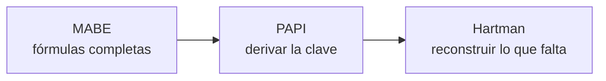

# Arquitectura técnica — las 3 fases de desarrollo

Alcance actualizado: **tres instrumentos** — PAPI, Hartman y MABE.

Documentos de motor: [`PAPI-CALIFICACION.md`](PAPI-CALIFICACION.md) · [`HARTMAN-CALIFICACION.md`](HARTMAN-CALIFICACION.md) · [`MABE-CALIFICACION.md`](MABE-CALIFICACION.md)

---

## 0. Estado real de cada instrumento

Antes de diseñar hay que saber qué tan resuelto está cada motor. El orden de dificultad **no es el que parecía**:

| Instrumento | Cálculo | Ítems | Textos | Bloqueo |
|-------------|:-------:|:-----:|:------:|---------|
| **MABE** | ✅ 100 % | ⚠️ falta plantilla | ✅ en el manual | `PLANTILLA MABE.ppt` ilegible (binario viejo) + cuestionario |
| **PAPI** | ✅ 95 % | ✅ 90 pares extraídos | ✅ en el manual | derivar la clave + 1 protocolo oro |
| **Hartman** | ✅ 98 % | ✅ 36 ítems extraídos | ✅ en el Word | una suposición sobre el bloque `+/−` |

**Ningún instrumento tiene ya incógnitas de cálculo que bloqueen.** MABE resultó ser el más fácil: su Excel nunca estuvo cifrado y sus fórmulas están además escritas en prosa en el manual. Hartman, que parecía el peor, terminó siendo el mejor documentado: su motor completo está en pseudocódigo en `HARTMAN-CALIFICACION.md` §3.15, reconstruido **sin descifrar el archivo**, a partir de las fórmulas leídas celda por celda en pantalla.

Lo que falta ya no es información de los archivos, sino **validación**: tres protocolos reales calificados a mano.

---

## FASE 1 — Front · Aplicación y captura

### 1.1 La decisión que define el costo

Un error caro sería construir "la pantalla del PAPI", "la pantalla del Hartman" y "la pantalla del MABE". Los tres instrumentos, sumados, usan **solo tres formas de responder**:

| # | Tipo de respuesta | Usado por | Validación |
|---|-------------------|-----------|------------|
| **R1** | **Elección forzada A/B** | PAPI — 90 pares | Los 90 pares respondidos, uno por par |
| **R2** | **Ranking sin repetir 1–N** | Hartman — 2 bloques de 18 · MABE valores — 12 bloques de 5 | Permutación completa; Σ = 171 (Hartman) o 15 por bloque (MABE) |
| **R3** | **Puntuación por ítem 1–5** | MABE proceso pensante — persona (60) y puesto (24) | Rango válido, sin ítems vacíos |

> **Se construyen tres componentes de captura, no tres aplicaciones.** Agregar MABE no significa un front nuevo: reutiliza R2 y añade R3. Esta es la razón por la que el tercer instrumento cuesta mucho menos que el primero.

### 1.2 Inventario de pantallas

| Pantalla | Descripción |
|----------|-------------|
| Ingreso | Usuario, contraseña y rol |
| Participantes | Alta y búsqueda; datos demográficos mínimos |
| **Perfiles de puesto** | Alta del puesto y su calificación MABE. **Se califica una vez y se reutiliza** para todos los candidatos evaluados contra él |
| Sesiones | Alta de sesión: participante + batería (una o varias pruebas) + puesto si aplica |
| Captura R1 · R2 · R3 | Los tres componentes anteriores, con autoguardado y opción de pausar |
| Revisión de calificación | Puntajes, banderas de validez, cuadrícula de ítems con las disimilitudes en rojo (Hartman) |
| Perfiles gráficos | PAPI (20 factores) · Hartman (3 axiogramas) · MABE (2 gráficas superpuestas) |
| Informe | Texto borrador editable, aprobación y firma |
| Administración | Usuarios, versiones de metodología, bitácora |

### 1.3 Las gráficas — donde está el trabajo fino del front

No son gráficas de librería genérica. Cada una reproduce una plantilla de papel que el psicólogo ya sabe leer, y romper esa lectura sería un retroceso.

| Gráfica | Complejidad |
|---------|-------------|
| **Perfil PAPI** | 20 columnas 0–9, roles arriba y necesidades abajo, alineadas por díada |
| **Axiogramas Hartman** | 3 láminas × 23 columnas × 7 niveles, con la banda del nivel resaltada |
| **MABE** | **Dos curvas superpuestas** — azul el puesto, rojo la persona — sobre el mismo eje. La lectura clínica es la **brecha entre ambas**, no cada curva |

La de MABE es la más delicada: hay que verificar que ambas curvas comparten escala (§5.1 de `MABE-CALIFICACION.md` señala que las constantes difieren: +70 en proceso pensante, +50 en valores).

### 1.4 Modo de captura

El evaluado sigue respondiendo **en papel**; el psicólogo o el aplicador transcribe. La captura se optimiza para teclear rápido desde el protocolo, no para guiar a alguien que está contestando por primera vez.

> Aplicación en pantalla para el evaluado: **+20 h**, módulo aislado, se enchufa después sin tocar los motores.

---

## FASE 2 — Back · Datos

### 2.1 ¿Cuántas bases de datos? **Una.**

Una sola base **PostgreSQL**. No tres, ni una por prueba.

Es la pregunta correcta y la respuesta importa, porque separar por prueba parece ordenado y sale caro:

| Con 1 base | Con 3 bases (una por prueba) |
|------------|------------------------------|
| Un respaldo, una restauración que probar | Tres de cada uno |
| Una sesión puede aplicar **batería** (PAPI + Hartman + MABE al mismo participante) | Habría que unir datos entre bases a mano |
| Un participante, un historial | El mismo participante duplicado tres veces, sin forma confiable de ligarlo |
| Una bitácora de auditoría | Tres bitácoras parciales; ninguna cuenta la historia completa |
| Un motor de permisos | Tres |

Las tres pruebas comparten el **mismo pipeline** — captura → validez → calificación → interpretación → informe. Lo único que cambia entre ellas es el tipo de respuesta y la fórmula. Eso son **filas distintas en las mismas tablas**, no bases distintas.

### 2.2 Las tablas — 17 en tres grupos

**Grupo A · Metodología** (versionada; solo lectura en operación)

| Tabla | Contenido |
|-------|-----------|
| `tests` | PAPI · Hartman · MABE |
| `test_versions` | Versión de ítems e instrucciones; una marcada como activa |
| `item_blocks` | Bloques de respuesta: PAPI 1 bloque de 90 · Hartman 2 × 18 · MABE 4 bloques |
| `items` | Enunciado, orden, bloque, tipo de respuesta (R1/R2/R3) |
| `scoring_keys` | PAPI: ítem → rol/necesidad · Hartman: norma + clave I/E/S · MABE: ítem → cuadrante o valor |
| `norm_tables` | Tabla Gráfica de Hartman (23 columnas × 42 filas) y constantes de escalado de MABE |
| `interpretation_rules` | Textos por escala, nivel y **par** (díadas PAPI, combinaciones MABE) |

**Grupo B · Operación**

| Tabla | Contenido |
|-------|-----------|
| `participants` | Datos demográficos mínimos |
| `job_profiles` | **Puestos** — nombre, empresa, y su calificación MABE reutilizable |
| `assessment_sessions` | Participante, batería, puesto si aplica, psicólogo responsable, estado |
| `responses` | Respuestas crudas por ítem (JSONB) + tiempos |
| `item_scores` | Detalle por ítem: valor ideal, valor de la persona, diferencia, marca de disimilitud |
| `scores` | Puntaje por escala + nivel resultante |
| `validity_flags` | Σ ≠ 171, disimilitudes impares, DIS ≥ 6, bloques incompletos |
| `reports` | Snapshot de interpretación, notas, estado, firma y versiones usadas |

**Grupo C · Seguridad**

| Tabla | Contenido |
|-------|-----------|
| `users` | Psicólogo · aplicador · administrador |
| `audit_log` | Solo agregado: actor, acción, entidad, antes y después, fecha |

### 2.3 Dos reglas de datos que no se negocian

1. **Los informes son inmutables.** Un informe firmado guarda qué versión de clave, normas y reglas usó. Publicar una clave nueva **nunca** cambia un informe ya emitido. Recalificar es una acción explícita y auditada que produce un informe nuevo, enlazado al anterior.
2. **`job_profiles` es una entidad de primera clase.** MABE compara persona contra puesto. Si el puesto se guardara dentro de la sesión, cada candidato al mismo puesto obligaría a recalificarlo — y dos calificaciones distintas del mismo puesto harían incomparables a dos candidatos.

### 2.4 Los motores son funciones puras

```ts
scorePAPI(respuestas, clave)            → { G: 7, L: 4, …, W: 2 }
scoreHartman(rankingsI, rankingsII, …)  → { DIF, DIM, INT, DIS, VQ, SQ, BQr, BQa, CQ }
scoreMABE(persona, puesto, plantilla)   → { cuadrantes, valores, brechas }
```

Sin base de datos, sin HTTP, sin framework. Es la decisión de arquitectura más importante del proyecto: permite correr miles de casos de prueba en segundos y contrastar el motor contra el Excel sin levantar nada.

---

## FASE 3 — Calificación · El trabajo conjunto con el psicólogo

Tienes razón en que es la fase crítica, aunque por un motivo distinto al esperado: **no es difícil de programar, es difícil de *acordar*.** El código de los tres motores cabe en unos cientos de líneas. Lo caro es tener la certeza de que esas líneas son las correctas.

### 3.1 El riesgo que define esta fase

Un motor de calificación mal calibrado **no truena**. Devuelve un número plausible, dentro de rango, que se imprime en un informe clínico firmado y se usa para decidir sobre una persona. No hay prueba automática que atrape eso: solo un protocolo real calificado a mano.

### 3.2 Protocolo de trabajo — 3 sesiones con el psicólogo

| Sesión | Duración | Objetivo | Sale de aquí |
|--------|:--------:|----------|--------------|
| **1 · Firma de claves** | 2 h | Revisar los puntos donde la transcripción es ambigua | Claves congeladas y firmadas |
| **2 · Contraste** | 2 h | Correr los protocolos oro contra el motor, celda a celda | Lista de discrepancias |
| **3 · Cierre** | 2 h | Resolver discrepancias y firmar la equivalencia | Autorización para pasar a interpretación |

### 3.3 Los puntos concretos que hay que decidir en la sesión 1

Estos ya están identificados. No son dudas abiertas, son preguntas cerradas con opciones:

| # | Instrumento | Decisión |
|---|-------------|----------|
| 1 | **Hartman** | La clave I/E/S transcrita difiere en **7 de 18 ítems** de la composición HVP publicada. ¿Es propio de esta adaptación o un renglón desalineado? |
| 2 | **Hartman** | ¿`DIF` usa las diferencias crudas o las ajustadas con la regla de −2? |
| 3 | **MABE** | Los valores **personales** reparten 6 ítems al económico y 4 al estético; los del **puesto**, 5 a cada uno. Como el producto es superponer ambas curvas, la brecha en esos dos valores queda sesgada. ¿Deliberado o error de plantilla? |
| 4 | **MABE** | ¿El promedio de valores personales es siempre 15 y el total 90? |
| 5 | **PAPI** | Confirmar el ítem 1 real: en el `.docx` el primer par aparece tres veces, dos como ejemplo dentro de las instrucciones |
| 6 | **Los tres** | Redondeo: MABE conserva la fracción exacta `.50` en vez de redondearla. Confirmar que aplica igual en todos los promedios |

### 3.4 Casos oro — el entregable que desbloquea todo

**Uno por instrumento, mínimo.** Un protocolo real ya calificado a mano, con las respuestas *y* todos los resultados.

| Instrumento | Qué debe traer |
|-------------|----------------|
| **PAPI** | Las 90 respuestas A/B + los 20 puntajes |
| **Hartman** | Rankings de ambas partes + DIF, DIM, INT, DIS, VQ, SQ, BQr, BQa, CQ y niveles |
| **MABE** | Los 4 bloques (persona y puesto) + las dos gráficas resultantes |

**Un caso oro de MABE vale doble:** como su Excel sí es legible, permite verificar el motor contra las fórmulas *y* contra un resultado humano a la vez.

### 3.5 Orden de ataque recomendado



Contra la intuición, **conviene empezar por MABE**: es el único con las fórmulas 100 % conocidas, así que sirve para validar que el andamiaje de pruebas, la carga de claves y el pipeline funcionan, antes de enfrentar la parte incierta. Hartman va al final, cuando el motor de contraste ya esté probado con dos instrumentos.

---

## Estimación revisada — tres instrumentos

| Bloque | Horas | USD |
|--------|------:|----:|
| Base de dos instrumentos (PAPI + Hartman) | 216 | 2 160 |
| **+ MABE** — captura R3, perfiles de puesto, motor, 2 gráficas superpuestas, interpretación | **+64** | +640 |
| **− Trabajo metodológico ya resuelto** — ver `CRONOGRAMA.md` §2.1 | **−40** | −400 |
| **Subtotal** | **240** | **2 400** |
| Reserva de riesgo (10 %) | 24 | 240 |
| **TOTAL** | **264 h** | **2 640 USD** |

**Duración:** 15 semanas a ~18 h/semana. Cronograma detallado en [`CRONOGRAMA.md`](CRONOGRAMA.md).

### Por qué el tercer instrumento cuesta 640 USD y no 2 000

| | |
|---|---|
| Reutiliza | Infraestructura, base de datos, autenticación, sesiones, panel, informe, PDF, motor de interpretación, bitácora |
| Reutiliza parcialmente | Componente de captura R2 (ranking) |
| Es nuevo | Componente R3, entidad `job_profiles`, motor MABE, dos gráficas superpuestas, textos de cuadrantes y valores |

Esa proporción — reutilizar mucho más de lo que se agrega — es exactamente lo que la arquitectura de **una sola base y un solo pipeline** compra. Con tres bases separadas, el tercer instrumento habría costado casi lo mismo que el primero.

---

## Lo que se necesita para cerrar la estimación

| # | Entregable | Desbloquea |
|:-:|-----------|-----------|
| 1 | `Calificación Hartman.xlsx` **sin cifrar** o en CSV | El único motor con incógnitas de cálculo |
| 2 | `PLANTILLA MABE.ppt` guardado como **`.pptx`** o PDF | El mapa ítem → letra de MABE |
| 3 | `Grafica PAPI.doc` exportado como **imagen o PDF** | Las bandas de la gráfica del perfil PAPI |
| 4 | El **cuestionario MABE** que responde la persona | Los enunciados de los 4 bloques |
| 5 | **Tres protocolos calificados a mano**, uno por instrumento | La compuerta de la Fase 3 |

No hace falta transcribir nada a mano: los archivos de PAPI, Hartman y el manual de MABE ya se leyeron completos.

---

*Documento técnico de referencia. Complementa `PLAN-ARQUITECTURA-DESARROLLO.md` y `docs/CRONOGRAMA.md`.*
