# Guía ejecutiva del psicólogo
## Operación integral de la plataforma profesional

> **PDF para lectura/impresión:** [`GUIA-PSICOLOGO.pdf`](./GUIA-PSICOLOGO.pdf)

Documento operativo para la persona psicóloga y/o coordinación clínica que administra aplicación de pruebas, revisión de resultados, cursos, clases en vivo y ventas.

---

## 1) Instrumentos activos

- **PAPI**
- **Hartman**
- **MABE**
- **Cleaver (DISC)** — Autodescripción + Factor Humano (Análisis del Trabajo)

### Cleaver — flujo completo

1. Participante aplica Autodescripción (24 series Más/Menos).
2. Psicólogo crea **Perfil de puesto** en `/admin/pruebas/perfiles` (24 ítems 1–5).
3. En la sesión Cleaver, vincular el perfil Factor Humano.
4. Revisar gráficas M/L/T, perfil de puesto y **brecha persona−puesto**.

---

## 2) Flujo clínico principal (pruebas)

1. Entrar al panel profesional.
2. Abrir **Pruebas**.
3. Crear/gestionar **códigos de acceso** (incluye Cleaver).
4. Esperar aplicación por participante.
5. Revisar sesión: **Calificación / Respuestas / Interpretación**.

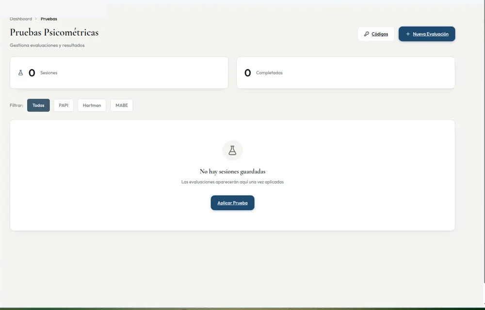

---

## 3) Códigos de acceso

Completar lote, empresa, cupos y pruebas incluidas → generar código → monitorear cupos.

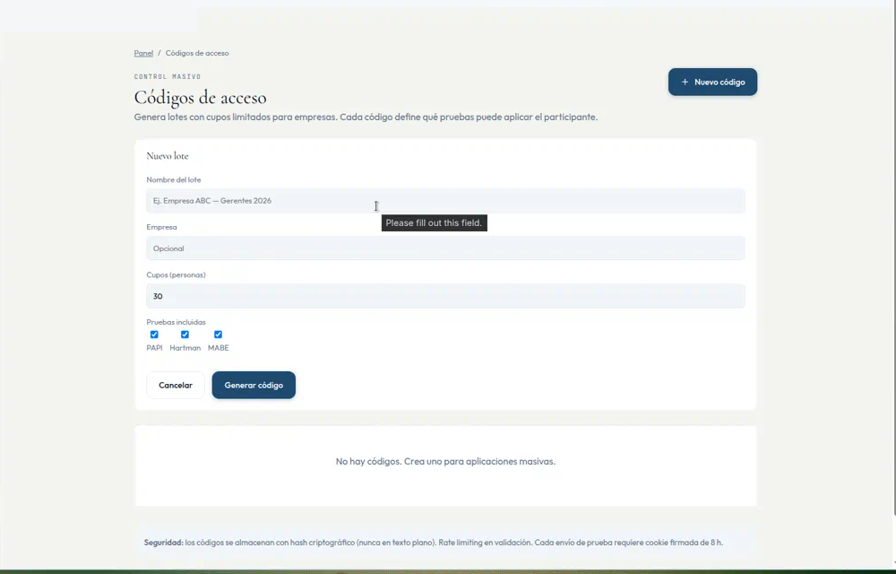

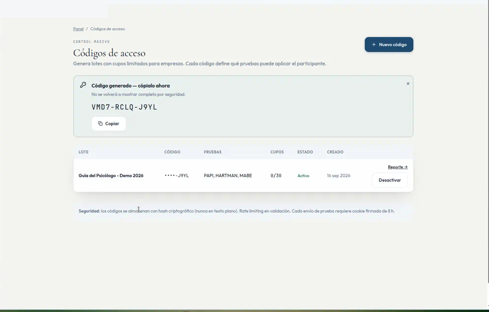

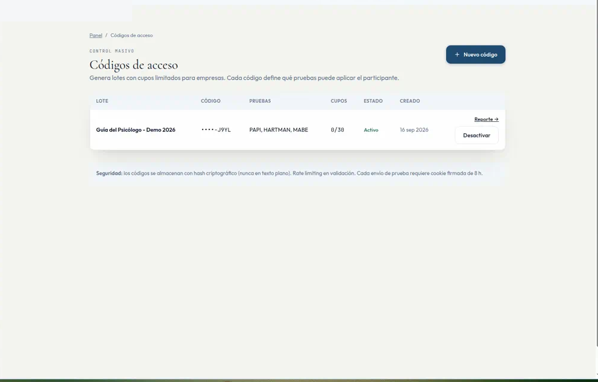

---

## 4) Revisión de sesión

Priorizar validez antes de interpretar. En Cleaver, vincular Factor Humano para ver brecha.

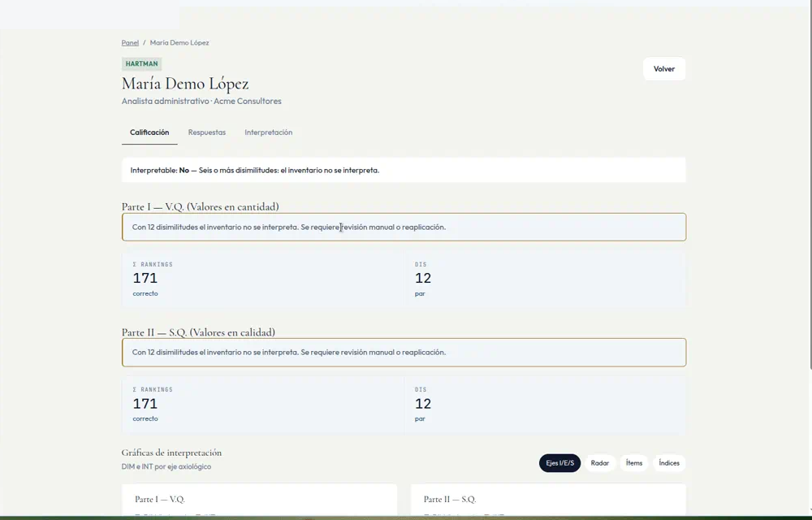

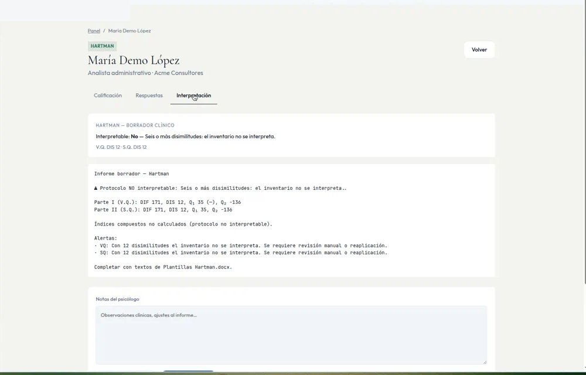

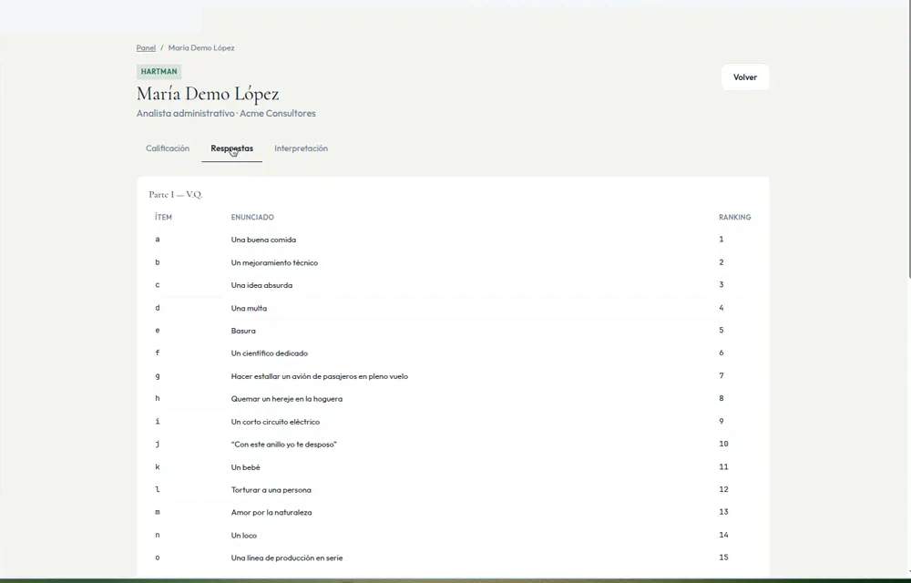

---

## 5) Cursos y catálogo académico

Crear cursos, categorías e inventario para la oferta formativa.

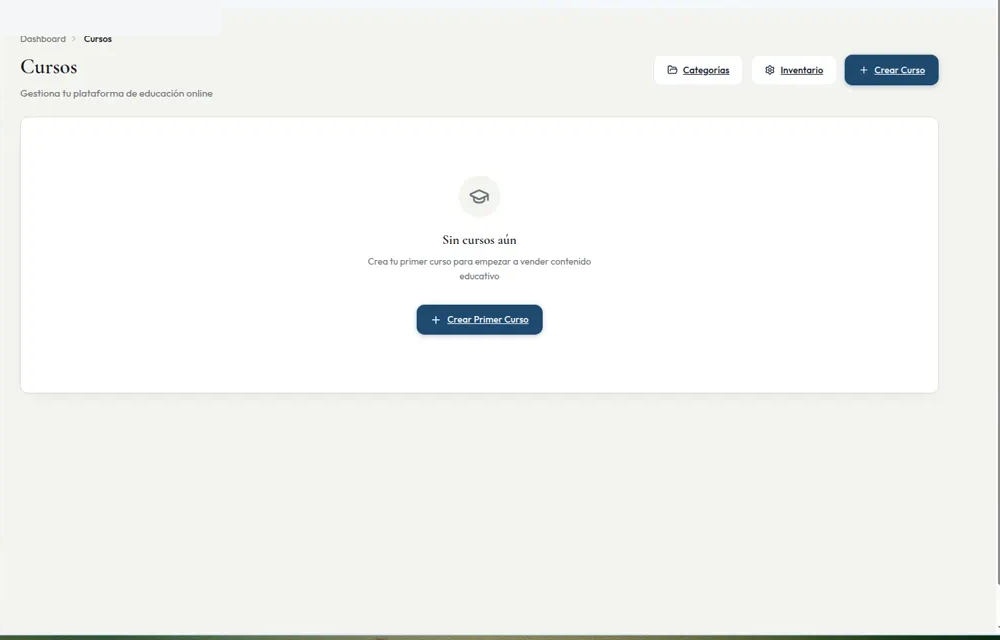

---

## 6) Plataforma de meet propia (clases en vivo)

Programación, seguimiento y trazabilidad de sesiones sincrónicas.

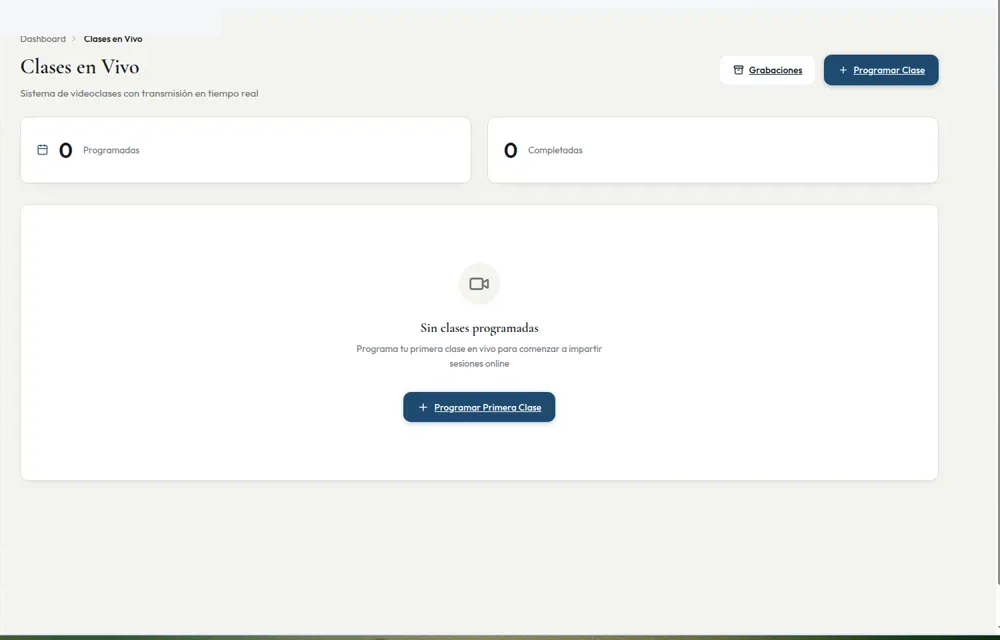

---

## 7) Sistema de ventas y cobros

Pagos (ingresos, transacciones, reportes) + marketing.

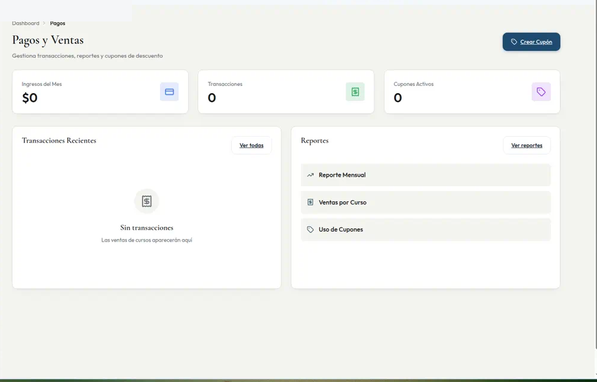

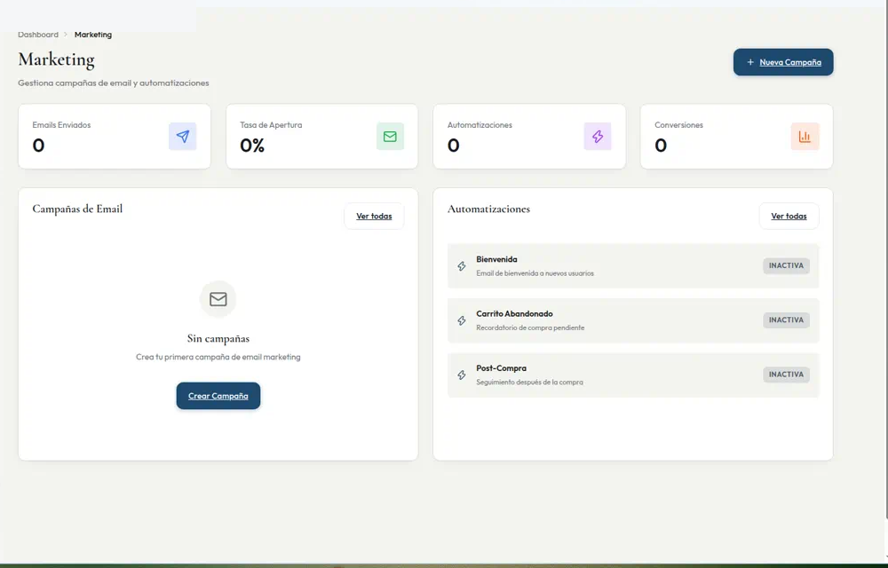

---

## 8) Checklist ejecutivo

1. Definir campaña e instrumento (incl. Cleaver si aplica).
2. Generar lote de códigos.
3. Si Cleaver: crear Análisis del Trabajo del puesto.
4. Monitorear aplicaciones.
5. Validar protocolo e interpretar.
6. Vincular perfil de puesto y revisar brecha.
7. Cursos / clases en vivo / cobro según plan.

---

## 9) Rutas rápidas

- `/admin/pruebas`
- `/admin/pruebas/codigos`
- `/admin/pruebas/perfiles` — Análisis del Trabajo Cleaver
- `/admin/pruebas/sesiones/[id]`
- `/admin/cursos`
- `/admin/clases-vivo`
- `/admin/pagos`
- `/admin/marketing`
- `/evaluacion/cleaver`
