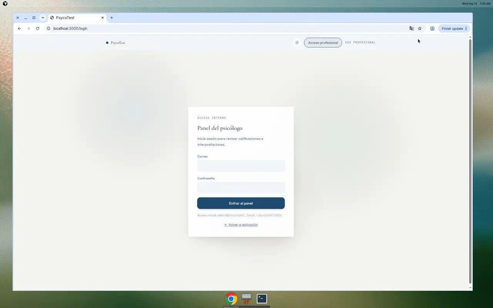
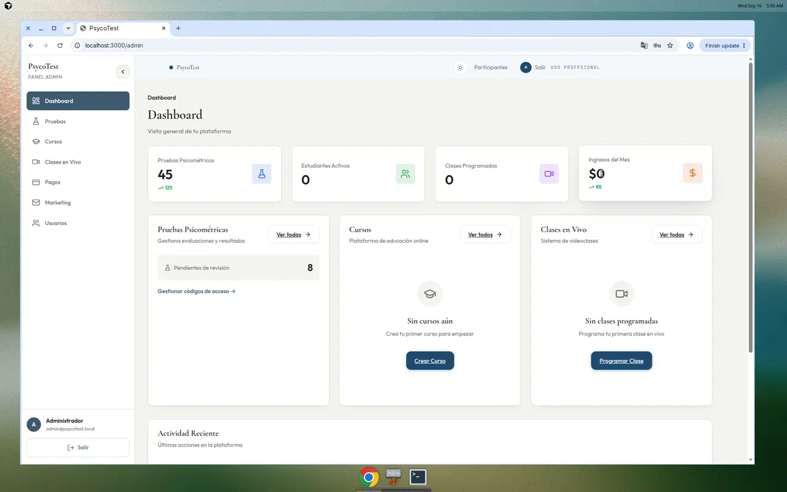
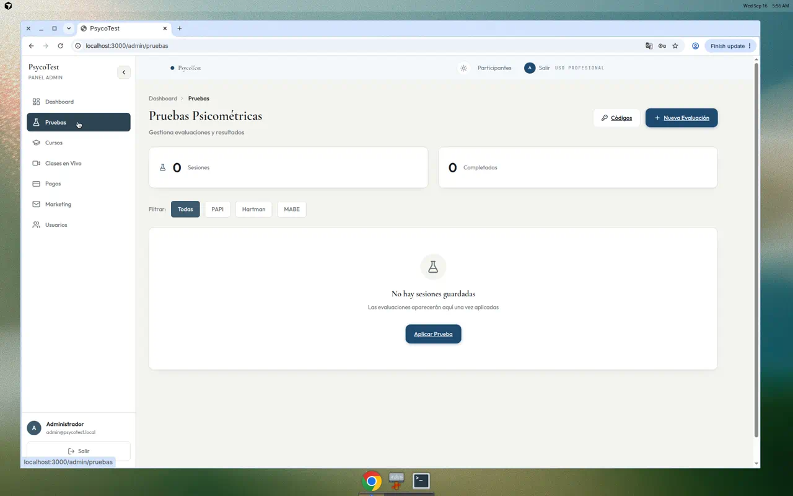
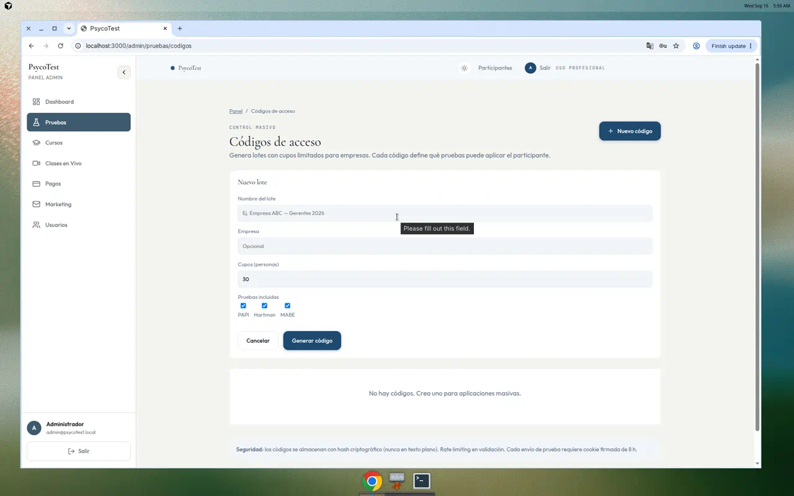
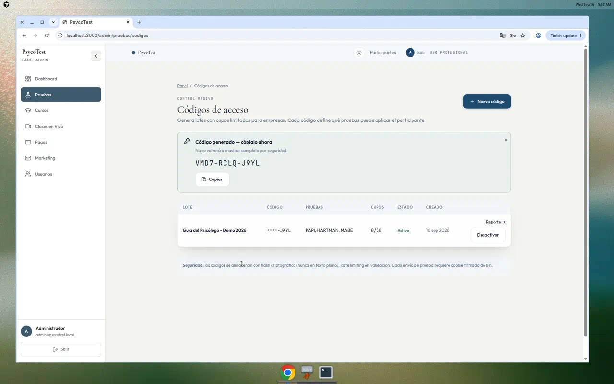
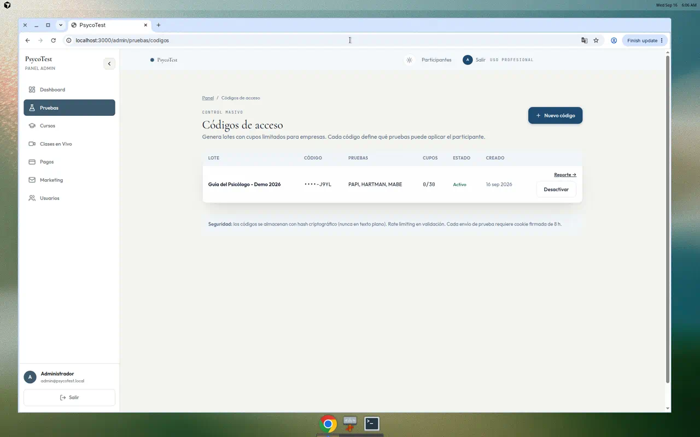
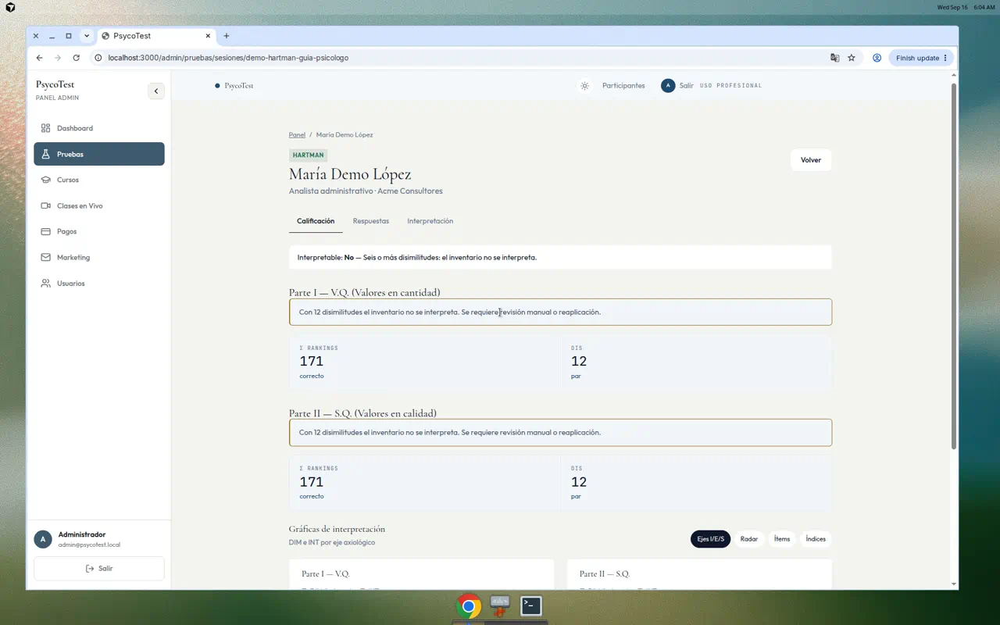
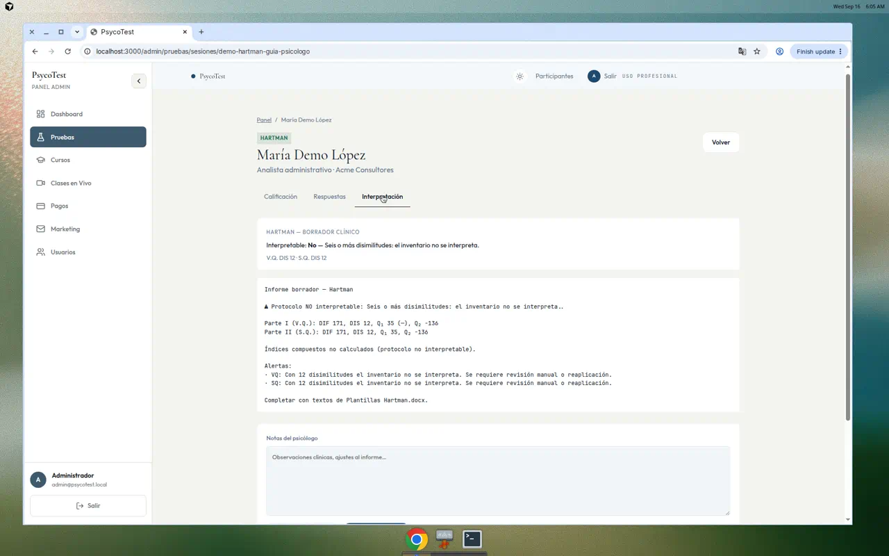
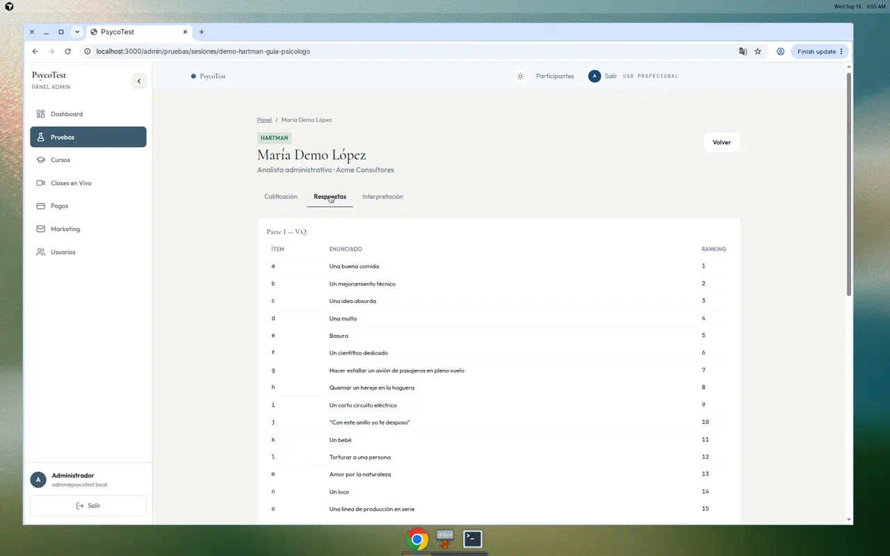

# Guía del psicólogo — PsycoTest
## Resumen ejecutivo de uso del panel profesional

Documento operativo para el profesional que aplica, califica e interpreta pruebas psicométricas en la plataforma. Flujo cubierto: **acceso → panel → códigos → revisión de sesión (calificación / respuestas / interpretación)**.

Instrumentos disponibles en el panel: **PAPI**, **Hartman** y **MABE**.

> **PDF para lectura/impresión:** [`GUIA-PSICOLOGO.pdf`](./GUIA-PSICOLOGO.pdf) (mismas capturas e índice operativo).

---

## 1. Acceso al panel

1. Abrir la plataforma y entrar a **Acceso profesional** (`/login`).
2. Iniciar sesión con las credenciales del consultorio.
3. Pulsar **Entrar al panel**.

> Credenciales de demo iniciales (entorno de prueba): `admin@psycotest.local` / `psycotest2026`.



**Resultado:** acceso al área interna para revisar calificaciones e interpretaciones.

---

## 2. Dashboard — vista general

Tras el login se muestra el **Dashboard** (`/admin`): resumen de pruebas, estudiantes, clases en vivo e ingresos, con atajos a lo más usado.



Acciones frecuentes desde aquí:

| Acción | Dónde |
|--------|--------|
| Ver evaluaciones | **Pruebas** → *Ver todas* |
| Generar códigos de acceso | **Gestionar códigos de acceso** |
| Salir del panel | **Salir** (barra superior o pie del menú) |

---

## 3. Pruebas psicométricas

En **Pruebas** (`/admin/pruebas`) se concentran las sesiones aplicadas.



Qué puede hacer el psicólogo:

- Filtrar por instrumento (**Todas / PAPI / Hartman / MABE**).
- Abrir **Códigos** para lotes de aplicación masiva.
- Iniciar una **Nueva evaluación** / **Aplicar prueba**.
- Cuando existan sesiones, abrir el detalle de cada una para calificar e interpretar.

Las evaluaciones aparecen en esta lista **después de que el participante las complete**.

---

## 4. Códigos de acceso (aplicación masiva)

Ruta: `/admin/pruebas/codigos`.

Los códigos permiten entregar a una empresa o grupo un lote con cupos limitados. Cada código define **qué pruebas** puede aplicar el participante.

### 4.1 Crear un lote

1. Pulsar **+ Nuevo código**.
2. Completar:
   - **Nombre del lote** (obligatorio)
   - **Empresa** (opcional)
   - **Cupos** (número de personas)
   - **Pruebas incluidas** (PAPI, Hartman, MABE)
3. Pulsar **Generar código**.



### 4.2 Código generado

Al generar el lote, la plataforma muestra el **código en claro una sola vez**. Debe copiarse y entregarse a la empresa o al responsable de aplicación.



### 4.3 Listado de lotes

La tabla muestra nombre, empresa, cupos usados/disponibles, pruebas incluidas y estado. Desde aquí se puede **desactivar** un código o ver su detalle.



---

## 5. Revisar una sesión completada

Cuando un participante termina una prueba, la sesión aparece en **Pruebas**. Al abrirla, el psicólogo dispone de tres pestañas:

| Pestaña | Uso clínico |
|---------|-------------|
| **Calificación** | Índices automáticos, alertas de validez y gráficas |
| **Respuestas** | Auditoría ítem por ítem |
| **Interpretación** | Borrador clínico + notas del psicólogo |

Ejemplo de sesión demo: **Hartman — María Demo López** (Analista administrativo · Acme Consultores).

### 5.1 Calificación



En Hartman se muestran, entre otros:

- Validez / interpretabilidad (p. ej. disimilitudes **DIS**).
- Sumatorias de rankings (**Σ RANKINGS**).
- Separación **Parte I (V.Q.)** y **Parte II (S.Q.)**.
- Controles de gráfica (**Ejes / Radar / Ítems / Índices**).

Si el protocolo **no es interpretable**, el sistema lo marca de forma explícita (p. ej. seis o más disimilitudes) para evitar un informe inválido.

### 5.2 Interpretación



La pestaña ofrece:

1. Estado de interpretabilidad.
2. **Borrador clínico** generado por el motor (índices, alertas).
3. Campo **Notas del psicólogo** para observaciones y ajustes al informe final.

El borrador es apoyo técnico; la firma clínica permanece en el profesional.

### 5.3 Respuestas



Sirve para contrastar el protocolo original, resolver dudas de captura o documentar reaplicación.

---

## 6. Flujo recomendado (checklist)

```
1. Entrar al panel profesional
2. Crear lote de códigos (empresa, cupos, pruebas)
3. Entregar el código al responsable de aplicación
4. Esperar a que el participante complete la(s) prueba(s)
5. Abrir la sesión en Pruebas
6. Revisar Calificación (validez primero)
7. Si es interpretable → revisar Interpretación y completar notas
8. Si NO es interpretable → reaplicar o documentar revisión manual
9. Usar Respuestas solo para auditoría cuando haga falta
```

---

## 7. Buenas prácticas

- **Validez antes que narrativa:** si el motor marca no interpretable, no forzar perfil clínico.
- **Códigos de un solo uso operativo:** copiar el código al generarlo; no se vuelve a mostrar en claro.
- **Un lote por campaña:** nombre claro (empresa + grupo + año) facilita el seguimiento de cupos.
- **Notas del psicólogo:** registrar contexto laboral, observaciones de aplicación y decisiones de retest.
- **Filtros por instrumento:** en listados mixtos, filtrar PAPI / Hartman / MABE acelera la revisión.

---

## 8. Mapa rápido de rutas

| Pantalla | Ruta |
|----------|------|
| Login profesional | `/login` |
| Dashboard | `/admin` |
| Pruebas / sesiones | `/admin/pruebas` |
| Códigos de acceso | `/admin/pruebas/codigos` |
| Detalle de sesión | `/admin/pruebas/sesiones/[id]` |

---

*PsycoTest — uso profesional. Esta guía describe el flujo del psicólogo en el panel admin; no sustituye los manuales técnicos de calificación de cada instrumento.*
