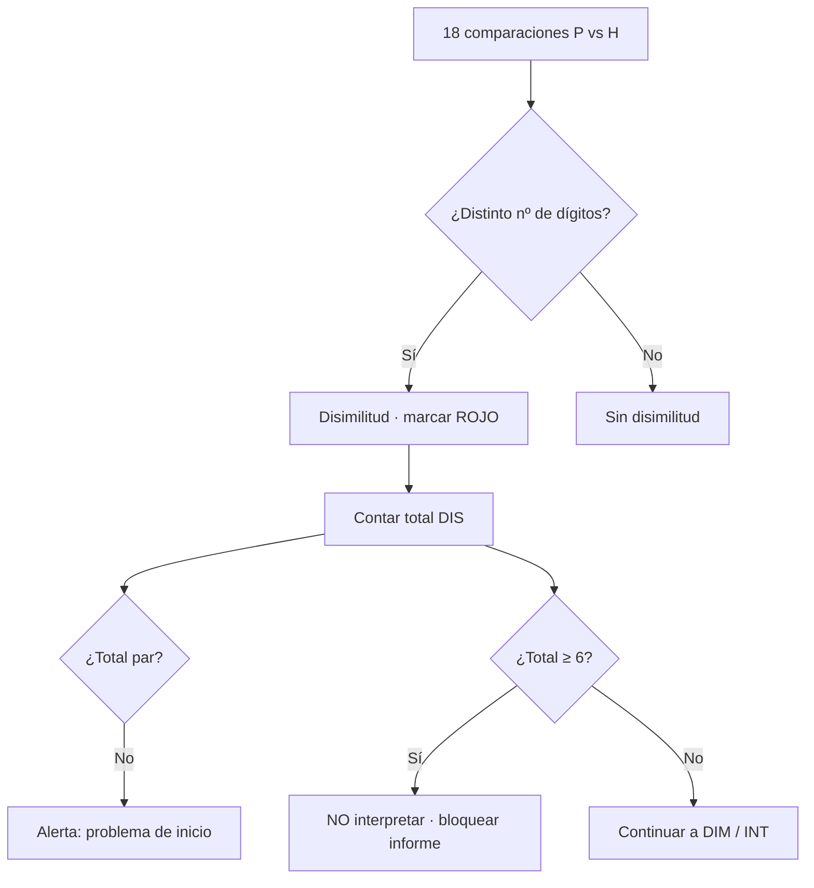
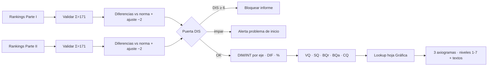

# Especificación de calificación — Inventario de Valores Hartman (HVP)

Fuentes: hojas **Hartman** y **Gráfica** de `Calificación Hartman.xlsx` (transcritas por el equipo, julio 2026) + `Plantillas Hartman.docx` (extraído automáticamente de este repo).

Convención: **✅ verificado** · **⚠️ hipótesis con prueba definida** · **❌ pendiente de terceros**.

> **Revisión 3 — cerrada con la captura de pantalla del libro (julio 2026)**
>
> La captura reveló las **letras de columna** de la hoja, lo que permitió cruzarlas con las celdas de referencia que el equipo había citado. Resultado:
>
> 1. ✅ **La clave I/E/S queda confirmada de forma independiente.** Las 18 celdas citadas caen exactamente en la fila del eje que les corresponde. Ya no es un punto de riesgo de transcripción — §2.5.
> 2. ✅ **La regla de signo queda resuelta y era distinta a lo documentado:** depende de los dígitos del **valor ideal de Hartman**, no de los del examinado — §3.1.
> 3. ✅ **`BQr`, `BQa` y `CQ` resueltos**, y se aclara que `VQ` y `SQ` tienen dos componentes: **(1) cantidad** y **(2) calidad** — §3.7.
> 4. ✅ **Mapa de celdas de la hoja** — §2.7.
>
> **Revisión 2 — cambios respecto a la versión anterior de este documento**
>
> 1. **`DIF` no es 171.** El 171 es la comprobación de integridad (Σ rankings). `DIF` es el puntaje de diferenciación y su rango normativo es **22–80**. Detalle y evidencia en §3.6.
> 2. **No existe una "Parte III" de entrada.** El instrumento tiene **2 partes de aplicación** y **3 axiogramas de salida**. Pendiente cerrado — §2.1.
> 3. **El ejemplo del Excel es un protocolo perfecto, no un caso oro.** Sus rankings son exactamente el orden normativo de Hartman, por eso todo da 0 / 57 / 171. No sirve para validar el motor — §2.4.
> 4. **Orden normativo de Hartman identificado y ligado a las 18 frases** — §2.5.
> 5. **Mapa completo de las 23 columnas de la hoja Gráfica** — §5.

---

## 1. Hojas del libro Excel

| Hoja | Función en la plataforma |
|------|---------------------------|
| **Hartman** | Motor por parte: entradas (rankings), diferencias, DIF/DIM/INT/DIS, índices **VQ**, **SQ**, compuestos **BQr**, **BQa** |
| **Gráfica** | Tabla de conversión puntaje bruto → **nivel de desarrollo 1–7** para las 23 columnas del perfil |

---

## 2. Estructura del instrumento

### 2.1 Dos partes de entrada, tres axiogramas de salida ✅

`Plantillas Hartman.docx` contiene, en este orden:

| Bloque | Contenido | Rol |
|--------|-----------|-----|
| **Parte I** | 18 **frases** ("Una buena comida", "Un bebé", "Esclavitud"…) | **Entrada** → bloque **V.Q.** del Excel — valoración del **mundo externo** |
| **Parte II** | 18 **citas** ("Me gusta mi trabajo y me hace bien", "Estoy contento con ser yo mismo"…) | **Entrada** → bloque **S.Q.** del Excel — valoración **consigo mismo** |
| **Axiograma 1** | "VALORACIÓN CON EL MUNDO EXTERNO", niveles 1–7 | **Salida** |
| **Axiograma 2** | "VALORACIONES CONSIGO MISMO", niveles 1–7 | **Salida** |
| **Axiograma 3** | "SUMARIO DE CONCLUSIONES" (DIF 1/2, BQr 1, BQa 1, CQ 1) | **Salida** |

> **Pendiente cerrado.** La versión anterior listaba una "Parte III (18 citas consigo mismo)" como incógnita bloqueante de M5. No existe: lo que se leyó como tercer bloque son los **axiogramas de salida**. Encaja perfectamente con el Excel, que tiene exactamente dos bloques de cálculo (V.Q. y S.Q.).

### 2.2 Validación de respuesta

- Cada parte recibe una **permutación de 1 a 18** sin repetir (1 = mayor valor, 18 = menor).
- **Integridad:** Σ rankings = **171**. El Excel muestra esta comprobación dos veces por bloque (`171`, diferencia `0`).

### 2.3 Puntos por ítem

```text
puntos(R) = 19 − R          // ranking 1 → 18 puntos ; ranking 18 → 1 punto
```

Σ puntos de los 18 ítems = **171** siempre.

> **Advertencia sobre los "57".** Las celdas `I DIM 57 / E DIM 57 / S DIM 57` del ejemplo son la suma de `19 − R` por eje. Como Σ total es constante (171), **estos tres subtotales siempre suman 171 y no son el puntaje DIM del perfil**. El `DIM I/E/S` de la hoja Gráfica tiene rango 1–42 (§5) y es un puntaje de **desviación**, no de puntos. No confundirlos al implementar.

### 2.4 El ejemplo del Excel es el protocolo perfecto ✅

Los rankings del ejemplo (`6 9 10 11 13 5 17 16 12 4 1 18 2 14 8 15 3 7`) son **idénticos** a la fila de valores ideales de Hartman. Es decir, el Excel transcrito está en su estado plantilla, con las celdas del examinado pre-cargadas con la norma.

Por eso todas las diferencias son 0, `DIS` = 0 y los tres DIM dan 57. **No sirve como caso de prueba del motor** — solo verifica el caso degenerado. Se necesita **❌ al menos un protocolo real calificado a mano** (ver §7).

### 2.5 Orden normativo de Hartman + clave I/E/S ✅⚠️

Cruzando la fila de ideales del Excel con las 18 frases de la Parte I del Word:

| Ítem | Frase (Parte I) | Rank ideal | Clave |
|------|-----------------|-----------:|:-----:|
| a | Una buena comida | 6 | **E** |
| b | Un mejoramiento técnico | 9 | **S** |
| c | Una idea absurda | 10 | **S** |
| d | Una multa | 11 | **E** |
| e | Basura | 13 | **E** |
| f | Un científico dedicado | 5 | **I** |
| g | Hacer estallar un avión de pasajeros en pleno vuelo | 17 | **E** |
| h | Quemar un hereje en la hoguera | 16 | **S** |
| i | Un corto circuito eléctrico | 12 | **S** |
| j | "Con este anillo yo te desposo" | 4 | **I** |
| k | Un bebé | 1 | **I** |
| l | Torturar a una persona | 18 | **I** |
| m | Amor por la naturaleza | 2 | **E** |
| n | Un loco | 14 | **I** |
| o | Una línea de producción en serie | 8 | **E** |
| p | Esclavitud | 15 | **I** |
| q | Un genio matemático | 3 | **S** |
| r | Un uniforme | 7 | **S** |

Significado de la clave: **I** = juicio de individualidad (intrínseco) · **E** = juicio práctico concreto (extrínseco) · **S** = juicio lógico-conceptual (sistémico). Seis ítems por eje.

- ✅ **El orden de rankings ideales queda confirmado** — reproduce el orden normativo publicado del HVP (bebé, amor por la naturaleza, genio matemático, … , torturar a una persona) sin una sola discrepancia. Esto valida la transcripción del Excel.
- ✅ **La clave I/E/S queda confirmada por triple concordancia.** Las 18 celdas que el equipo citó como referencia (`K11`, `S11`, `U11`, `A14`… `Q17`) caen **cada una en la fila del eje que le corresponde**: las 6 de la fila 11 son exactamente los ítems **I**, las 6 de la fila 14 los **E** y las 6 de la fila 17 los **S**. Tres fuentes independientes coinciden — la fila de clasificación, la distribución de los rankings en las tres filas, y las referencias de celda. **No hay error de transcripción.**
- ⚠️ **Queda solo la confirmación clínica.** Esta clave difiere en 7 de 18 ítems de la composición I/E/S más difundida del HVP (`f` científico dedicado, `g` estallar un avión, `h` quemar un hereje, `m` amor por la naturaleza, `n` un loco, `p` esclavitud, `r` un uniforme). Al estar descartado el error de transcripción, lo más probable es que sea una particularidad de esta adaptación al español. Basta que el psicólogo lo confirme de palabra; ya no bloquea el desarrollo.

**Prueba mecánica que debe pasar la clave:** exactamente 6 ítems por eje (6 I + 6 E + 6 S = 18).

### 2.7 Mapa de celdas de la hoja Hartman ✅

Cada ítem ocupa **dos columnas**: una angosta para la **diferencia** y una ancha para el **ranking**.

| Ítem | a | b | c | d | e | f | g | h | i | j | k | l | m | n | o | p | q | r |
|------|---|---|---|---|---|---|---|---|---|---|---|---|---|---|---|---|---|---|
| **Col. diferencia** | A | C | E | G | I | K | M | O | Q | S | U | W | Y | AA | AC | AE | AG | AI |
| **Col. ranking** | B | D | F | H | J | L | N | P | R | T | V | X | Z | AB | AD | AF | AH | AJ |

Verificado por partida doble: las celdas de la regla de signo citadas por el equipo (`K11`, `A14`, `C17`…) caen en las columnas **impares**, y las fórmulas `AM11 = SUM(L11+T11+V11+X11+AB11+AF11)` y `AM14 = +B14+H14+J14+N14+Z14+AD14` leen las columnas **pares** — exactamente un desplazamiento de +1 sobre las mismas 6 posiciones de cada eje.

| Fila (bloque V.Q.) | Contenido |
|--------------------|-----------|
| 6 | Etiquetas `a`–`r` |
| 8 | **Rankings ideales de Hartman** |
| **11** | Rankings del examinado — eje **I** (f, j, k, l, n, p) |
| **14** | Rankings del examinado — eje **E** (a, d, e, g, m, o) |
| **17** | Rankings del examinado — eje **S** (b, c, h, i, q, r) |
| 20 | Fila de clave `E S S E E I E S S I I I E I E I S S` |

El bloque **S.Q.** repite la misma estructura más abajo. Columnas de salida: `AM` = DIF · `AO` = DIM y DIM% · `AP` = INT e INT% · `AQ` = DIS · `AR`/`AS` = componentes **+** y **−** · `AU` = **±** · `BA` = DIM global, D.I. y A.I.

### 2.6 Dígitos (regla de comparación)

| Rango | Tratamiento |
|-------|-------------|
| **1–9** | número de **1 dígito** |
| **10–18** | número de **2 dígitos** |

---

## 3. Cálculo por parte

Notación: para cada ítem, `H` = ranking ideal de Hartman, `P` = ranking del examinado.

### 3.1 Diferencias con signo

**Magnitud base**

```text
d_raw = |P − H|
```

**Signo** ✅ *(corregido en la revisión 3)*

El signo **no depende de los dígitos del examinado, sino de los del valor ideal de Hartman**:

| Si el ideal `H` es… | La diferencia es **negativa** cuando |
|---------------------|--------------------------------------|
| **1 dígito** (1–9) — ítem de valor **alto** | `P > H` — el examinado lo colocó **peor** que la norma |
| **2 dígitos** (10–18) — ítem de valor **bajo** | `P < H` — el examinado lo colocó **mejor** que la norma |

```ts
const esNegativa = (H <= 9) ? (P > H) : (P < H);
```

**Cómo se determinó.** El equipo había citado dos grupos de nueve celdas. Al cruzarlos con el mapa de columnas (§2.7), los grupos resultaron ser **exactamente** los ítems cuyo ideal tiene uno y dos dígitos:

| Grupo de celdas | Ítems que resultan | Ideales de ese grupo |
|-----------------|--------------------|----------------------|
| `K11 S11 U11 A14 Y14 AC14 C17 AG17 AI17` | **a b f j k m o q r** | los 9 ideales de **1 dígito** — coincidencia exacta |
| `W11 AA11 AE11 G14 I14 M14 E17 O17 Q17` | **c d e g h i l n p** | los 9 ideales de **2 dígitos** — coincidencia exacta |

Es decir, **cada celda de la plantilla ya viene pre-clasificada por el número de dígitos de su ideal**, y la condición que se evalúa es la comparación `P` contra `H`.

**Por qué la formulación anterior no podía ser la correcta:** si la condición dependiera de los dígitos del examinado, quedarían casos sin clasificar. Con `H = 6` y `P = 15`, el examinado tiene 2 dígitos y `P > H`, así que no cumple ninguna de las dos reglas tal como estaban escritas. Con la regla corregida el caso queda resuelto: `H ≤ 9` y `P > H` ⇒ negativa. **Las 18 × 18 combinaciones quedan cubiertas sin huecos.**

**Sentido axiológico:** la diferencia es negativa cuando el examinado *comprime* su valoración hacia el centro — subvalora algo bueno o sobrevalora algo malo. Es positiva cuando la *expande*. Coincide con el concepto de inversión de valores del HVP.

⚠️ **Confirmar con el protocolo oro:** que un caso con `H ≤ 9` y `P` de dos dígitos efectivamente salga negativo.

### 3.2 Ajuste "restar 2"

```text
ajuste(d) = |d| ≤ 2 ? 0 : |d| − 2        // conservando el signo de d
```

Es decir: diferencias de 0, 1 o 2 se anulan (tolerancia); a partir de 3 se descuentan 2 puntos.

### 3.3 Persistencia por ítem

Guardar siempre las cinco columnas, no solo el agregado — es lo que permite al psicólogo auditar un informe y lo que hace depurables los casos raros:

```ts
{ item: "a", hartman: 6, persona: 9, d_signed: +3, d_ajustada: +1, es_disimilitud: false }
```

### 3.4 Disimilitudes (DIS) — puerta de validez

- **Disimilitud:** `P` y `H` tienen **distinta cantidad de dígitos** (uno 1–9 y el otro 10–18, en cualquier sentido).
- **Presentación:** marcar en **rojo** en la cuadrícula a–r.
- **Paridad:** el total **debe ser PAR**. Impar ⇒ alerta de **"problema de inicio"**.
- **Corte:** con **6 o más** disimilitudes **no se interpreta el inventario**. El motor bloquea el informe automático.



Esta puerta se evalúa **antes** de calcular DIM/INT y antes de cualquier lookup en la hoja Gráfica.

> ### Por qué la regla de paridad es en realidad un detector de errores de captura ✅
>
> La norma tiene exactamente **9 valores de un dígito** (1–9) y **9 de dos dígitos** (10–18). Una permutación válida de 1 a 18 también. Por lo tanto, el número de posiciones donde el examinado puso un dígito y la norma dos **tiene que ser igual** al número de posiciones donde ocurre lo contrario — de lo contrario no cuadrarían los conteos. De ahí que `DIS` sea **siempre par**.
>
> Verificado empíricamente: **10 000 permutaciones aleatorias, cero con `DIS` impar** (`src/lib/hartman.test.ts`).
>
> **Consecuencia:** un `DIS` impar no es un hallazgo clínico — es matemáticamente imposible en un protocolo bien capturado. Solo puede ocurrir si hay un número repetido, uno faltante o un error de transcripción. Es exactamente lo que dice el manual (*"refleja un problema de inicio"*), ahora con la explicación de por qué.
>
> **Para el producto:** como la plataforma valida la permutación y la suma 171 **en el momento de capturar**, el caso que la regla detecta ya no puede llegar al motor. La alerta se conserva por trazabilidad, pero el problema queda prevenido en el origen.

### 3.5 Agregados por eje

| Campo | Cálculo | Fórmula Excel de referencia |
|-------|---------|------------------------------|
| **DIM I / E / S** | Suma de diferencias ajustadas de los 6 ítems del eje | filas 11 / 14 / 17 |
| **INT I / E / S** | Componente de integración por eje | `AP12`, `AP15`, `AP18` |
| **DIM %** | `AO6 × 100 / AM6` | — |
| **INT %** | análogo a DIM% | — |
| **D.I.** | capacidad de concentración | ❌ fórmula pendiente |
| **A.I. / A.I. %** | actitud positiva/dinámica | ❌ fórmula pendiente |

Las columnas **+ / − / ±** acumulan por separado los componentes positivos y negativos de las diferencias ajustadas.

### 3.6 DIF — corrección ✅

**`DIF` = puntaje de diferenciación = suma de las diferencias entre el orden del examinado y el orden normativo.**

Evidencia de que **no** es 171:

1. La hoja **Gráfica** lista `DIF` únicamente con valores **pares del 22 al 80** (nivel 1: 22–30 · nivel 2: 32–40 · nivel 3: 42–50 · nivel 4: 52–60 · nivel 5: 62–70 · nivel 6: 72–80). Un valor constante de 171 no tendría columna de perfil.
2. **Σ|P − H| sobre una permutación es siempre par** — lo que explica exactamente por qué la tabla solo contiene números pares.
3. El protocolo perfecto (§2.4) debe puntuar *mejor que Excelente*, es decir cerca de **0**, no 171.
4. El `171` de la cabecera aparece dos veces por bloque junto a un `0` de diferencia: es la comprobación **Σ rankings = 171**, no un puntaje.

⚠️ **A confirmar con un protocolo real:** si `DIF` usa las diferencias **crudas** (`Σ|P−H|`, lo más probable dado el rango 22–80) o las **ajustadas** de §3.2. Un solo protocolo calificado a mano resuelve la duda.

### 3.7 Índices compuestos

✅ *(resuelto en la revisión 3)*

**Cada parte produce dos cifras, no una:** un componente **(1) cantidad** y un componente **(2) calidad**. Esto explica por qué la hoja Gráfica tiene columnas duplicadas para VQ, SQ, BQr, BQa y CQ.

| Índice | Componente 1 | Componente 2 |
|--------|--------------|--------------|
| **VQ** | Capacidad de valoración — **cantidad** | — **calidad** |
| **SQ** | Capacidad de autovaloración — **cantidad** | — **calidad** |

Y los tres compuestos se calculan **por separado para cada componente**:

```text
BQr(n) = SQ(n) / VQ(n)                 // razón — balance externo vs interno
BQa(n) = ( SQ(n) + VQ(n) ) / 2         // promedio — capacidad axiológica global
CQ(n)  = BQr(n) × BQa(n)               // capacidades combinadas

para n = 1 (cantidad) y n = 2 (calidad)
```

Verificación con el bloque `1)` de la plantilla en su estado ideal: `SQ = 171`, `VQ = 171` ⇒ `BQr(1) = 171/171 = 1.00` ✓ y `BQa(1) = (171+171)/2 = 171.0` ✓. El bloque `2)` está vacío (`SQ = VQ = 0`), de ahí el `#DIV/0!` en `BQr(2)`.

### 3.8 Cadena de cálculo — leída del libro ✅

Fórmulas obtenidas directamente de la barra de fórmulas del bloque **V.Q.** (Parte I). El bloque **S.Q.** repite la misma estructura desplazada 19 filas.

| Celda | Fórmula real | Significado |
|-------|--------------|-------------|
| `AM6` | `=+AM11+AM14+AM17` | **DIF** = subtotal eje **I** + eje **E** + eje **S** |
| `AO6` | `=+BA12` | **DIM** global, tomado del bloque de balance de la derecha |
| `BA12` | `=SUM(BA9:BA11)` | Suma de los tres componentes del bloque DIM |
| `AP6` | `=+AP12+AP15+AP18` | **INT** global = INT I + INT E + INT S |
| `AQ6` | *(sin fórmula)* | **DIS se captura a mano** — ver §3.9 |
| `AS6` | `=+AM6+AO6+AP6+AQ6` | **VQ (1)** = **DIF + DIM + INT + DIS** |
| `AU6` | `=+AS6-AM6` | **VQ (2)** = VQ(1) − DIF = **DIM + INT + DIS** |
| `AQ44` | `=(+AS25+AS6)/2` | **BQa (1)** = ( SQ(1) + VQ(1) ) / 2 |
| `AO9` | `=+AP6*100/AM6` | **INT %** = INT × 100 / DIF |
| (simétrica) | `=+AO6*100/AM6` | **DIM %** = DIM × 100 / DIF |

**El eslabón que faltaba queda resuelto:**

```text
VQ(1) = DIF + DIM + INT + DIS        // "cantidad" — incluye la diferenciación
VQ(2) = DIM + INT + DIS              // "calidad"  — la excluye
SQ(1), SQ(2) = idéntico sobre el bloque Parte II
```

La distinción cantidad/calidad es simplemente **con y sin `DIF`**. Verificación con la plantilla en estado ideal: `DIF = 171`, `DIM = 0`, `INT = 0`, `DIS` vacío ⇒ `VQ(1) = 171` ✓ y `VQ(2) = 171 − 171 = 0` ✓ — exactamente los valores que muestra la hoja.

### 3.9 `DIS` no está automatizado en el Excel ✅

La celda `AQ6` **está vacía de fórmula**: contiene solo el comentario que describe la regla. El psicólogo cuenta a mano las discrepancias marcadas en rojo y teclea el número.

> **Decisión de producto:** la plataforma **sí debe calcular DIS automáticamente**. La regla está completamente especificada en §3.4 (distinta cantidad de dígitos entre `P` y `H`), así que automatizarla elimina un conteo manual propenso a error del que dependen las dos puertas de validez — la de paridad y la del corte en 6. Es una mejora real sobre la hoja de cálculo, no solo una traducción de ella.

### 3.10 Subtotales por eje — resueltos ✅

```
AM11 = SUM(L11+T11+V11+X11+AB11+AF11)     // DIM del eje I
AP12 =    +L12+T12+V12+X12+AB12+AF12      // INT del eje I
```

Las columnas `L, T, V, X, AB, AF` son las de los **seis ítems del eje I** (`f, j, k, l, n, p`), y las dos fórmulas leen **filas distintas de las mismas columnas**:

| Fila | Contenido | Alimenta |
|:----:|-----------|----------|
| **11** | El **ranking que escribió el examinado** | `AM11` → **DIM** del eje |
| **12** | La **diferencia ajustada** (regla −2 de §3.2), escrita *debajo* de cada ranking | `AP12` → **INT** del eje |

Coincide literalmente con la instrucción operativa: *"a cada una de las diferencias resultantes se les restará 2 y se pondrá el resultado **debajo** de cada una"*.

**Comprobación aritmética** con la plantilla en estado ideal:

| Eje | Ítems | Rankings | Suma |
|-----|-------|----------|-----:|
| **I** | f j k l n p | 5 + 4 + 1 + 18 + 14 + 15 | **57** |
| **E** | a d e g m o | 6 + 11 + 13 + 17 + 2 + 8 | **57** |
| **S** | b c h i q r | 9 + 10 + 16 + 12 + 3 + 7 | **57** |

Los tres dan exactamente los 57 que muestra la hoja. ✓

### 3.11 `DIF` de la hoja **es la comprobación de integridad** ✅

Queda resuelta la contradicción que estaba abierta. Como `DIM_eje = Σ rankings` y los tres ejes agotan la permutación 1–18:

```text
DIF = DIM_I + DIM_E + DIM_S = Σ(1…18) = 171     // constante, para todo protocolo válido
```

**La celda `AM6` no contiene el puntaje DIF del perfil: contiene la verificación Σ = 171.** El `DIF` de la hoja Gráfica (rango 22–80, siempre par) es una cantidad distinta que **este libro no calcula** — igual que `DIS`, se obtiene aparte.

> Esto valida la corrección de la revisión 2 desde otro ángulo: el 171 nunca fue un puntaje.

### 3.12 De dónde salen los puntajes del perfil ⚠️ hipótesis con prueba

Si `DIM_eje` es la suma de rankings de ese eje, su valor de **equilibrio perfecto es 57** (= 171 / 3). La desviación respecto a ese equilibrio es lo que mide el desbalance entre las tres dimensiones valorativas:

```text
DIM_perfil(eje) ?= | 57 − Σ rankings del eje |          // rango 0 … 36
```

Tres razones para creerlo:

1. El rango resultante **0–36** encaja con el **1–42** que la hoja Gráfica asigna a `DIM I / E / S`.
2. El Word define `DIM` como *"la capacidad para mantener el **sentido de proporción** al hacer juicios en las tres dimensiones valorativas"* — es literalmente una medida de equilibrio entre ejes.
3. Un protocolo perfectamente equilibrado daría 0, es decir **mejor que Excelente**, que es lo esperable.

**Dónde se confirma:** el bloque de la derecha de la hoja — columnas `AR` (+), `AS` (−), `AU` (±) y `BA9:BA11` — es el que alimenta `AO6 = BA12 = SUM(BA9:BA11)`. Ahí viven los puntajes que van a la hoja Gráfica. Ver §9.2.

### 3.13 Bloque de balance `+ / − / ±` ✅

```
AU11 = +AR11 + AS11        // ±  = suma de positivos + suma de negativos
AR11 = (sin fórmula)       // +  capturado a mano
AS11 = (sin fórmula)       // −  capturado a mano
```

Los comentarios adjuntos a esas celdas en el libro lo dicen literalmente:

| Celda | Comentario en el libro |
|-------|------------------------|
| `AR11` | *"Sumar todos los valores **POSITIVOS** (son aquellos que no se les pone el signo −)"* |
| `AS11` | *"Sumar todos los valores **NEGATIVOS** (son aquellos que se les pone el signo −)"* |

Es decir, **`±` es el balance neto del eje**: cuánto se desvía la persona por exceso frente a cuánto por defecto.

El bloque **DIM global** de la derecha repite la misma idea con la convención inversa (resta en vez de suma):

```
BA9  = +AY9  - AZ9        // eje 1
BA10 = +AY10 - AZ10       // eje 2
BA11 = +AY11 - AZ11       // eje 3
BA12 = SUM(BA9:BA11)      // DIM global  →  AO6
```

`AY` y `AZ` son de nuevo **celdas grises sin fórmula**: entradas manuales. `AR/AS` suman positivos y negativos con el signo incluido (`± = AR + AS`); `AY/AZ` guardan las magnitudes y la resta produce el neto (`BA = AY − AZ`). Dos convenciones para la misma cantidad.

### 3.14 El Excel **no es un motor de calificación** ✅

Hallazgo con consecuencias directas para el producto. Estas celdas **no tienen fórmula** — el psicólogo las teclea a mano:

| Se captura a mano | Cantidad de operaciones manuales por protocolo |
|-------------------|------------------------------------------------|
| Las 18 diferencias con signo (§3.1) | 18 comparaciones × 2 partes = **36** |
| Las 18 diferencias ajustadas −2 (§3.2) | **36** |
| Suma de positivos `AR` y de negativos `AS`, por eje | 3 ejes × 2 × 2 partes = **12** |
| Conteo de disimilitudes `DIS` (§3.9) | **2** |

**Alrededor de 86 operaciones manuales por protocolo**, y el libro solo suma los totales al final.

> **Consecuencia:** no se trata de "portar el Excel". El Excel automatiza el último 20 %; el 80 % del trabajo — y del riesgo de error — está en las comparaciones que el psicólogo hace a mano. Ese es exactamente el trabajo que la plataforma elimina, y la razón por la que las reglas de §3.1, §3.2 y §3.4 tenían que documentarse con este nivel de detalle.
>
> También explica por qué **un protocolo real calificado a mano sigue siendo indispensable**: es la única fuente que muestra esas 86 celdas ya resueltas por una persona.

### 3.15 El motor completo

Todas las fórmulas del libro están extraídas. **No queda ninguna celda calculada por leer**: cada celda gris restante es una entrada manual, y lo que debe contener está definido por las reglas operativas de §3.1, §3.2 y §3.4 — no por el archivo.

```ts
function calificarParte(P: Ranking[18], H = NORMA_HARTMAN): ResultadoParte {
  // ---- puerta de integridad -------------------------------------------
  assert(esPermutacion1a18(P) && suma(P) === 171);

  // ---- por ítem --------------------------------------------------------
  const items = P.map((p, i) => {
    const h = H[i];
    const magnitud  = Math.abs(p - h);
    const negativa  = h <= 9 ? p > h : p < h;              // §3.1
    const dSigned   = negativa ? -magnitud : magnitud;
    const dAjustada = magnitud <= 2 ? 0                     // §3.2
                    : Math.sign(dSigned) * (magnitud - 2);
    const esDis     = (p <= 9) !== (h <= 9);                // §3.4
    return { item: LETRAS[i], h, p, dSigned, dAjustada, esDis };
  });

  // ---- puerta de validez ----------------------------------------------
  const DIS = items.filter(i => i.esDis).length;
  if (DIS % 2 !== 0)  alertar("problema de inicio");
  if (DIS >= 6)       return { bloqueado: true, motivo: "DIS >= 6", DIS, items };

  // ---- agregados por eje ----------------------------------------------
  const porEje = (eje: "I" | "E" | "S") => {
    const g = items.filter(i => CLAVE[i.item] === eje);
    return {
      DIM: suma(g.map(i => i.p)),                           // §3.10  AM11
      INT: suma(g.map(i => i.dAjustada)),                   // §3.10  AP12
      pos: suma(g.filter(i => i.dSigned > 0).map(i => i.dSigned)),   // AR
      neg: suma(g.filter(i => i.dSigned < 0).map(i => i.dSigned)),   // AS
      get balance() { return this.pos + this.neg; },        // AU = AR + AS
    };
  };
  const [I, E, S] = ["I", "E", "S"].map(porEje);

  // ---- totales ---------------------------------------------------------
  const DIF = I.DIM + E.DIM + S.DIM;        // = 171 siempre — integridad, §3.11
  const DIM = I.balance + E.balance + S.balance;            // BA12 → AO6
  const INT = I.INT + E.INT + S.INT;                        // AP6

  return {
    items, DIS, ejes: { I, E, S }, DIF, DIM, INT,
    Q1: DIF + DIM + INT + DIS,                              // VQ(1) o SQ(1), §3.8
    Q2: DIM + INT + DIS,                                    // VQ(2) o SQ(2)
  };
}

function calificarHartman(parteI: Ranking[18], parteII: Ranking[18]) {
  const VQ = calificarParte(parteI);
  const SQ = calificarParte(parteII);
  if (VQ.bloqueado || SQ.bloqueado) return { bloqueado: true, VQ, SQ };

  const compuesto = (n: 1 | 2) => {
    const v = n === 1 ? VQ.Q1 : VQ.Q2;
    const s = n === 1 ? SQ.Q1 : SQ.Q2;
    const BQr = s / v;
    const BQa = (s + v) / 2;
    return { BQr, BQa, CQ: BQr * BQa };                     // §3.7
  };

  return { VQ, SQ, uno: compuesto(1), dos: compuesto(2) };  // → lookup §4.3
}
```

⚠️ **Lo único que este pseudocódigo asume** es que los bloques `+ / −` operan sobre la diferencia **con signo** (fila 11) y no sobre la **ajustada** (fila 12) — `INT` ya usa la ajustada, así que sería redundante. **Un protocolo real calificado a mano lo confirma en un minuto**, y es la última pieza.

---

## 4. Textos de interpretación ✅

`Plantillas Hartman.docx` ya trae los textos definitivos de cada indicador, y **cambian según el axiograma**. Ejemplo con `DIM I`:

| Axiograma | Texto |
|-----------|-------|
| **Mundo externo** | "El juicio de la individualidad y el mundo propio de los demás." |
| **Consigo mismo** | "Juicios de la individualidad y unidad de nosotros mismos. La riqueza personal…" |

Implicación de diseño: `interpretation_rules` se indexa por **(axiograma, indicador, nivel 1–7)**, no solo por indicador. Los 22 textos por axiograma están completos en el Word y se pueden vaciar de forma automatizada.

Niveles: `1 Excelente · 2 Muy bueno · 3 Bueno · 4 Promedio · 5 Pobre · 6 Muy pobre · 7 Pésimo`.

---

## 5. Hoja Gráfica — las 23 columnas del perfil ✅

Mapa completo, reconstruido cruzando las filas de encabezado del Excel con los textos del Word:

| # | Etiqueta clínica | Columna | Rango observado en la tabla |
|---|------------------|---------|------------------------------|
| 1 | Juicio de individualidad | **DIM I** | 1–42 |
| 2 | Juicio práctico concreto | **DIM E** | 1–42 |
| 3 | Juicio lógico conceptual | **DIM S** | 1–42 |
| 4 | Juicio en general | **DIF** | 22–80 (pares) |
| 5 | Sentido de proporción | **DIM** | 0–33 |
| 6 | Aceptación del mundo | **DIM %** | 0–23 |
| 7 | Capacidad de decisiones en relaciones | **INT I** | 0–33 |
| 8 | Decisiones en aspecto práctico | **INT E** | 0–33 |
| 9 | Decisiones en normas | **INT S** | 0–33 |
| 10 | Capacidad de resolver problemas | **INT** | 1–42 |
| 11 | Control de impulsos | **INT %** | 0–23 |
| 12 | Capacidad de concentración | **DI** | 0–6 |
| 13 | Diferenciar el bien del mal | **DIS** | 0–2… |
| 14–15 | Capacidad de valoración (cantidad / calidad) | **VQ 1 / VQ 2** | 1–130 / 1–42 |
| 16–17 | Capacidad de autovaloración (cantidad / calidad) | **SQ 1 / SQ 2** | 1–130 / 1–42 |
| 18–19 | Balance de valores internos y externos | **BQr 1 / BQr 2** | 0,1–4,0 |
| 20–21 | Capacidad para valorar (cantidad / calidad) | **BQa 1 / BQa 2** | 1–130 / 1–42 |
| 22–23 | Capacidades combinadas para valorar | **CQ 1 / CQ 2** | 1–508 / 1–180 |

### 4.3 Tabla de conversión — digitalizada ✅

Las 42 filas están transcritas y convertidas a bandas en **[`data/hartman-profile-lookup.csv`](../data/hartman-profile-lookup.csv)** — 158 bandas sobre 23 columnas, con el formato `(columna, nivel, etiqueta, min, max)`.

| Columna | N1 Excelente | N2 Muy bueno | N3 Bueno | N4 Promedio | N5 Pobre | N6 Muy pobre | N7 Pésimo |
|---------|---|---|---|---|---|---|---|
| **DIM I / E / S** | 1–7 | 8–14 | 15–21 | 22–28 | 29–35 | 36–42 | ≥ 43 |
| **DIF** | 22–30 | 32–40 | 42–50 | 52–60 | 62–70 | 72–80 | ≥ 81 |
| **DIM** (proporción) | 0–3 | 4–7 | 8–11 | 12–15 | 16–19 | 20–23 | ≥ 24 |
| **DIM %** | 2–10 | 12–20 | 22–30 | 32–40 | 42–50 | 52–60 | ≥ 61 |
| **INT I / E / S** | 0 | 1–5 | 6–12 | 13–19 | 20–26 | 27–33 | ≥ 34 |
| **INT** | 1–7 | 8–14 | 15–21 | 22–28 | 29–35 | 36–42 | ≥ 43 |
| **INT %** | 2–10 | 12–20 | 22–30 | 32–40 | 42–50 | 52–60 | ≥ 61 |
| **DI** | 0–3 | 4–7 | 8–11 | 12–15 | 16–19 | 20–23 | ≥ 24 |
| **DIS** | 0 | — | 2 | 4 | — | 6 | — |
| **VQ 1 · SQ 1 · BQa 1** | 1–55 | 56–70 | 71–85 | 86–100 | 101–115 | 116–130 | ≥ 131 |
| **VQ 2 · SQ 2 · BQa 2** | 1–7 | 8–14 | 15–21 | 22–28 | 29–35 | 36–42 | ≥ 43 |
| **BQr 1 · BQr 2** | 0,1–1,5 | 1,6–2,0 | 2,1–2,5 | 2,6–3,0 | 3,1–3,5 | 3,6–4,0 | ≥ 4,1 |
| **CQ 1** | 1–89 | 90–148 | 149–223 | 224–312 | 313–417 | 418–508 | ≥ 509 |
| **CQ 2** | 1–12 | 13–31 | 32–56 | 57–89 | 90–129 | 130–180 | ≥ 181 |

### 4.4 Dos confirmaciones que salen de esta tabla ✅

**1. `DIF` es par — tercera confirmación independiente.** Las bandas dejan huecos exactamente en los impares: 31, 41, 51, 61, 71. Un hueco en cada frontera de nivel solo tiene sentido si `DIF` **nunca puede tomar valores impares**. Y `Σ|P − H|` sobre una permutación es siempre par. Confirma §3.6.

**2. `DIS` confirma la regla de corte.** La columna solo admite **0, 2, 4 y 6** — únicamente valores pares, tal como exige la regla de paridad de §3.4. Y el **6** cae en *MUY POBRE*, que es precisamente donde el manual dice *"seis disimilitudes, no se interpreta el inventario"*. La tabla y la regla operativa coinciden.

**Implementación:** cargar el CSV como `hartman_profile_lookup`. Dado un puntaje bruto por columna, devuelve `nivel 1–7` + el texto del axiograma correspondiente.

> **Nota sobre BQr.** El protocolo perfecto da `BQr(1) = 1.00`, que cae en la banda 0,1–1,5 = **Excelente**. Es la validación de sentido: equilibrio total entre valorar el mundo externo y valorarse a uno mismo debe puntuar como excelente. ✓

---

## 6. Pipeline del motor (M5 / M7)



---

## 7. Casos de prueba obligatorios

| # | Caso | Resultado esperado |
|---|------|--------------------|
| 1 | Protocolo perfecto (rankings = norma) | todas las diferencias 0 · DIS 0 · DIF 0 · DIM I/E/S subtotales 57 |
| 2 | Permutación con Σ ≠ 171 | rechazo en validación, sin calcular |
| 3 | Disimilitudes impares | alerta "problema de inicio" |
| 4 | DIS ≥ 6 | bloqueo de interpretación, sin lookup |
| 5 | \|P−H\| = 2 → ajuste 0 · \|P−H\| = 5 → ajuste 3 | aritmética del §3.2 |
| 6 | Invariante: DIF siempre par | property test sobre 10 000 permutaciones aleatorias |
| 7 | **❌ Protocolo real calificado a mano** (2 partes + todas las salidas) | coincidencia celda a celda con el motor |

El caso 7 es el único que valida de verdad. Los demás son andamiaje.

---

## 8. UI interna (psicólogo)

| Estado | Comportamiento |
|--------|----------------|
| Disimilitud por ítem | Resaltar **rojo** en la cuadrícula a–r |
| DIS impar | Banner: posible **problema de inicio** |
| DIS ≥ 6 | **Sin interpretación automática**; mensaje explícito y motivo en la sesión |
| Protocolo válido | DIM/INT, 3 axiogramas, informe borrador editable |

---

## 9. Estado de pendientes

| Estado | Punto |
|:------:|-------|
| ✅ | Reglas de signo (1 vs 2 dígitos) y ajuste −2 |
| ✅ | Reglas de disimilitudes (rojo, paridad, corte en 6) |
| ✅ | Orden normativo de Hartman confirmado contra las 18 frases |
| ✅ | **Parte III resuelta**: 2 partes de entrada, 3 axiogramas de salida |
| ✅ | **DIF corregido**: no es 171 |
| ✅ | Mapa de las 23 columnas de la hoja Gráfica |
| ✅ | **Clave I/E/S confirmada** por triple concordancia — sin error de transcripción |
| ✅ | **Regla de signo resuelta** — depende de los dígitos del ideal, no del examinado |
| ✅ | **`BQr`, `BQa`, `CQ` resueltos**; `VQ`/`SQ` tienen componentes de cantidad y calidad |
| ✅ | Mapa de celdas de la hoja (columnas alternas A…AI, filas 11/14/17) |
| ⚠️ | Confirmación clínica de la clave I/E/S — de palabra basta, ya no bloquea |
| ⚠️ | ¿`DIF` usa diferencias crudas o ajustadas? |
| ✅ | **Tabla Gráfica digitalizada** — 158 bandas en `data/hartman-profile-lookup.csv` |
| ✅ | **`BQa = (SQ + VQ) / 2` verificado** contra la fórmula real de la celda — §9.1 |
| ✅ | **`VQ(1) = DIF + DIM + INT + DIS` y `VQ(2) = VQ(1) − DIF`** — leído del libro |
| ✅ | **`DIF`, `DIM`, `INT` globales** — fórmulas reales en §3.8 |
| ✅ | **`DIS` se captura a mano en el Excel**; la plataforma lo automatiza (§3.9) |
| ✅ | **Subtotales por eje resueltos**: `DIM_eje` = Σ rankings · `INT_eje` = Σ diferencias ajustadas — §3.10 |
| ✅ | **`DIF` de la hoja = comprobación Σ = 171**, no un puntaje — §3.11 |
| ✅ | **Bloque `+ / − / ±` resuelto**: `± = (+) + (−)`, ambos capturados a mano — §3.13 |
| ✅ | **Mapa de columnas por partida doble**: impar = diferencia, par = ranking — §2.7 |
| ✅ | **El Excel no es un motor**: ~86 operaciones manuales por protocolo — §3.14 |
| ✅ | **`DIM global` resuelto**: `BA = AY − AZ` por eje, sumados en `BA12` — §3.13 |
| ✅ | **Motor completo en pseudocódigo** — §3.15. No quedan fórmulas por leer |
| ⚠️ | Una sola suposición: los bloques `+/−` operan sobre la diferencia con signo, no la ajustada — §3.15 |
| ❌ | Fórmulas de `D.I.`, `A.I.` y `A.I. %` |
| ❌ | Un protocolo real calificado a mano |

### 9.1 Fórmula leída directamente del libro ✅

La barra de fórmulas mostró:

```
AQ44 = (+AS25 + AS6) / 2
```

`AS6` es la celda **1 V.Q.** del bloque Parte I y `AS25` la celda **1 S.Q.** del bloque Parte II. Es decir, `BQa(1) = ( SQ(1) + VQ(1) ) / 2` — **exactamente** la fórmula derivada en §3.7, ahora verificada contra el archivo.

### 9.2 Nivel superior resuelto — falta el nivel inferior

La cadena `DIF → DIM → INT → DIS → VQ → SQ → BQr → BQa → CQ` está **completa y verificada** (§3.8). Lo que falta es un nivel más abajo: cómo se producen los **subtotales por eje** que alimentan esa cadena.

Falta un solo bloque: el de la **derecha de la hoja**, que es donde se producen los puntajes que realmente se buscan en la hoja Gráfica.

**Ya no quedan celdas calculadas por leer.** La cadena está completa (§3.15) y toda celda gris restante es una **entrada manual** — pedir más fórmulas no aportaría nada porque no las hay.

Lo único pendiente del archivo son tres indicadores secundarios, por si sus celdas resultaran tener fórmula:

| Celda | Qué contiene | Si no aparece |
|-------|--------------|---------------|
| `AO9` | `DIM %` | Se emite el informe con el indicador marcado *"no calculado"* |
| `AO20` | `D.I.` | Ídem |
| `AU20` | `A.I. %` | Ídem |

Ninguno afecta el resto del perfil.

**Lo que sí falta es de otra naturaleza:** un **protocolo real calificado a mano**. Es la única fuente capaz de mostrar las ~86 celdas manuales ya resueltas por una persona, y con ella se cierra la última suposición del motor (§3.15).

---

*Documento de referencia para desarrollo. No sustituye el criterio clínico del psicólogo.*
