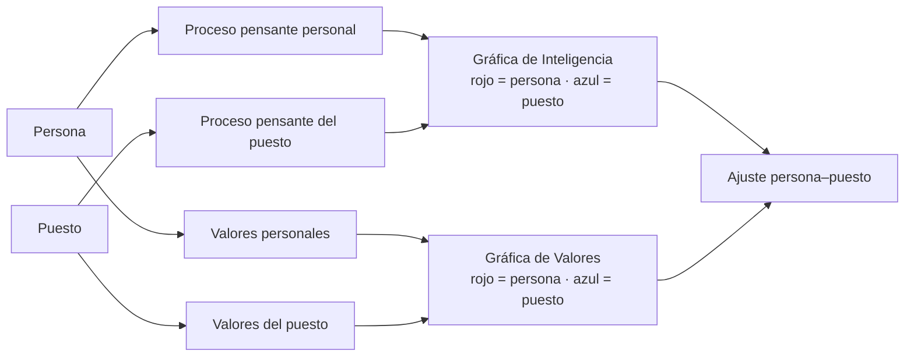

# Especificación de calificación — MABE (Managerial Behavior Evaluation)

Autor del instrumento: **Dr. Jaime Grados Espinosa**.

Fuentes, ambas **completamente legibles**:

| Archivo | Aporta | Estado |
|---------|--------|--------|
| `MABE_2007.docx` | Manual completo (1 108 párrafos) + **Proceso de Calificación** paso a paso | ✅ extraído |
| `Calificación MABE_2007.xlsx` | **4 hojas con las fórmulas vivas** — no está cifrado | ✅ extraído |
| `PLANTILLA MABE.ppt` | Plantilla que asigna cada ítem a su letra | ❌ formato binario antiguo — reexportar a `.pptx` o PDF |

> **MABE es el instrumento más resuelto de los tres.** Fórmulas explícitas en el Excel *y* descritas en prosa en el manual, y ambas coinciden. No queda ninguna incógnita de cálculo.

---

## 1. Qué mide y por qué es distinto

MABE no evalúa solo a la persona: **evalúa también el puesto**, con los mismos instrumentos, y superpone ambos perfiles.



**El producto de MABE es la brecha entre las dos curvas**, no cada curva por separado. Esto tiene consecuencias directas de diseño (§5 de `ARQUITECTURA-TECNICA.md`): el puesto se califica una vez y se **reutiliza** para todos los candidatos que se evalúen contra él.

### 1.1 Los dos marcos teóricos

| Bloque | Marco | Escalas |
|--------|-------|---------|
| **Proceso pensante** | Dominio cerebral (cuadrantes) | **A** · **L** · **I** · **V** |
| **Valores** | Modelo de **Edward Spranger** | **T** teórico · **E** económico · **A** estético · **S** social · **P** político · **R** religioso |

**Combinaciones de cuadrantes** (confirmadas por las fórmulas `O31`, `O33`, `Q31`, `Q33` de la hoja *Proc. Ps.*):

| Combinación | Fórmula | Lectura |
|-------------|---------|---------|
| **L** — izquierdo | `A + L` | — |
| **R** — derecho | `I + V` | — |
| **C** — cortical | `A + V` | — |
| **S** — límbico | `L + I` | — |

---

## 2. Las cuatro hojas de cálculo

| Hoja | Bloque | Ítems | Constante final |
|------|--------|------:|-----------------|
| `Proc. Puesto` | Proceso pensante del puesto | 24 (6 por cuadrante) | **+70** |
| `Proc. Ps.` | Proceso pensante personal | 60 (3 secciones × 20) | escalado ×5 |
| `Val. Puesto` | Valores del puesto | 30 (5 por valor) | **+50** |
| `Val. Ps.` | Valores personales | 30 (ver §4.2) | **+50** |

---

## 3. Motor — Proceso pensante

### 3.1 Del puesto (`Proc. Puesto`) ✅

Manual (§Proceso de Calificación, punto 1) y Excel coinciden exactamente:

```text
T[q]  = Σ puntajes de los 6 ítems del cuadrante q          para q ∈ {A, L, I, V}
TR    = T[A] + T[L] + T[I] + T[V]
A     = redondear(TR / 4)          // regla de redondeo en §3.3
D[q]  = T[q] − A                   // conserva signo negativo
X[q]  = D[q] × 5
TN[q] = X[q] + 70                  // se grafica en AZUL
```

Fórmulas Excel de referencia: `F21..F24` (sumas) · `F25 = SUM(F21:F24)` · `G21 = F25/4` · `I21 = F21−H21` · `J21 = I21*5` · `K21 = J21+70`.

### 3.2 Personal (`Proc. Ps.`) ✅

Tres secciones con **pesos distintos** — esta es la única complicación real del bloque:

| Sección | Nombre en el manual | Peso | Ítems por cuadrante |
|---------|---------------------|:----:|:-------------------:|
| **I** | Intereses Personales | **× 2** | 5 |
| **II** | Descripción Personal | **× 3** | 5 |
| **III** | Preferencias Personales | **× 5** | 5 |

```text
S[q]  = ( ΣI[q]×2  +  ΣII[q]×3  +  ΣIII[q]×5 ) / 10
N[q]  = S[q] − 5
esc[q] = N[q] × 5                  // se grafica en ROJO
```

Fórmulas Excel: `C31 = B6+B8+H5+K7+E12` (sección I, cuadrante A) · `D31 = C31*2` · `E31` sección II · `F31 = E31*3` · `G31` sección III · `H31 = G31*5` · `I31 = (D31+F31+H31)/10` · `K31 = J31−5` · `L31 = K31*5`.

> **Nota:** el divisor **10** es exactamente la suma de los pesos (2 + 3 + 5). El resultado es un promedio ponderado, no una suma.

### 3.3 Regla de redondeo del promedio (manual, líneas 1076–1078)

| Fracción | Acción |
|----------|--------|
| < 0,50 | se elimina |
| = 0,50 | se conserva |
| > 0,50 | se redondea a la unidad siguiente |

⚠️ **Este redondeo debe implementarse tal cual.** No es `Math.round` — `Math.round(x.5)` redondea hacia arriba y aquí el 0,50 se **conserva** como fracción. Un caso de prueba obligatorio.

---

## 4. Motor — Valores

### 4.1 Del puesto (`Val. Puesto`) ✅

```text
TR[v] = Σ puntajes de los 5 ítems del valor v      para v ∈ {T, E, A, S, P, R}
TS    = Σ TR[v]
A     = TS / 6
D[v]  = TR[v] − A                  // conserva signo
X[v]  = D[v] × 6
TN[v] = X[v] + 50                  // se grafica en AZUL
```

Fórmulas Excel: `F24..K24` · `L24 = SUM(F24:K24)` · `F25 = L24/6` · `F27 = F24−F26` · `F28 = F27*6` · `F29 = F28+50`.

Distribución verificada: **5 ítems por valor**, los seis valores.

### 4.2 Personales (`Val. Ps.`) ✅ con una advertencia ⚠️

Misma aritmética:

```text
R[v]  = Σ ítems del valor v
A     = ΣR / 6
D[v]  = R[v] − A
D%[v] = D[v] × 6
T[v]  = D%[v] + 50                 // se grafica en ROJO
```

Fórmulas Excel: `J20..O20` · `P20 = SUM(J20:O20)` · `J21 = P20/6` · `J23 = J20−J22` · `J24 = J23*6` · `J25 = J24+50`.

> ### ⚠️ Hallazgo que requiere decisión del psicólogo
>
> La distribución de ítems por valor **no coincide entre las dos hojas**:
>
> | Valor | `Val. Puesto` | `Val. Ps.` |
> |-------|:-------------:|:----------:|
> | T teórico | 5 | 5 |
> | **E económico** | 5 | **6** |
> | **A estético** | 5 | **4** |
> | S social | 5 | 5 |
> | P político | 5 | 5 |
> | R religioso | 5 | 5 |
> | **Total** | **30** | **30** |
>
> Ambas hojas suman 30 ítems, pero la hoja personal reparte 6 al valor **económico** y solo 4 al **estético**. Verificado dos veces: tanto las etiquetas del formato como las fórmulas de suma lo confirman, así que es consistente dentro de la hoja — no es un error de lectura.
>
> **Por qué importa:** el producto de MABE es superponer la curva roja (persona) sobre la azul (puesto). Si el valor económico se mide con 6 ítems en una y 5 en la otra, ambas curvas **no están en la misma escala** y la brecha en E y en A queda sesgada por construcción.
>
> **Decisión requerida antes de programar el motor:** ¿es una particularidad deliberada del instrumento, o un error heredado de la plantilla? Es un punto de firma, igual que la clave I/E/S de Hartman.
>
> **Fila 22 de la hoja:** `J22 = 15` está escrito como literal, y `K22..O22` lo copian. Es decir, el promedio no se calcula, se asume **15** (= 90 / 6). Confirmar si el rango total de puntajes es efectivamente 90.

---

## 5. Salidas e interpretación

### 5.1 Las dos gráficas

| Gráfica | Contiene | Azul | Rojo |
|---------|----------|------|------|
| **Inteligencia** | 4 cuadrantes A · L · I · V | Puesto (`TN`, base 70) | Persona (`N × 5`) |
| **Valores** | 6 valores T · E · A · S · P · R | Puesto (`TN`, base 50) | Persona (`T`, base 50) |

⚠️ Las bases difieren entre gráficas (**70** para proceso pensante, **50** para valores) y la curva roja del proceso pensante **no lleva constante**. Al implementar, verificar contra `PLANTILLA MABE.ppt` que ambas curvas de cada gráfica comparten eje.

### 5.2 Textos de interpretación — ya disponibles en el manual

`MABE_2007.docx` contiene los bloques completos, listos para vaciar a `interpretation_rules`:

| Sección del manual | Contenido |
|--------------------|-----------|
| III · Comprensión de la gente y sus valores | Descripción de los valores del puesto |
| III · Interpretación de combinaciones | **Combinaciones de dos valores en el puesto** |
| IV | Interpretación de los valores pensantes |
| V | **Combinación de dos valores personales altos** |
| VI | Supervisión efectiva de los valores |
| — | Breve descripción de las cuatro regiones del cerebro |

Patrón de indexación: además de `(escala, nivel)`, MABE necesita reglas de **par** — *"los dos valores más altos"* y *"los dos cuadrantes dominantes"*. Es la misma mecánica que las díadas del PAPI, así que el motor de interpretación se comparte.

---

## 6. Casos de prueba obligatorios

| # | Caso | Esperado |
|---|------|----------|
| 1 | Redondeo del promedio con fracción exacta `.50` | Se **conserva** la fracción, no se redondea al entero |
| 2 | Cuadrante con `D` negativo | Signo conservado hasta `TN` |
| 3 | Σ de los 4 cuadrantes = `TR` | Invariante |
| 4 | Σ de los 6 valores = `TS`; promedio = `TS/6` | Invariante |
| 5 | Combinaciones L = A+L, R = I+V, C = A+V, S = L+I | Invariante |
| 6 | Protocolo real calificado a mano (persona + puesto) | Coincidencia celda a celda |

---

## 7. Pendientes

| Estado | Punto |
|:------:|-------|
| ✅ | Fórmulas de los 4 bloques — completas y verificadas contra el manual |
| ✅ | Constantes de escalado (+70, +50, ×5, ×6, /10) |
| ✅ | Combinaciones de cuadrantes |
| ✅ | Textos de interpretación localizados en el manual |
| ⚠️ | **Asimetría 6/4 en los valores personales** — decisión del psicólogo |
| ⚠️ | Confirmar que el promedio de valores personales es 15 y el total 90 |
| ❌ | **`PLANTILLA MABE.ppt` en formato legible** — es lo que dice qué ítem pertenece a qué letra |
| ❌ | El cuestionario que responde la persona (los enunciados de las 3 secciones) |
| ❌ | Un protocolo real calificado a mano |

**El único bloqueo técnico es la plantilla.** Las fórmulas ya están; falta el mapa ítem → letra, que vive en el `.ppt`.

---

*Documento de referencia para desarrollo. No sustituye el criterio clínico del psicólogo.*
