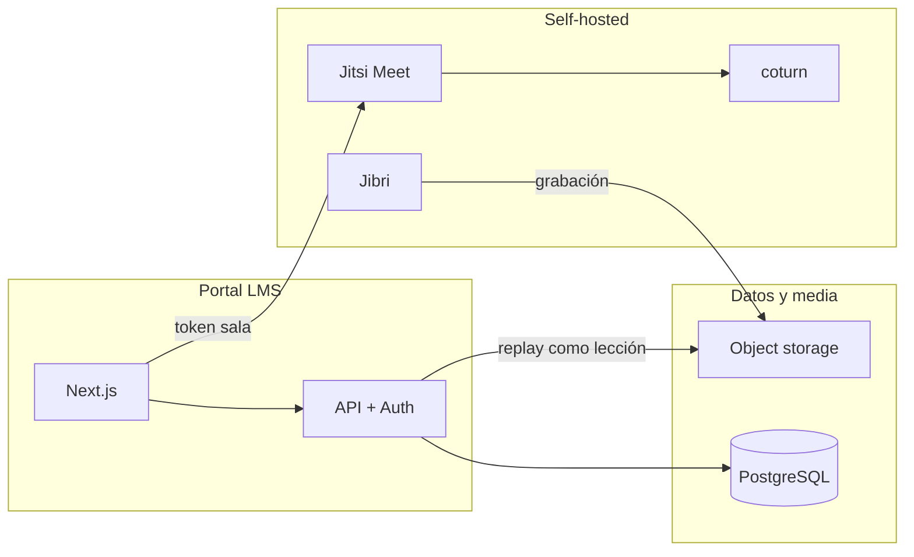

# Presupuesto — Fase 2: Plataforma de cursos y clases en vivo

**Proyecto:** capacitación para psicólogos (producto **separado** de PsycoTest)  
**Cliente:** [nombre]  
**Prestador:** [nombre]  
**Fecha:** agosto 2026  
**Tarifa de referencia:** **10 USD / hora** de desarrollo  
**Tipo de cambio orientativo:** 1 USD ≈ 17.40 MXN (ajustar al facturar)

---

## 0. Contexto y prioridad

| Proyecto | Estado | Pago recibido |
|----------|--------|---------------|
| **Fase 1 — PsycoTest** (PAPI, Hartman, MABE) | En curso / entrega pendiente de producción | **750 USD** (acordado) |
| **Fase 2 — LMS + en vivo** | Por iniciar **después** de cerrar Fase 1 | Presupuesto de este documento |

**Condición de arranque:** la Fase 2 no inicia hasta que Fase 1 cumpla el criterio de aceptación acordado (aplicación + calificación + panel psicólogo en producción interna).

**Productos separados:** login, base de datos y dominio distintos de PsycoTest. En el futuro se puede añadir SSO opcional; **no está incluido** en este presupuesto.

---

## 1. Requerimientos confirmados por el cliente

| # | Tema | Decisión |
|---|------|----------|
| 1 | Alumnos simultáneos en vivo | **Máximo 30** |
| 2 | Interacción en vivo | **Cámara, micrófono y chat** |
| 3 | Grabación | **Sí** — publicar replay en el LMS |
| 4 | Modelo de acceso | **Cursos internos y de pago** |
| 5 | Certificación | **Por definir** — fuera del MVP |
| 6 | Relación con PsycoTest | **Productos aparte** |
| 7 | Streaming | **Opción D** — infraestructura propia (self-hosted), no Zoom embebido |

---

## 2. Solución técnica propuesta (Opción D acotada a 30 usuarios)

Para **30 participantes con A/V bidireccional**, la opción más madura y mantenible en self-hosted es:

**BigBlueButton (self-host) + grabaciones + coturn (TURN/STUN)**

| Componente | Función |
|------------|---------|
| **Next.js** | Portal LMS (catálogo, lecciones, pagos, calendario) |
| **PostgreSQL** | Usuarios, cursos, progreso, inscripciones, sesiones en vivo |
| **Object storage** | Videos VOD, PDFs, grabaciones (MinIO, R2 o S3) |
| **BigBlueButton** | Aulas en vivo con cámara, micrófono, pizarra y chat |
| **Jibri** | Grabación de la sesión → archivo de video |
| **Worker / API** | Tras grabación: procesar, subir a storage, crear lección “Replay” |
| **Stripe** | Cobro de cursos públicos; cupones / acceso manual para internos |

**Nota:** Opción D implica que el **cliente (o el prestador bajo su cuenta) paga servidores y ancho de banda** aparte del desarrollo. Ver §6.

---

## 3. Alcance del MVP (Fase 2)

### 3.1 Incluido

| Módulo | Entregables |
|--------|-------------|
| **M1 — Base LMS** | Auth (admin, instructor, alumno), catálogo, cursos → módulos → lecciones, PDFs y texto |
| **M2 — Video bajo demanda** | Subida de lecciones en video, reproductor, progreso por lección |
| **M3 — Evaluaciones** | Cuestionarios por módulo (opción múltiple / verdadero-falso), nota mínima configurable |
| **M4 — Inscripciones** | Interno: invitación / alta manual · Público: checkout Stripe (MXN) |
| **M5 — En vivo (BigBlueButton)** | Calendario de sesiones, aula con A/V + pizarra + chat, solo inscritos, máx. 30 |
| **M6 — Grabación → LMS** | Jibri graba → worker publica “Replay” en el curso correspondiente |
| **M7 — Panel instructor** | CRUD cursos, ver alumnos, iniciar/cerrar live, ver grabaciones |
| **M8 — Panel admin** | Usuarios, cursos, pagos (lista), configuración básica |
| **M9 — Despliegue** | Staging + producción, SSL, backups BD, documentación de operación |

### 3.2 Excluido (fases posteriores o add-on)

| Ítem | Motivo |
|------|--------|
| **Certificados PDF** | Punto 5 aún no definido |
| **Integración / SSO con PsycoTest** | Productos separados (punto 6) |
| **App móvil nativa** | Fuera de alcance |
| **Breakout rooms, pizarra avanzada, encuestas en vivo** | No solicitado; add-on |
| **Transcodificación multi-bitrate profesional** | MVP: un archivo MP4 por grabación |
| **Cumplimiento formal COFEPRIS / acreditación oficial** | Requiere definición legal |

---

## 4. Estimación por módulos

| # | Módulo | Horas | USD (10/h) |
|---|--------|------:|-----------:|
| M0 | Especificación UX, roles, flujos de pago y live | 16 | 160 |
| M1 | Base LMS + auth + catálogo + progreso | 48 | 480 |
| M2 | Video VOD + storage + reproductor | 32 | 320 |
| M3 | Quizzes + reglas de aprobación | 24 | 240 |
| M4 | Stripe (pago + acceso interno sin pago) | 28 | 280 |
| M5 | Jitsi self-hosted + integración token + calendario | 44 | 440 |
| M6 | Jibri + pipeline grabación → lección replay | 36 | 360 |
| M7 | Panel instructor | 28 | 280 |
| M8 | Panel admin + despliegue + docs operación | 32 | 320 |
| M9 | Pruebas de carga ligera (≤30), ajustes, capacitación | 20 | 200 |
| | **Subtotal MVP** | **308 h** | **3 080 USD** |
| | Reserva imprevistos (10 %) | 31 h | 310 USD |
| | **Total recomendado** | **339 h** | **3 390 USD** |

**En MXN (× 17.40):** ~**59 000 MXN** redondeado para propuesta comercial.

> **Comparación:** Fase 1 PsycoTest = 750 USD. Fase 2 es ~**4.5×** más horas porque incluye infra live self-hosted, pagos, VOD y operación de servidores.

---

## 5. Cronograma propuesto (después de Fase 1)

Ritmo orientativo: **~22 h/semana** → **~15 semanas (~4 meses)**.

| Mes | Foco | Módulos | Horas | Entregable visible |
|-----|------|---------|------:|-------------------|
| **1** | LMS base | M0, M1 (parcial) | 22 | Login, catálogo, 1 curso demo con lecciones texto/PDF |
| **2** | VOD + quizzes | M1 (cierre), M2, M3 | 22 | Curso con video, progreso y examen |
| **3** | Pagos | M4, M7 (parcial) | 22 | Curso de pago Stripe + curso interno por invitación |
| **4** | En vivo | M5, M6 | 22 | Primera clase en vivo con 30 usuarios + grabación en LMS |
| **5** | Operación | M7, M8, M9 (parcial) | 22 | Paneles instructor/admin, staging estable |
| **6** | Cierre | M9 | 22 | Producción, documentación, capacitación 2 h |

**Duración total:** **~4 meses** desde kick-off de Fase 2.

---

## 6. Infraestructura (costo recurrente — paga el cliente)

Desarrollo **no incluye** hosting mensual. Estimación para **30 usuarios en vivo** + VOD moderado:

| Recurso | Especificación orientativa | USD/mes |
|---------|---------------------------|--------:|
| **VPS Jitsi + Jibri** | 8 vCPU, 16 GB RAM, 200 GB SSD, 1 Gbps | 80 – 150 |
| **VPS app + BD** | 2 vCPU, 4 GB (o Postgres gestionado) | 20 – 40 |
| **Object storage + egress** | Grabaciones y videos (100–300 GB) | 15 – 60 |
| **Dominio + SSL** | Let's Encrypt incluido | ~2 |
| **Stripe** | Comisión por transacción | ~3.6 % + fijo |
| **Email transaccional** | Resend / similar | 0 – 20 |
| **Total orientativo** | | **120 – 270 USD/mes** |

Picos de ancho de banda en clases en vivo pueden subir el costo; conviene **1–2 pruebas de estrés** antes del primer curso real (incluido en M9).

---

## 7. Forma de pago sugerida (Fase 2)

Alineado a 3 hitos de Fase 1:

| Hito | % | USD | Criterio de aceptación |
|------|---:|----:|------------------------|
| **H1 — Kick-off LMS** | 30 % | 1 017 | Catálogo, auth, 1 curso con lecciones y progreso en staging |
| **H2 — VOD + pagos** | 35 % | 1 187 | Video, quizzes, Stripe e inscripción interna funcionando |
| **H3 — Live + cierre** | 35 % | 1 186 | Clase en vivo ≤30, grabación publicada, producción y capacitación |
| | **100 %** | **3 390** | |

Alternativa en **4 mensualidades de ~848 USD** si el cliente prefiere flujo mensual fijo.

---

## 8. Entregables del cliente (para no retrasar plazo)

| # | Entregable | Cuándo |
|---|------------|--------|
| 1 | Marca: logo, colores, nombre de la plataforma | Antes de M1 |
| 2 | Dominio(s) para LMS y subdominio Jitsi (ej. `learn.` / `live.`) | Antes de M5 |
| 3 | Cuenta Stripe México verificada | Antes de M4 |
| 4 | Contenido piloto: 1 curso (outline + 3 lecciones + 1 sesión en vivo de prueba) | Antes de M2 |
| 5 | Decisión sobre certificados (sí/no) | Antes de ampliación post-MVP |
| 6 | Acceso a VPS o aprobación para contratar servidores | Antes de M5 |
| 7 | Política de privacidad y aviso de grabación de clases | Antes de producción |

---

## 9. Riesgos y supuestos

| Riesgo | Mitigación |
|--------|------------|
| Self-hosted con 30 A/V es exigente en CPU/red | VPS dimensionado + prueba con 10 y luego 30 usuarios |
| Grabación Jibri falla bajo carga | Reintentos, monitorización, plan B manual (subir MP4) documentado |
| Certificación futura cambia el modelo | Módulo certificados como **Fase 2b** (+24–40 h) |
| Contenido de pago + facturación MX | Stripe; factura fiscal es responsabilidad del cliente |
| Separación de PsycoTest | Misma persona desarrolla, repos distintos; sin SSO en MVP |

---

## 10. Fase 2b opcional (cuando definan certificación)

| Add-on | Horas | USD |
|--------|------:|----:|
| Plantilla certificado PDF + verificación por código QR | 20 | 200 |
| Reglas (tiempo mínimo, examen aprobado, asistencia live) | 16 | 160 |
| **Subtotal 2b** | **36 h** | **360 USD** |

---

## 11. Resumen ejecutivo (para el cliente)

| Concepto | Valor |
|----------|------:|
| **Alcance** | LMS propio + clases en vivo self-hosted (Jitsi) hasta 30 personas + grabación automática + cursos pagos e internos |
| **No incluye** | PsycoTest, certificados (por ahora), app móvil |
| **Horas** | 339 h (con reserva) |
| **Precio desarrollo** | **3 390 USD** (~59 000 MXN) |
| **Plazo** | ~4 meses tras cerrar Fase 1 |
| **Hosting mensual** | ~120–270 USD (cliente) |

---

*Documento de propuesta comercial. No sustituye contrato ni anexo técnico firmado.*
