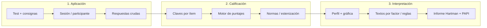

# Psicología plataforma diseño
_Exported on 28/7/2026 at 13:12:42 GMT-6 from Cursor (3.12.10)_

---

**User**

hola estoy diseñando una plataforma par aplicar test psicologicos. 

dividiremos en 1. aplicaicon 2. calificacion 3. interpretacion. pero todo es basado en una metodología Hartman

Inventario de Preferencias de Personalidad (PAPI) contiene:
Prueba, consignas de aplicación e interpretación 
Cuestionario de aplicación
Tabla para evaluar 
Gráfica 

aca tengo documentos base para automatizar las pruebas psicologicas en una plataforma donde tengamos la prueba, ligada a la base de datos, que se guardan y califican deacuerdo a la metodologia. y tambien su correcta interpretacion 

---

**Cursor**

Explorando los documentos base y el estado del proyecto para entender la metodología Hartman y proponer una arquitectura coherente.

Hola. Revisé la carpeta **PsycoTest** y el contenido encaja bien con tu idea de plataforma en tres capas (aplicación → calificación → interpretación). Aquí va un mapa concreto de lo que ya tienes y cómo encajarlo en software.

## Inventario de materiales

| Archivo | Rol en la plataforma |
|--------|----------------------|
| `Prueba PAPI.docx` | Manual: aplicación, 20 factores, normalización (escala 0–9), interpretación, anexos |
| `Cuestionario.docx` | **90 pares** forzados (elige A o B); instrucciones de aplicación |
| `Tabla para evaluar.jpg` | **Clave de calificación**: cada ítem (1–90) enruta la respuesta a uno de **20 factores** (G, L, I, T, V, S, R, D, C, E arriba; N, A, P, X, B, O, Z, K, F, W abajo) |
| `Grafica PAPI.doc` | Plantilla del perfil gráfico |
| `Plantillas Hartman.docx` | **Axiograma Hartman**: Parte I (18 frases de valor), Parte II/III (18 citas cada una), ranking 1–18 sin repetir |
| `Calificación Hartman.xlsx` | Lógica de calificación Hartman (archivo **cifrado**; no pude leerlo automáticamente) |
| `MABE_2007.*`, `PLANTILLA MABE.ppt` | Segunda prueba/metodología en el mismo ecosistema |

En el manual PAPI los **20 factores** se agrupan en **10 necesidades** (N, A, P, X, B, O, Z, K, F, W) y **10 roles** (G, L, I, T, V, S, R, D, C, E), con escala típica **0–9** y medias de referencia para normalizar.

---

## Arquitectura propuesta (metodología como código + datos)

### 1. Aplicación
- Catálogo de pruebas (`PAPI`, `Axiograma Hartman`, luego `MABE`).
- Definición versionada: ítems, instrucciones, tiempo sugerido, datos demográficos (como en tus plantillas: nombre, edad, sexo, etc.).
- **PAPI**: UI de 90 elecciones binarias; validar “una respuesta por par”.
- **Hartman**: tres bloques de 18; validar permutación **1–18** sin duplicados en cada parte.
- Guardar en BD: `session_id`, respuestas, timestamps, aplicador, condiciones (presencial/remoto).

### 2. Calificación
- **PAPI**: tabla `item_key` (ítem → factor si elige A, factor si elige B) derivada de `Tabla para evaluar.jpg` — esto es el corazón del motor; conviene transcribirla una vez a JSON/CSV y revisarla contra casos manuales.
- Sumar conteos por factor → convertir a escala **0–9** según fórmulas del manual y tablas de normalización.
- **Hartman**: reglas del Excel (cuando lo tengas desbloqueado o exportado) + matrices de las tres partes.
- Resultado persistido: puntajes crudos, estandarizados, versión de la clave y de las normas (auditoría).

### 3. Interpretación
- No “inventar” texto: **plantillas y umbrales** extraídos de `Prueba PAPI.docx` (por factor, asociaciones lógicas N–G, efecto estrés, guía de medias, etc.).
- **Gráfica**: reproducir `Grafica PAPI.doc` (radar o perfil de barras con bandas de referencia).
- **Informe**: secciones fijas (orientación al trabajo, liderazgo, dinamismo…) + bloques condicionales según puntaje; rol **solo psicólogo** en UI (el manual insiste en uso profesional y licencia PAPI).

---

## Modelo de datos mínimo (multi-prueba)

- `tests`, `test_versions`, `items`, `scoring_keys`, `norm_tables`
- `participants`, `assessment_sessions`, `responses`
- `scores` (por factor/dimensión), `interpretation_snapshots` (texto generado + versión de reglas)

Así PAPI y Hartman comparten el mismo pipeline; solo cambian el tipo de respuesta (binaria vs ranking) y el motor de calificación.

---

## Orden de trabajo recomendado

1. **PAPI clave de 90 ítems** — digitalizar la tabla de evaluación y un caso de prueba calificado a mano.
2. **MVP aplicación + guardado** — cuestionario en web, sin interpretación automática aún.
3. **Motor 0–9 + gráfica** — alinear con un perfil ya calificado.
4. **Capa de interpretación** — por fases (factores altos/bajos → asociaciones → párrafos del manual).
5. **Hartman** — Partes I–III + lógica del Excel cuando esté accesible.
6. **MABE** — mismo patrón una vez PAPI esté estable.

---

## Aspectos importantes

- **Licencia PAPI**: el manual indica control por el editor (PA); la plataforma debe restringir acceso, trazabilidad y no exponer el cuestionario completo sin criterio profesional.
- **`Calificación Hartman.xlsx`**: si lo abres en Excel y lo guardas sin cifrado o como CSV, se puede importar la lógica al motor.
- **Hartman vs PAPI**: son instrumentos distintos pero complementarios (valores/axiología vs preferencias de personalidad); puedes ofrecer **baterías** en una misma sesión.

---

¿En qué quieres que avancemos en el repo?

1. **Scaffold** (Next.js + Postgres/Supabase) con el modelo anterior.  
2. **Solo extracción**: ítems PAPI + borrador de clave desde la tabla.  
3. **Diseño detallado** de pantallas (aplicador vs evaluado vs informe).

Indica prioridad (PAPI primero vs Hartman primero) y si la plataforma es solo para psicólogos internos o también autoservicio del evaluado.

---

**User**

la plataforma es interna, para que el psicologo pueda revisar las calificaciones e interptretaciones. 
hay que avanzar en la planeacion @Calificación Hartman.xlsx  a ver intenta leer la calificaion hartman de nuevo. 

y haz un archivo md explicnaod la arquitectura que usariamos y el plan de desarrollo. divide el desarrollos en modulos y define el precio de 10USD por hora de desarrollo. y al final un plan mensual de avance y tiempo estimado del proyecto 

---

**Cursor**

Reintentando leer `Calificación Hartman.xlsx` y preparando el documento de arquitectura y plan de desarrollo.

El Excel sigue cifrado; documentaré lo inferido desde `Plantillas Hartman.docx` y crearé el archivo de planificación completo.

## `Calificación Hartman.xlsx`

Volví a intentar leerlo: el archivo sigue siendo **Office cifrado** (`CDFV2 Encrypted`), no un `.xlsx` normal. Con herramientas automáticas **no se puede extraer** el contenido sin la contraseña correcta.

**Qué puedes hacer:** en Excel → abrir con tu contraseña → *Archivo → Información → Proteger libro → Cifrar con contraseña* (quitar) o **Guardar como** `.xlsx` sin cifrado / exportar cada hoja a **CSV** y dejarlo en la misma carpeta. Con eso se puede implementar el **M5** tal como está en el plan.

Mientras tanto, en `Plantillas Hartman.docx` ya está clara la **estructura de salida** (dimensiones DIF, DIM I/E/S, INT…, sumario BQr/BQa/CQ, escala 1–7); lo que falta del Excel son las **fórmulas y tablas de conversión** desde los rankings 1–18.

---

## Documento de planificación

Creé **[PLAN-ARQUITECTURA-DESARROLLO.md](file:///Users/gerryvela/Documents/PsycoTest/PLAN-ARQUITECTURA-DESARROLLO.md)** con:

- Arquitectura (stack sugerido, modelo de datos, flujo solo psicólogo interno)
- **10 módulos** (M0–M9 MVP + M10 MABE opcional) con horas y costo a **10 USD/h**
- **MVP:** 396 h → **3 960 USD** en **6 meses** (~66 h/mes)
- Cronograma mes a mes con entregables visibles
- Riesgos (Excel, clave PAPI, licencia, borrador clínico)

Si quieres, el siguiente paso puede ser ajustar el plan (por ejemplo PAPI antes que Hartman, menos horas en M6, o incluir solo una prueba en el MVP). Cuando tengas el Excel desbloqueado o los CSV, puedo revisar las hojas y actualizar la sección Hartman y la estimación de **M5** en ese mismo MD.

---

**User**

Nombre: 																																																					
Empresa: 																																																					
																																																					
																																																					
PARTE I - "V.Q."																																						DIF		DIM	INT	DIS		1 V.Q. 2									
a		b		c		d		e		f		g		h		i		j		k		l		m		n		o		p		q		r				171		0	0			171	-	0							
																																																					
																																					DIM%			INT%			1			2							
6		9		10		11		13		5		17		16		12		4		1		18		2		14		8		15		3		7			0			0			 +	 -		 +/-			DIM			0	
																																																				0	
											5								4		1		18				14				15					I	DIM	57								0							
																																								INT	0											0	
																																																					
	6						11		13				17												2				8							E	DIM	57								0			D.I.			0	
																																								INT	0											0	
																																																					
			9		10										16		12																3		7	S	DIM	57								0						0	
																																								INT	0												
																																																					
E		S		S		E		E		I		E		S		S		I		I		I		E		I		E		I		S		S						0	D.I.		0	0		A.I.%	0		A.I.		0		
																																																					
																																																					
																																																					
PARTE II - "S.Q."																																						DIF		DIM	INT	DIS		1 S.Q. 2									
a		b		c		d		e		f		g		h		i		j		k		l		m		n		o		p		q		r				171		0	0			171	-	0							
																																																					
																																					DIM%			INT%			1			2							
6		9		10		11		13		5		17		16		12		4		1		18		2		14		8		15		3		7			0			0			 +	 -		 +/-			DIM			0	
																																																				0	
											5								4		1		18				14				15					I	DIM	57								0							
																																								INT	0											0	
																																																					
	6						11		13				17												2				8							E	DIM	57								0			D.I.			0	
																																								INT	0											0	
																																																					
			9		10										16		12																3		7	S	DIM	57								0						0	
																																								INT	0												
																																																					
E		S		S		E		E		I		E		S		S		I		I		I		E		I		E		I		S		S						0	D.I.		0	0		A.I.%	0		A.I.		0		
																																																					
																																						1)		SQ	171	1.00	BQr(1)										
																																								VQ	171												
																																																					
																																								SQ + VQ		171.0	BQa (1)										
																																							2	2			

esto tiene el archivo de calificsicon. esta hoja es e hartman

---------------

Esta hjoja es de la grafica	

PERFIL DE INVENTARIO DE VALORES HARTMAN																									
																									
																									
Nombre: ___________________________________    Puesto: _________________    Fecha: _________________																									
																									
																									
			Juicio de individualidad	Juicio práctico concreto	Juicio lógico conceptual	Juicio en general	Sentido de proporción	Aceptación del mundo	Capacidad de decisiones en relaciones	Decisiones en aspecto práctico	Decisiones en normas	Capacidad de resolver problemas	Control de impulsos	Capacidad de concentración	Diferenciar el bien del mal	Capacidad de Valoración (Cantidad)	Capacidad de Valoración (Calidad)	Capacidad de Autovaloración (Cantidad)	Capacidad de Autovaloración (Calidad)	Balance de valores internos y externos (Q)	Balance de valores internos y externos ©	Capacidad para valorar (Cantidad)	Capacidad para valorar (Calidad)	Capacidades combinadas para valorar (Q)	Capacidades combinadas para valorar ©
			DIM	DIM	DIM	DIF	DIM	DIM	INT	INT	INT	INT	INT	DI	DIS	VQ	VQ	SQ	SQ	BQr	BQr	BQa	BQa	CQ	CQ
			I	E	S			%	I	E	S		%			1	2	1	2	1	2	1	2	1	2
DESARROLLO	1	EXCELENTE	1	1	1	22     24     26     28     30	0     1     2     3	2     4     6     8     10	0	0	0	1	2     4     6     8     10	0     1     2     3	0	1	1	1	1	0,1     0,7     1,1    1,5	0,1     0,7     1,1    1,5	1	1	1	1     3     5     7     9     11
			2	2	2							2				10	2	10	2			10	2	14	
			3	3	3							3				19	3	19	3			19	3	28	
			4	4	4							4				28	4	28	4			28	4	42	
			5	5	5							5				37	5	37	5			37	5	56	
			6	6	6							6				46	6	46	6			46	6	70	
			7	7	7							7				55	7	55	7			55	7	83	
	2	MUY BUENO	8	8	8	32     34     36     38     40	4       5      6       7	12     14     16     18     20				8	12     14     16     18     20	4       5      6       7		56	8	56	8	1,6     1,7     1,8     1,9     2,0	1,6     1,7     1,8     1,9     2,0	56	8	90	13
			9	9	9							9				58	9	58	9			58	9	98	16
			10	10	10				1	1	1	10				60	10	60	10			60	10	106	18
			11	11	11				2	2	2	11				63	11	63	11			63	11	115	21
			12	12	12				3	3	3	12				66	12	66	12			66	12	124	24
			13	13	13				4	4	4	13				68	13	68	13			68	13	132	26
			14	14	14				5	5	5	14				70	14	70	14			70	14	140	28
	3	BUENO	15	15	15	42     44     46    48    50	8     9     10     11	22     24     26     28     30	6	6	6	15	22     24     26     28     30	8     9     10     11	2	71	15	71	15	2,1     2,2     2,3     2,4     2,5	2,1     2,2     2,3     2,4     2,5	71	15	149	32
			16	16	16				7	7	7	16				73	16	73	16			73	16	159	35
			17	17	17				8	8	8	17				75	17	75	17			75	17	170	38
			18	18	18				9	9	9	18				78	18	78	18			78	18	181	42
			19	19	19				10	10	10	19				81	19	81	19			81	19	191	45
			20	20	20				11	11	11	20				83	20	83	20			83	20	202	49
			21	21	21				12	12	12	21				85	21	85	21			85	21	213	53
	4	PROMEDIO	22	22	22	52     54     56     58     60	12     13     14     15	32     34     36     38     40	13	13	13	22	32     34     36     38     40	12     13     14     15	4	86	22	86	22	2,6     2,7     2,8     2,9     3,0	2,6     2,7     2,8     2,9     3,0	86	22	224	57
			23	23	23				14	14	14	23				88	23	88	23			88	23	236	62
			24	24	24				15	15	15	24				90	24	90	24			90	24	249	66
			25	25	25				16	16	16	25				93	25	93	25			93	25	262	71
			26	26	26				17	17	17	26				96	26	96	26			96	26	275	75
			27	27	27				18	18	18	27				98	27	98	27			98	27	288	80
			28	28	28				19	19	19	28				100	28	100	28			100	28	300	84
	5	POBRE	29	29	29	62    64     66     68     70	16     17     18     19	42     44     46     48     50	20	20	20	29	42     44     46     48     50	16     17     18     19		101	29	101	29	3,1     3,2     3,3     3,4     3,5	3,1     3,2     3,3     3,4     3,5	101	29	313	90
			30	30	30				21	21	21	30				103	30	103	30			103	30	328	95
			31	31	31				22	22	22	31				105	31	105	31			105	31	343	101
			32	32	32				23	23	23	32				108	32	108	32			108	32	358	106
			33	33	33				24	24	24	33				111	33	111	33			111	33	373	112
			34	34	34				25	25	25	34				113	34	113	34			113	34	388	117
			35	35	35				26	26	26	35				115	35	115	35			115	35	403	123
	6	MUY POBRE	36	36	36	72     74     76     78     80	20     21     22    23	52     54     56     58     60	27	27	27	36	52     54     56     58     60	20     21     22    23	6	116	36	116	36	3,6     3,7     3,8     3,9     4,0	3,6     3,7     3,8     3,9     4,0	116	36	418	130
			37	37	37				28	28	28	37				118	37	118	37			118	37	435	137
			38	38	38				29	29	29	38				120	38	120	38			120	38	452	143
			39	39	39				30	30	30	39				123	39	123	39			123	39	469	149
			40	40	40				31	31	31	40				126	40	126	40			126	40	486	155
			41	41	41				32	32	32	41				128	41	128	41			128	41	503	162
			42	42	42				33	33	33	42				130	42	130	42			130	42	508	180
																									
																									
																									
																									
																																		

---

**Cursor**

Documentando la lógica de calificación Hartman que compartiste y actualizando el plan de arquitectura.

Confirmando la fórmula DIM con los datos que pegaste y documentándola en archivos del proyecto.

Gracias por pegar el contenido del Excel: con eso ya se puede planificar e implementar el motor Hartman aunque el archivo en disco siga cifrado.

## Qué confirma tu hoja **Hartman**

1. **Dos bloques de calificación** con la misma plantilla:
   - **Parte I → V.Q.** (Valoración)
   - **Parte II → S.Q.** (Autovaloración / segunda parte)

2. **18 ítems** fijos (`a`–`r`) con rankings **1–18**; la suma debe ser **171**.

3. **Clave I / E / S** por ítem (la fila `E S S E E I E S S I I I E I E I S S`):
   - **DIM E** = suma de puntos en ítems E  
   - **DIM S** = ítems S  
   - **DIM I** = ítems I  

4. **Puntos por ítem:** `19 − ranking`.  
   Con tu fila de ejemplo, **DIM I = DIM E = DIM S = 57**, igual que en el Excel.

5. **Índices compuestos:** **BQr(1)** (ratio SQ/VQ), **BQa(1)** (SQ + VQ).

## Hoja **Gráfica**

Tabla **“Perfil de Inventario de Valores Hartman”**: convierte puntajes en **niveles 1–7** (Excelente → Muy pobre) para DIM, DIF, INT, VQ, SQ, BQr, BQa, CQ, etc. Eso alimenta la **interpretación** y el gráfico en la plataforma.

## Documentación en el repo

- **[`docs/HARTMAN-CALIFICACION.md`](docs/HARTMAN-CALIFICACION.md)** — especificación técnica (claves, fórmulas confirmadas, pipeline, casos de prueba).
- **`PLAN-ARQUITECTURA-DESARROLLO.md`** — actualizado con este avance y riesgo M5 reducido.

## Pendiente de confirmar contigo

1. **Parte III** del Word (18 citas “consigo mismo”): ¿hay un tercer bloque en el Excel que no pegaste, o Parte II del Word = **S.Q.** y la III va en otra hoja?
2. Fórmulas de **DIF**, **DIS**, **DIM%**, **INT%**, **D.I.**, **A.I.** — si puedes copiar 2–3 celdas con la fórmula de Excel (o exportar sin cifrado), las cerramos al 100 %.

Si tienes la **Parte III** del Excel o un protocolo ya calificado completo (VQ + SQ + totales BQr/BQa), compártelo y lo integramos en la spec.

---

**User**

* Si el número colocado por la persona es de 1 dígito y es MAYOR al de Hartman la diferencia es negativa. (Celdas, K11, S11, U11, A14, Y14, AC14, C17, AG17, AI17)

* Si el número colocado por la persona es de 2 dígitos y es MENOR al de Hartman la diferencia es negativa. (Celdas, W11 AA11, AE11, G14, I14, M14, E17, O17, Q17)

* A cada una de las diferencias resultantes se les restara "2" y se pondrá el resultado debajo de cada una, Cuando las diferencias sean de 0, 1 ó 2, el resultado siempre será "0"
-----

 
Bj
Bj
2:16 PM Today
Las disimilitudes son la desigualdad existente entre las respuestas de valores del examinado contra los valores ideales de HARTMAN. Considerando como disimilitud o discrepancia a las diferencias de 1 dígito cuando el valor ideal asignado en el inventario es de 2 dígitos o viceverza. Marcar con ROJO las discrepancias existentes.

El número debe ser PAR, sino es así refleja un problema de inicio. SEIS DISIMILITUDES NO SE INTERPRETA EL INVENTARIO.

---

**Cursor**

Integrando las reglas de diferencias, disimilitudes y fórmulas de las capturas en la especificación Hartman.

Integré tus reglas y las fórmulas de las capturas en **`docs/HARTMAN-CALIFICACION.md`** (y un apunte en el plan). Resumen operativo:

## Comparación por ítem (`P` = examinado, `H` = ideal Hartman en la fila superior)

1. **Signo negativo**
   - `P` de **1 dígito** (1–9) y **P > H** → diferencia **negativa**.
   - `P` de **2 dígitos** (10–18) y **P < H** → diferencia **negativa**.
   - En el resto de casos → **positiva** (según estas reglas).

2. **Ajuste −2** (valor debajo de cada celda)
   - Si |diferencia| es **0, 1 o 2** → resultado **0**.
   - Si no → **|diferencia| − 2** (manteniendo el signo en las columnas +/− del Excel).

## Disimilitudes (criterio Bj)

- **Disimilitud** = uno va con **1 dígito** y el otro con **2** (da igual quién sea cuál).
- Mostrar en **rojo** en la plataforma.
- El **total debe ser par**; si es **impar** → alerta de **problema de inicio**.
- Con **6 o más** disimilitudes → **no se interpreta** el inventario (bloqueo de informe automático).

## Fórmulas de cabecera (capturas)

| Campo | Fórmula |
|--------|---------|
| **DIF** | `AM11 + AM14 + AM17` (suma DIM I + E + S → suele dar **171**) |
| **INT** | `AP12 + AP15 + AP18` |
| **DIM%** | `AO6 * 100 / AM6` |
| **DIM** (global) | enlace `BA12` hacia VQ |

## En la plataforma interna

Antes del informe, el motor debe: calcular las 18 diferencias → contar DIS → validar **par** y **&lt; 6** → solo entonces seguir a DIM/INT, gráfica e interpretación.

**Pendiente menor:** confirmar si la celda de diferencia usa siempre **|P−H|** antes de aplicar el signo (lo marqué en la spec para validar con una celda del Google Sheet “Copy of Calificación Hartman”).

Si quieres, el siguiente paso puede ser un **`hartman-scoring.ts`** de referencia con estas reglas y un protocolo de ejemplo para probar contra el Excel.

